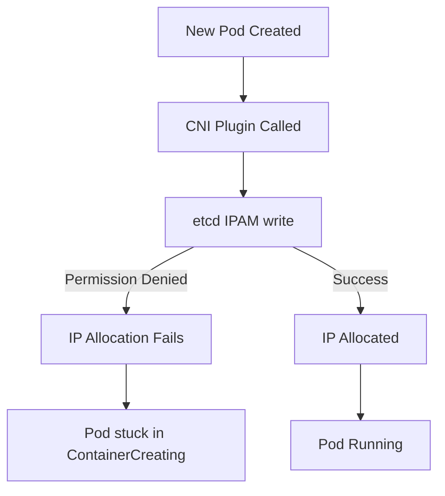

# Troubleshoot Calico etcd RBAC

Author: [nawazdhandala](https://github.com/nawazdhandala)

Tags: Calico, Kubernetes, Networking, Etcd, RBAC, Troubleshooting

Description: Diagnose and resolve common Calico etcd RBAC issues including permission denied errors, missing role bindings, and component authentication failures.

---

## Introduction

Calico etcd RBAC misconfigurations cause Calico components to fail in ways that can be difficult to diagnose. Felix may silently stop programming policies, the CNI plugin may fail to allocate IPs for new pods, or the API server may become unresponsive. The error messages from etcd are often generic "permission denied" messages that don't immediately tell you which component is failing or which path it was trying to access.

This guide covers the most common etcd RBAC failure modes and provides step-by-step diagnosis and resolution procedures.

## Prerequisites

- etcd v3.x with RBAC enabled
- etcdctl with root credentials
- Access to Calico component logs
- `kubectl` with cluster admin access

## Issue 1: Felix Stops Programming Policies

**Symptom**: New policies are not being enforced on nodes. Existing policies work but changes don't propagate.

**Diagnosis:**

```bash
# Check Felix logs for permission errors
kubectl logs -n kube-system ds/calico-node --tail=100 | grep -i "permission\|denied\|error"

# Look for etcd watch failures
kubectl logs -n kube-system ds/calico-node | grep "watch.*failed"
```

**Common cause**: Felix role missing read permission on `/calico/v1/policy/`.

```bash
# Check current permissions
etcdctl ... role get calico-felix | grep policy
```

**Resolution:**

```bash
etcdctl ... role grant-permission calico-felix --prefix=true read /calico/v1/policy/
# Restart Felix to reconnect
kubectl rollout restart ds/calico-node -n kube-system
```

## Issue 2: Pod IP Allocation Failing

**Symptom**: New pods stuck in ContainerCreating with CNI errors.

```bash
# Check CNI logs
tail -100 /var/log/calico/cni/cni.log | grep -i "error\|denied\|etcd"
```



**Resolution:**

```bash
etcdctl ... role grant-permission calico-cni --prefix=true readwrite /calico/v1/ipam/
```

## Issue 3: Authentication Failure

**Symptom**: "etcdserver: authentication failed" errors in component logs.

**Diagnosis:**

```bash
# Test credentials directly
etcdctl --endpoints=https://etcd:2379 \
  --cacert=/etc/etcd/ca.crt \
  --cert=/etc/calico/etcd/felix.crt \
  --key=/etc/calico/etcd/felix.key \
  get /calico/v1/config/ --prefix
```

**Common causes:**
- Certificate expired
- Wrong CA certificate
- Certificate CN does not match etcd user name

```bash
# Check certificate details
openssl x509 -in /etc/calico/etcd/felix.crt -noout -subject -dates
```

## Issue 4: Role Not Assigned to User

```bash
# Check user's assigned roles
etcdctl ... user get calico-felix

# If no role listed, assign it
etcdctl ... user grant-role calico-felix calico-felix
```

## Issue 5: Auth Mode Not Enabled

**Symptom**: All components work but RBAC restrictions are not enforced.

```bash
# Check if auth is enabled
etcdctl ... auth status
# Should return: Authentication Status: true
```

If auth is disabled, RBAC roles exist but are not enforced. Enable auth:

```bash
etcdctl ... auth enable
```

## Conclusion

Troubleshooting Calico etcd RBAC requires reading component logs for permission denied errors, testing credentials directly with etcdctl, and verifying role-to-user bindings. The most common issues are missing permissions for specific etcd path prefixes and expired or misconfigured TLS certificates. Always test changes to RBAC configuration in a non-production environment before applying them to production clusters.
