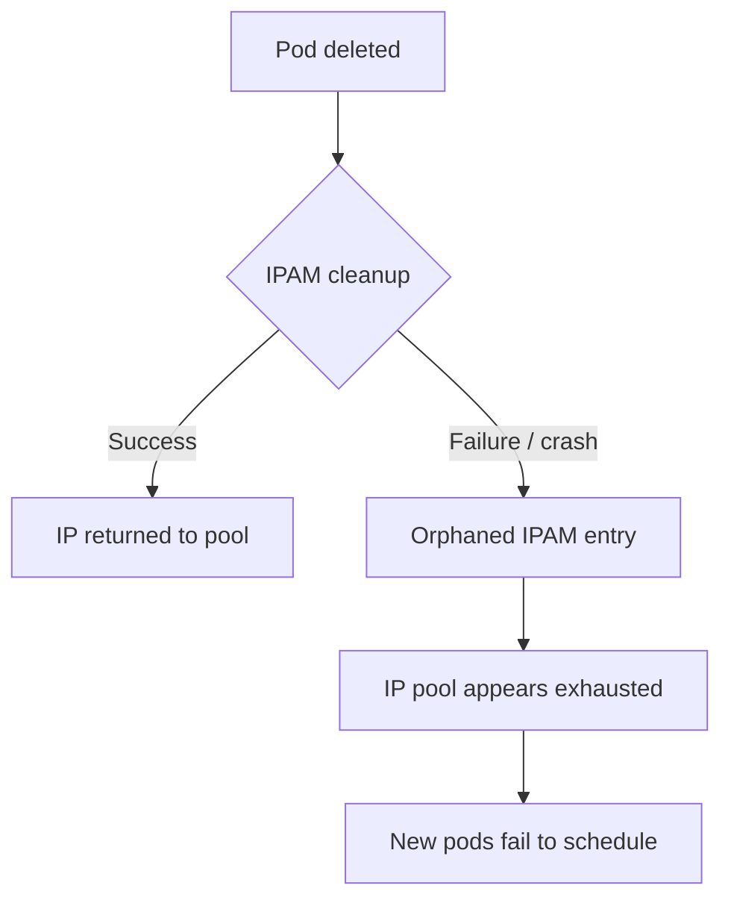

# Troubleshoot Calico etcdv3 Paths

Author: [nawazdhandala](https://github.com/nawazdhandala)

Tags: Calico, Kubernetes, Networking, etcd, etcdv3, Troubleshooting, Datastore

Description: Diagnose and resolve issues related to Calico etcdv3 path data - including corrupted entries, missing paths, and data inconsistencies that cause policy or IPAM failures.

---

## Introduction

etcdv3 path issues in Calico can cause a wide range of problems: policies that exist in Kubernetes but are never enforced, IP addresses that appear allocated but are not associated with any pod, or host data that references deleted nodes and creates phantom routing state. These issues are subtle because Calico continues to appear functional while enforcing stale or incomplete configuration.

Troubleshooting etcdv3 paths requires the ability to inspect raw etcd data, compare it with the expected cluster state, identify inconsistencies, and use calicoctl to correct them safely.

## Prerequisites

- etcdctl configured with appropriate Calico credentials
- `calicoctl` and `kubectl` with cluster admin access
- Understanding of Calico's etcdv3 path structure

## Issue 1: Policies Not Being Enforced

**Symptom**: A GlobalNetworkPolicy exists in the Kubernetes API but Felix is not enforcing it.

**Diagnosis:**

```bash
# Check if the policy exists in etcd
etcdctl get /calico/v1/policy/ --prefix --keys-only | grep "my-policy-name"

# If missing, the policy may not have been written to etcd
# Verify calicoctl can see it
calicoctl get globalnetworkpolicies my-policy-name -o yaml
```

**Resolution:**

```bash
# Re-apply the policy
calicoctl apply -f my-policy.yaml

# Verify it now exists in etcd
etcdctl get /calico/v1/policy/ --prefix --keys-only
```

## Issue 2: IPAM Allocation Leaks

**Symptom**: IP address pool exhausted but many pods have been deleted.



**Diagnosis:**

```bash
# Check IPAM blocks
calicoctl ipam show --show-blocks

# Check for leaked IPs
calicoctl ipam check
```

**Resolution:**

```bash
# Release leaked allocations
calicoctl ipam release --ip=10.0.1.50

# Or run the IPAM GC
calicoctl ipam gc
```

## Issue 3: Stale Host Entries

**Symptom**: Felix logs show references to nodes that no longer exist.

**Diagnosis:**

```bash
# Find stale host entries in etcd
etcdctl get /calico/v1/host/ --prefix --keys-only | \
  awk -F'/' '{print $5}' | sort -u | while read host; do
    kubectl get node "$host" &>/dev/null || echo "STALE: $host"
  done
```

**Resolution:**

```bash
# Use calicoctl to clean up stale node data
calicoctl delete node old-worker-3
```

## Issue 4: Corrupted etcd Data

**Symptom**: calicoctl get returns an error for a specific resource.

```bash
# Try to read the raw value
etcdctl get /calico/v1/policy/tier/default/policy/corrupt-policy

# If the value is malformed JSON/YAML, delete and recreate
etcdctl del /calico/v1/policy/tier/default/policy/corrupt-policy
calicoctl apply -f policy-backup.yaml
```

## Issue 5: Wrong etcd Prefix

**Symptom**: calicoctl reports no data but etcd contains Calico keys.

```bash
# Check what prefix Calico is using
kubectl get felixconfiguration default -o yaml | grep etcd

# List what prefixes exist in etcd
etcdctl get / --prefix --keys-only | grep calico | head -20
```

If data is under `/calico/` but Calico is configured to use `/custom-calico/`, update the configuration.

## Conclusion

Troubleshooting Calico etcdv3 paths requires cross-referencing raw etcd data with calicoctl output and Kubernetes state. The most common issues - IPAM leaks, stale host entries, and missing policy entries - each have specific diagnostic commands and calicoctl-based remediation. Always prefer calicoctl for data manipulation over direct etcdctl writes to avoid introducing new inconsistencies.
