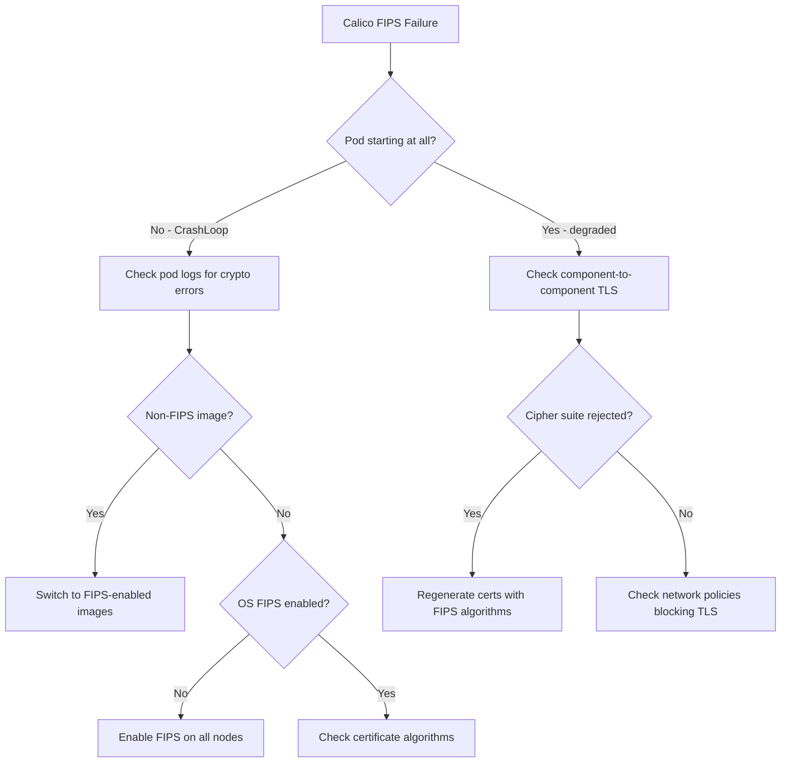

# How to Troubleshoot Calico FIPS Mode

Author: [nawazdhandala](https://github.com/nawazdhandala)

Tags: Calico, Kubernetes, Networking, FIPS, Troubleshooting, Compliance

Description: Diagnose and resolve common Calico FIPS mode issues including TLS handshake failures, cipher suite mismatches, and component startup errors in FIPS-enabled environments.

---

## Introduction

Troubleshooting Calico in FIPS mode requires understanding both Calico's internal communication patterns and the FIPS restrictions imposed by the operating system. When FIPS mode is active, the OS kernel rejects any cryptographic operation that uses non-approved algorithms, which can cause unexpected failures in Calico components that weren't designed with FIPS constraints in mind.

The most common FIPS-related failures manifest as TLS handshake errors between Calico components, certificate validation failures, or outright crashes of components that use non-FIPS algorithms. Understanding which Calico components communicate with each other and which cipher suites they use is essential for diagnosing these issues.

## Prerequisites

- Calico installed with FIPS mode attempted
- `kubectl` with cluster-admin access
- Access to node-level debugging tools

## Symptom 1: calico-node CrashLoopBackOff in FIPS Mode

```bash
# Check calico-node logs
kubectl logs -n calico-system ds/calico-node -c calico-node | tail -50

# Common FIPS-related error patterns:
# "tls: no supported versions satisfy MinVersion and MaxVersion"
# "x509: certificate signed by unknown authority"
# "crypto/tls: handshake failure"
# "unsupported cipher suite"

# Check if the node has FIPS enabled
kubectl debug node/<node-name> -it --image=registry.access.redhat.com/ubi8/ubi -- \
  bash -c 'cat /proc/sys/crypto/fips_enabled'
```

## Symptom 2: Felix-Typha TLS Handshake Failure

```bash
# Check Felix logs for TLS errors
kubectl exec -n calico-system ds/calico-node -c calico-node -- \
  cat /var/log/calico/felix.log | grep -i "tls\|handshake\|cipher"

# Check Typha logs
kubectl logs -n calico-system deploy/calico-typha | grep -i "tls\|handshake\|cipher"

# Verify Felix-Typha TLS configuration
kubectl get felixconfiguration default -o jsonpath='{.spec.typhaCaFile}'
kubectl get installation default -o jsonpath='{.spec.typhaAffinity}'
```

If you see TLS handshake failures between Felix and Typha, the certificates may have been generated with non-FIPS algorithms:

```bash
# Check certificate algorithm
kubectl get secret -n calico-system calico-typha-tls -o jsonpath='{.data.tls\.crt}' | \
  base64 -d | openssl x509 -noout -text | grep "Signature Algorithm"

# FIPS-approved: ecdsa-with-SHA256, sha256WithRSAEncryption (RSA 2048+)
# Non-FIPS (will fail): md5WithRSAEncryption, sha1WithRSAEncryption
```

## Symptom 3: Non-FIPS Image Running in FIPS Mode

```bash
# Check if Calico images are FIPS-enabled variants
kubectl get pods -n calico-system -o jsonpath='{range .items[*]}{.metadata.name}{"\t"}{range .spec.containers[*]}{.image}{"\n"}{end}{end}'

# Inspect the image for FIPS build tag
docker inspect calico/node:v3.27.0 | jq '.[0].Config.Labels'
# FIPS images should have a label like:
# "org.opencontainers.image.description": "Calico node (FIPS)"
```

## Troubleshooting Flow



## Symptom 4: kube-controllers Failing with FIPS

```bash
# Check kube-controllers logs
kubectl logs -n calico-system deploy/calico-kube-controllers

# Common issue: etcd TLS certificates using MD5 or SHA1
kubectl get secret -n calico-system calico-etcd-secrets -o yaml 2>/dev/null | \
  grep -A2 "tls"

# For etcd-backed Calico, verify etcd uses FIPS-approved TLS
etcdctl --cert=/etc/etcd/tls/client.crt \
        --key=/etc/etcd/tls/client.key \
        --cacert=/etc/etcd/tls/ca.crt \
        endpoint health
```

## Regenerating Certificates for FIPS Compliance

```bash
# Regenerate Calico certificates with FIPS-approved algorithms
# Delete existing certificate secrets to force regeneration
kubectl delete secret -n calico-system calico-typha-tls calico-node-tls

# The operator will regenerate them with FIPS-approved algorithms
# when fipsMode: Enabled is set in Installation

# Monitor regeneration
kubectl get secrets -n calico-system -w | grep tls
```

## Conclusion

Troubleshooting Calico in FIPS mode requires checking the full cryptographic chain: OS FIPS enforcement, certificate algorithms, TLS cipher suites, and image FIPS support. The most common issues are non-FIPS certificates (often pre-existing certs generated before FIPS was enabled) and non-FIPS images. When enabling FIPS on an existing cluster, always regenerate all Calico TLS certificates and replace images with FIPS-enabled variants. Use the troubleshooting flow diagram to systematically work through failures.
