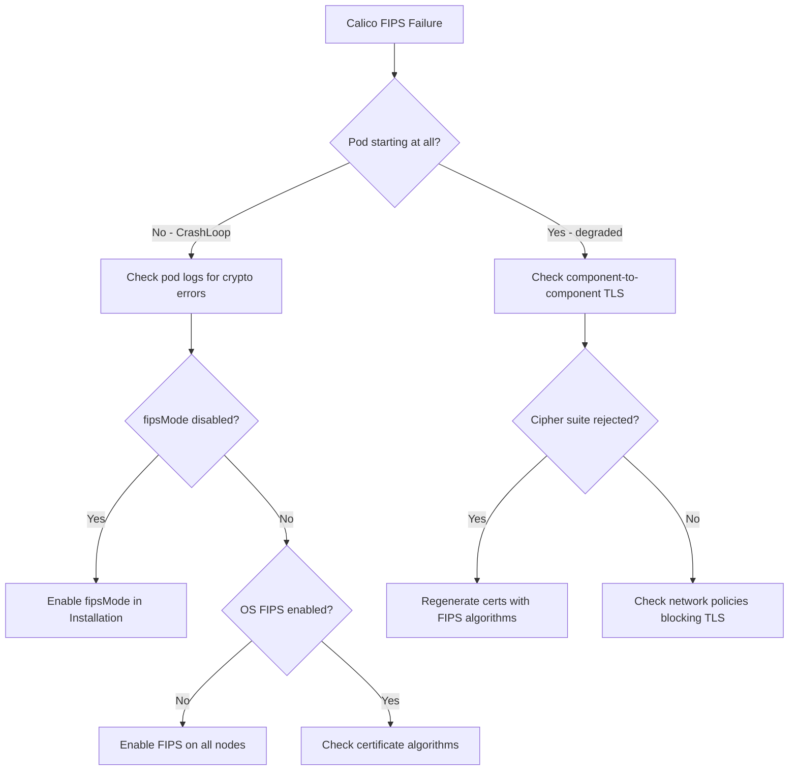

# How to Troubleshoot Calico FIPS Mode

Author: [nawazdhandala](https://github.com/nawazdhandala)

Tags: Calico, Kubernetes, Networking, FIPS, Troubleshooting, Compliance

Description: Diagnose and resolve common Calico FIPS mode issues including TLS handshake failures, cipher suite mismatches, and component startup errors in FIPS-enabled environments.

---

## Introduction

Troubleshooting Calico in FIPS mode requires understanding both Calico's internal communication patterns and the FIPS restrictions imposed by the operating system and cryptographic libraries. In current Calico releases, FIPS mode is deprecated and may be removed in a future release; when it is enabled, Calico uses FIPS-approved algorithms and validated cryptographic modules, and non-approved algorithms can fail depending on where the cryptographic operation is performed.

The most common FIPS-related failures manifest as TLS handshake errors between Calico components, certificate validation failures, or outright crashes of components that use non-FIPS algorithms. Understanding which Calico components communicate with each other and which cipher suites they use is essential for diagnosing these issues.

## Prerequisites

- Calico installed with FIPS mode attempted
- A Kubernetes distribution and Linux x86_64 hosts running in FIPS mode
- `kubectl` with cluster-admin access
- Access to node-level debugging tools

## Symptom 1: calico-node CrashLoopBackOff in FIPS Mode

```bash
# Check calico-node logs

kubectl logs -n calico-system ds/calico-node -c calico-node | tail -50

# Common FIPS-related error patterns:
# "tls: no supported versions satisfy MinVersion and MaxVersion"
# "x509: certificate signed by unknown authority"
# "crypto/tls: handshake failure"
# "unsupported cipher suite"

# Check if the node has FIPS enabled
kubectl debug node/<node-name> -it --image=registry.access.redhat.com/ubi8/ubi -- \
  bash -c 'cat /proc/sys/crypto/fips_enabled'
```

## Symptom 2: Felix-Typha TLS Handshake Failure

```bash
# Check Felix logs for TLS errors
kubectl exec -n calico-system ds/calico-node -c calico-node -- \
  cat /var/log/calico/felix.log | grep -i "tls\|handshake\|cipher"

# Check Typha logs
kubectl logs -n calico-system deploy/calico-typha | grep -i "tls\|handshake\|cipher"

# Verify Felix-Typha TLS configuration
kubectl get installation default -o jsonpath='{.spec.fipsMode}{"\n"}'
kubectl get installation default -o jsonpath='{.spec.certificateManagement}{"\n"}'
kubectl get installation default -o jsonpath='{.spec.typhaDeployment}{"\n"}'
```

If you see TLS handshake failures between Felix and Typha, the certificates may have been generated with non-FIPS algorithms:

```bash
# Check issued Calico certificate algorithms when certificateManagement is enabled
kubectl get csr | grep 'calico-system'
kubectl get csr <csr-name> -o jsonpath='{.status.certificate}' | \
  base64 -d | openssl x509 -noout -text | grep "Signature Algorithm"

# Supported Calico certificate choices include:
# keyAlgorithm: RSAWithSize2048, RSAWithSize4096, RSAWithSize8192,
#               ECDSAWithCurve256, ECDSAWithCurve384, ECDSAWithCurve521
# signatureAlgorithm: SHA256WithRSA, SHA384WithRSA, SHA512WithRSA,
#                     SHA256WithECDSA, SHA384WithECDSA, SHA512WithECDSA
# Avoid MD5 and SHA-1 certificate signatures in FIPS environments.
```

## Symptom 3: Calico Not Running with FIPS Mode Enabled

```bash
# Check that the operator is configured to use FIPS mode
kubectl get installation default -o jsonpath='{.spec.fipsMode}{"\n"}'

# Check the images currently running
kubectl get pods -n calico-system -o jsonpath='{range .items[*]}{.metadata.name}{"\t"}{range .spec.containers[*]}{.image}{"\n"}{end}{end}'

# Inspect image metadata if you need to confirm the exact image version
docker inspect calico/node:v3.27.0 | jq '.[0].Config.Labels'
# Do not rely on a generic "FIPS" image label; use Installation.spec.fipsMode
# and your release's documented image set as the source of truth.
```

## Troubleshooting Flow


```mermaid
flowchart TD
    A[Calico FIPS Failure] --> B{Pod starting at all?}
    B -->|No - CrashLoop| C[Check pod logs for crypto errors]
    B -->|Yes - degraded| D[Check component-to-component TLS]
    C --> E{fipsMode disabled?}
    E -->|Yes| F[Enable fipsMode in Installation]
    E -->|No| G{OS FIPS enabled?}
    G -->|No| H[Enable FIPS on all nodes]
    G -->|Yes| I[Check certificate algorithms]
    D --> J{Cipher suite rejected?}
    J -->|Yes| K[Regenerate certs with FIPS algorithms]
    J -->|No| L[Check network policies blocking TLS]
```

## Symptom 4: kube-controllers Failing with FIPS

```bash
# Check kube-controllers logs
kubectl logs -n calico-system deploy/calico-kube-controllers

# Common issue: etcd TLS certificates using MD5 or SHA1 signatures
kubectl get secret -n calico-system calico-etcd-secrets -o yaml 2>/dev/null | \
  grep -E "etcd-ca|etcd-cert|etcd-key"

# For etcd-backed Calico, verify etcd uses FIPS-approved TLS
etcdctl --cert=/etc/etcd/tls/client.crt \
        --key=/etc/etcd/tls/client.key \
        --cacert=/etc/etcd/tls/ca.crt \
        endpoint health
```

## Regenerating Certificates for FIPS Compliance

```bash
# Configure Calico certificate management with FIPS-appropriate algorithms
kubectl patch installation default --type=merge -p '{
  "spec": {
    "certificateManagement": {
      "caCert": "<Your CA Cert in PEM format>",
      "signerName": "<your-domain>/<signer-name>",
      "keyAlgorithm": "RSAWithSize4096",
      "signatureAlgorithm": "SHA512WithRSA"
    }
  }
}'

# Monitor the certificate signing requests created by Calico pods
kubectl get csr -w
```

## Conclusion

Troubleshooting Calico in FIPS mode requires checking the full cryptographic chain: OS FIPS enforcement, certificate algorithms, TLS cipher suites, and Calico FIPS configuration. The most common issues are non-FIPS certificates (often pre-existing certs generated before FIPS was enabled) and installations where `fipsMode: Enabled` was not applied consistently. When enabling FIPS on an existing cluster, review all Calico TLS certificates and the documented image set for your Calico release. Use the troubleshooting flow diagram to systematically work through failures.
