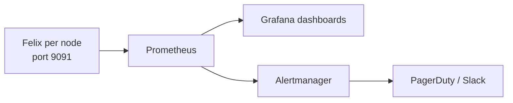

# How to Troubleshoot the Calico Flow Logs API

Author: [nawazdhandala](https://github.com/nawazdhandala)

Tags: Calico, Kubernetes, Networking, Observability

Description: Diagnose and resolve Calico Flow Logs API issues including authentication failures, missing data for recent time windows, and query timeout errors on large result sets.

---

## Introduction

Felix metrics troubleshooting focuses on whether the Prometheus endpoint is enabled, whether the endpoint is reachable on each calico-node pod, and whether Prometheus can discover the metrics target through a Service or ServiceMonitor. Most issues are resolved by enabling the Felix Prometheus endpoint, verifying port 9091 locally on the calico-node container, and checking that the scrape Service exposes a named metrics port.

## Key Commands

```bash
# Enable Felix metrics (if not already enabled)

kubectl patch felixconfiguration default   --type=merge   -p '{"spec":{"prometheusMetricsEnabled":true,"prometheusMetricsPort":9091}}'

# Test Felix metrics endpoint
CALICO_POD=$(kubectl get pods -n calico-system -l k8s-app=calico-node   -o jsonpath='{.items[0].metadata.name}')

kubectl exec -n calico-system "${CALICO_POD}" -c calico-node --   wget -qO- http://localhost:9091/metrics | head -30

# Key Felix metrics to check:
kubectl exec -n calico-system "${CALICO_POD}" -c calico-node --   wget -qO- http://localhost:9091/metrics | grep -E   "^felix_int_dataplane_failures|^felix_calc_graph"
```

## ServiceMonitor for Felix

```yaml
apiVersion: v1
kind: Service
metadata:
  name: felix-metrics-svc
  namespace: calico-system
  labels:
    k8s-app: calico-node
spec:
  clusterIP: None
  selector:
    k8s-app: calico-node
  ports:
    - name: http-metrics
      port: 9091
      targetPort: 9091
---
apiVersion: monitoring.coreos.com/v1
kind: ServiceMonitor
metadata:
  name: calico-felix-metrics
  namespace: calico-system
spec:
  selector:
    matchLabels:
      k8s-app: calico-node
  endpoints:
    - port: http-metrics
      path: /metrics
      interval: 30s
```

## Architecture



## Conclusion

Felix metrics provide the deepest operational visibility into the Calico data plane. Enable the Prometheus endpoint via FelixConfiguration, configure a ServiceMonitor to scrape all calico-node pods, and build dashboards focused on dataplane failures and policy calculation latency. These two metric categories detect the most impactful Calico failure modes before they cause visible pod connectivity issues.
