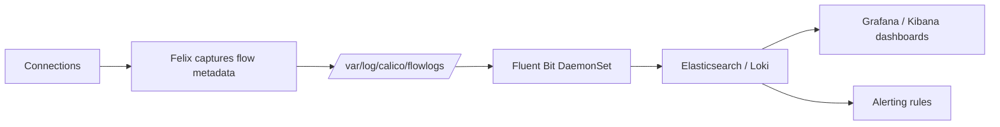

# How to Troubleshoot Calico Flow Logs

Author: [nawazdhandala](https://github.com/nawazdhandala)

Tags: Calico, Kubernetes, Networking, Observability

Description: Diagnose and resolve Calico flow log collection issues including logs not appearing, high log volume, incorrect aggregation levels, and missing denied traffic entries.

---

## Introduction

Flow log troubleshooting focuses on two categories: logs not being written (FelixConfiguration not applied, disk space issues, file permission errors) and logs not reaching the aggregation backend (Fluent Bit configuration errors, index mapping failures). The most common issue is an incorrect FelixConfiguration that doesn't have flow logging enabled.

## Key Commands

```bash
# View flow logs directly from a calico-node pod
CALICO_POD=$(kubectl get pods -n calico-system -l k8s-app=calico-node   -o jsonpath='{.items[0].metadata.name}')

kubectl exec -n calico-system "${CALICO_POD}" -c calico-node --   tail -20 /var/log/calico/flowlogs/flows.log 2>/dev/null

# Filter for denied flows
kubectl exec -n calico-system "${CALICO_POD}" -c calico-node --   grep "deny\|Deny" /var/log/calico/flowlogs/flows.log | tail -10

# Check flow log configuration
kubectl get felixconfiguration default -o yaml |   grep -i "flowLog"
```

## Flow Log Format

```plaintext
# Example flow log entry (abbreviated):
# StartTime | EndTime | SrcIP | DstIP | Proto | SrcPort | DstPort | 
# Packets | Bytes | Action | SrcNamespace | SrcPod | DstNamespace | DstSvc

# Allowed flow example:
# 2026-03-13T10:00:00 | 192.168.1.5 | 192.168.2.10 | TCP | 54321 | 8080 | 
# 12 pkts | 1500 bytes | Allow | default | frontend-abc | production | backend

# Denied flow example:
# 2026-03-13T10:00:05 | 192.168.1.5 | 192.168.3.1 | TCP | 54322 | 5432 |
# 1 pkt | 60 bytes | Deny | default | frontend-abc | database | postgres
```

## Architecture



## Conclusion

Calico flow logs provide the connection-level detail that no other Calico diagnostic can offer. The most valuable operational use case is denied traffic analysis - flow logs show exactly which connections are being blocked, by which policy, enabling rapid policy debugging. Validate the flow log pipeline periodically by generating known test connections and verifying they appear with the correct attributes in your aggregation system.
