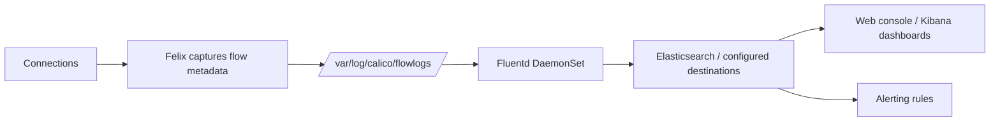

# How to Troubleshoot Calico Flow Logs

Author: [nawazdhandala](https://github.com/nawazdhandala)

Tags: Calico, Kubernetes, Networking, Observability

Description: Diagnose and resolve Calico flow log collection issues including logs not appearing, high log volume, incorrect aggregation levels, and missing denied traffic entries.

---

## Introduction

For file-based Calico Enterprise and Calico Cloud flow logs, troubleshooting focuses on two categories: logs not being written (FelixConfiguration not applied, disk space issues, file permission errors) and logs not reaching the aggregation backend (Fluentd configuration errors, index mapping failures). Calico Open Source 3.30+ exposes flow logs through Goldmane and the Whisker web console instead of this file-based Elasticsearch pipeline.

## Key Commands

```bash
# View file-based flow logs directly from a calico-node pod

CALICO_POD=$(kubectl get pods -n calico-system -l k8s-app=calico-node   -o jsonpath='{.items[0].metadata.name}')

kubectl exec -n calico-system "${CALICO_POD}" -c calico-node --   tail -20 /var/log/calico/flowlogs/flows.log 2>/dev/null

# Filter for denied flows
kubectl exec -n calico-system "${CALICO_POD}" -c calico-node --   grep -E " deny$" /var/log/calico/flowlogs/flows.log | tail -10

# Check flow log configuration
kubectl get felixconfiguration default -o yaml |   grep -Ei "flowLogs(File|Flush|DynamicAggregation)"
```

## Flow Log Format

```plaintext
# Example file flow log fields (space-delimited, abbreviated):
# startTime endTime srcType srcNamespace srcName srcLabels dstType dstNamespace dstName
# dstLabels srcIP dstIP proto srcPort dstPort numFlows numFlowsStarted numFlowsCompleted
# reporter packetsIn packetsOut bytesIn bytesOut action

# Allowed flow example:
# 1773396000 1773396300 wep default frontend-abc - wep production backend - 192.168.1.5 192.168.2.10 6 54321 8080 1 1 1 out 12 0 1500 0 allow

# Denied flow example:
# 1773396005 1773396305 wep default frontend-abc - wep database postgres - 192.168.1.5 192.168.3.1 6 54322 5432 1 1 1 out 1 0 60 0 deny
```

## Architecture


```mermaid
flowchart LR
    A[Connections] --> B[Felix captures flow metadata]
    B --> C[/var/log/calico/flowlogs/]
    C --> D[Fluentd DaemonSet]
    D --> E[Elasticsearch / configured destinations]
    E --> F[Web console / Kibana dashboards]
    E --> G[Alerting rules]
```

## Conclusion

Calico flow logs provide connection-level detail for understanding workload communication. The most valuable operational use case is denied traffic analysis - flow logs show which connections are being blocked and, when policy fields are collected, which policies were involved, enabling rapid policy debugging. Validate the flow log pipeline periodically by generating known test connections and verifying they appear with the correct attributes in your aggregation system.
