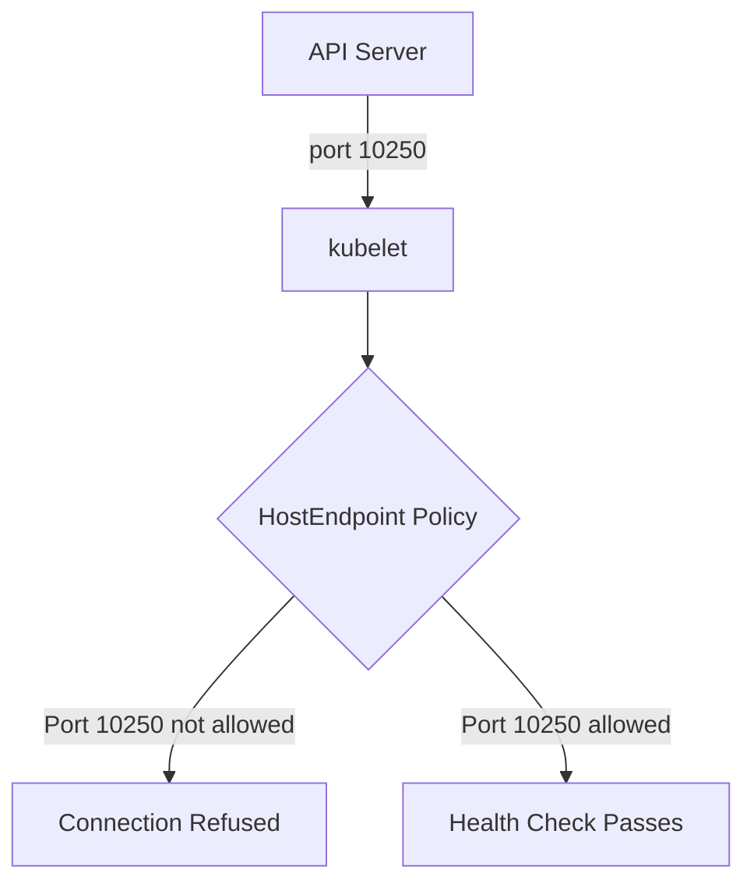

# Troubleshoot Calico Host Endpoint Security

Author: [nawazdhandala](https://github.com/nawazdhandala)

Tags: Calico, Kubernetes, Networking, Security, Host Endpoint, Troubleshooting

Description: A practical troubleshooting guide for diagnosing and resolving common issues with Calico host endpoint security policies on Kubernetes nodes.

---

## Introduction

Calico host endpoint security issues can manifest in subtle and disruptive ways. Nodes may become unreachable over SSH, the kubelet may fail health checks, or cluster components may be unable to communicate with the API server. Because host endpoint policies operate at the OS network layer, issues are often harder to diagnose than pod-level policy problems.

Understanding the diagnostic flow - from checking resource state to inspecting kernel programming to capturing live traffic - is essential for resolving host endpoint security issues quickly and safely. This guide covers the most common failure modes and the commands used to investigate them.

## Prerequisites

- SSH access to affected cluster nodes
- `kubectl` and `calicoctl` with cluster admin privileges
- Familiarity with iptables and/or eBPF concepts
- Access to Calico Felix logs

## Common Issue 1: Node Becomes Unreachable After Applying Host Endpoint

This is the most dangerous scenario. When a HostEndpoint is created without sufficient allow policies, Felix may begin dropping all traffic to the node.

**Diagnosis:**

```bash
# Check if HostEndpoint was recently created
calicoctl get hostendpoints -o wide

# Review Felix logs for deny actions
kubectl logs -n calico-system -l k8s-app=calico-node --since=5m | grep -i "denied\|drop"
```

**Resolution:**

Connect via out-of-band access (cloud console) and temporarily disable the HostEndpoint:

```bash
calicoctl delete hostendpoint node1-eth0
```

Then add the required allow policy before re-applying the HostEndpoint.

## Common Issue 2: Kubelet Health Checks Failing



**Diagnosis:**

```bash
kubectl describe node node1 | grep -A10 "Conditions"
# Look for NotReady status

# Test connectivity to kubelet
curl -k https://10.0.1.10:10250/healthz
```

**Resolution:**

Ensure your GlobalNetworkPolicy allows port 10250:

```yaml
ingress:
  - action: Allow
    protocol: TCP
    destination:
      ports: [10250, 10255]
    source:
      selector: "role == 'control-plane'"
```

## Common Issue 3: Policies Not Taking Effect

**Diagnosis:**

```bash
# Verify Felix is running on the affected node
kubectl get pods -n calico-system -o wide | grep node1

# Check Felix configuration
kubectl get felixconfiguration default -o yaml

# Inspect iptables on the node
sudo iptables -L -n -v | grep cali
```

**Resolution:**

Restart Felix on the node:

```bash
kubectl delete pod -n calico-system -l k8s-app=calico-node --field-selector spec.nodeName=node1
```

## Common Issue 4: Unexpected Traffic Allowed

If you expect traffic to be blocked but it is still reaching the node:

```bash
# Check policy order - lower order = higher priority
calicoctl get globalnetworkpolicies -o wide | sort -k4

# Verify selector matches the HostEndpoint labels
calicoctl get hostendpoint node1-eth0 -o yaml | grep -A5 labels
```

## Common Issue 5: Failsafe Port Conflicts

Calico has built-in failsafe ports. If your policy conflicts with them, traffic may be unexpectedly allowed:

```bash
# View current failsafe inbound ports
kubectl get felixconfiguration default -o jsonpath='{.spec.failsafeInboundHostPorts}'
```

## Conclusion

Troubleshooting Calico host endpoint security requires a methodical approach: start with the resource state, check Felix logs, inspect kernel programming, and use traffic tests to confirm behavior. Always maintain an out-of-band access path to nodes when experimenting with host endpoint policies in production, and build a rollback procedure before making changes.
