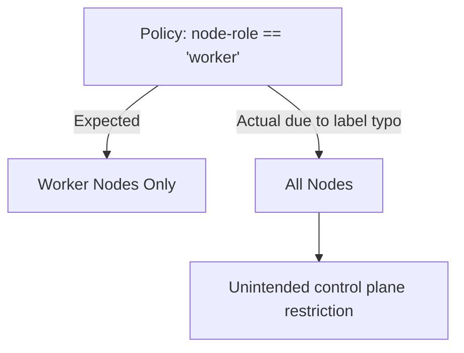

# Troubleshoot Calico Host Endpoint Selectors

Author: [nawazdhandala](https://github.com/nawazdhandala)

Tags: Calico, Kubernetes, Networking, Host Endpoint, Selectors, Troubleshooting

Description: Diagnose and fix common problems with Calico host endpoint selector expressions that cause policies to match the wrong nodes or fail to apply at all.

---

## Introduction

Selector-related issues in Calico host endpoint policies are often invisible - the policy exists, no errors are reported, but the intended security rules are simply not being enforced on the target nodes. This happens because selectors silently fail to match when labels are missing, mismatched, or expressed incorrectly. The consequences range from over-permissive security to unexpected traffic denial on the wrong nodes.

This guide covers the most common selector troubleshooting scenarios, including zero-match policies, partial matches, automatic host endpoint label propagation issues, and selector syntax errors.

## Prerequisites

- `calicoctl` and `kubectl` with cluster admin access
- Calico host endpoints deployed on cluster nodes
- Ability to SSH into nodes or run privileged pods

## Issue 1: Policy Has Zero Matching Endpoints

**Symptom**: Security policy exists but traffic is not being filtered as expected.

**Diagnosis:**

```bash
# Check how many endpoints the selector matches
calicoctl get hostendpoints --selector="node-role == 'worker'" -o wide

# If no output, the selector matches nothing
```

**Common causes:**

```bash
# Check actual labels on HostEndpoint
calicoctl get hostendpoint worker-1-eth0 -o yaml | grep -A5 "labels:"

# Likely output: no labels defined
```

**Resolution:**

Add the missing labels:

```bash
calicoctl patch hostendpoint worker-1-eth0 \
  --patch='{"metadata":{"labels":{"node-role":"worker","security-tier":"standard"}}}'
```

## Issue 2: Policy Applies to Wrong Nodes

**Symptom**: Traffic is being filtered on nodes you didn't intend to restrict.



**Diagnosis:**

```bash
# List all hostendpoints and their labels
calicoctl get hostendpoints -o yaml | python3 -c "
import sys, yaml
docs = list(yaml.safe_load_all(sys.stdin))
for item in docs[0].get('items', []):
    print(item['metadata']['name'], item['metadata'].get('labels', {}))
"
```

**Resolution:**

Check that labels are unique to the intended node group before applying policies.

## Issue 3: Selector Syntax Errors

**Symptom**: `calicoctl apply` fails with a validation error.

**Common mistakes:**

```yaml
# Wrong: using == with multiple values
selector: "node-role == 'worker' or node-role == 'storage'"

# Correct: use 'in' for multiple values
selector: "node-role in {'worker', 'storage'}"

# Wrong: missing quotes around string value
selector: "node-role == worker"

# Correct
selector: "node-role == 'worker'"
```

## Issue 4: Automatic Host Endpoint Labels Not Propagating

When using automatic host endpoint creation, node labels may not automatically appear on HostEndpoint resources in all Calico versions.

**Diagnosis:**

```bash
# Compare node labels vs. hostendpoint labels
kubectl get node worker-1 --show-labels
calicoctl get hostendpoint worker-1-auto -o yaml | grep -A10 labels
```

**Resolution:**

For Calico v3.23+, automatic host endpoints inherit node labels. For older versions, use a DaemonSet or operator to sync labels:

```bash
# Manually sync labels
for node in $(kubectl get nodes -o name | cut -d/ -f2); do
  calicoctl patch hostendpoint "${node}-auto" \
    --patch="{\"metadata\":{\"labels\":{\"node-role\":\"$(kubectl get node $node -o jsonpath='{.metadata.labels.kubernetes\.io/role}')\"}}}"
done
```

## Issue 5: OR Logic Not Working as Expected

```yaml
# This is AND logic - both labels must exist
selector: "env == 'prod' && tier == 'frontend'"

# This is OR logic - either label
selector: "env == 'prod' || tier == 'frontend'"
```

Verify your boolean operators are correct for your intended behavior.

## Conclusion

Selector troubleshooting in Calico host endpoint policies requires checking label presence at both node and HostEndpoint levels, verifying selector syntax, and testing matches with explicit queries. Zero-match selectors are the most common issue and the most dangerous because they silently result in no policy enforcement. Build label validation into your deployment pipeline to catch these issues before reaching production.
