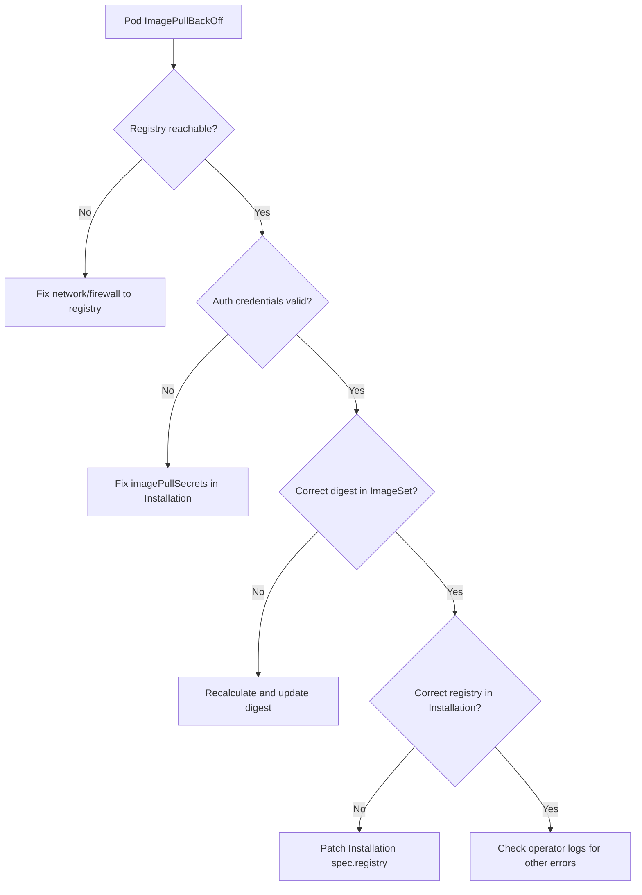

# How to Troubleshoot Calico ImageSet Management

Author: [nawazdhandala](https://github.com/nawazdhandala)

Tags: Calico, Kubernetes, Networking, ImageSet, Troubleshooting

Description: Diagnose and resolve common Calico ImageSet management issues including digest mismatches, registry connectivity failures, and operator reconciliation errors.

---

## Introduction

Calico ImageSet management introduces a new category of failure modes that don't exist in default public-registry deployments. When something goes wrong, pods fail to start with `ImagePullBackOff` or `ErrImagePull` errors, but the root cause might be a digest mismatch, missing image tag, wrong registry URL, or authentication failure. Understanding how the Tigera Operator processes ImageSets is essential for fast diagnosis.

The operator reads the `ImageSet` resource, validates all digests, constructs pull references, and injects them into the managed DaemonSets and Deployments. If any step in this chain fails, the operator may silently skip the ImageSet or surface a condition in the `Installation` status. Knowing where to look is half the battle.

This guide covers the most common ImageSet troubleshooting scenarios with concrete diagnostic commands and resolution steps.

## Prerequisites

- Calico installed via the Tigera Operator
- `kubectl` with cluster-admin access
- Access to view operator logs

## Symptom 1: Pods Stuck in ImagePullBackOff

```bash
# Identify affected pods
kubectl get pods -n calico-system | grep -v Running

# Get the exact error
kubectl describe pod <pod-name> -n calico-system | grep -A10 "Events:"
```

Common causes and fixes:

```bash
# Check if the registry is reachable from a node
kubectl debug node/<node-name> -it --image=alpine -- sh
# Inside the debug pod:
wget -qO- https://registry.internal.example.com/v2/

# Check imagePullSecrets are configured
kubectl get installation default -o jsonpath='{.spec.imagePullSecrets}'

# Verify the secret exists in calico-system namespace
kubectl get secret -n calico-system | grep registry
```

## Symptom 2: Operator Not Applying ImageSet

```bash
# Check operator logs for ImageSet processing
kubectl logs -n tigera-operator deploy/tigera-operator | grep -i imageset

# Check Installation status conditions
kubectl get installation default -o jsonpath='{.status.conditions}' | jq .

# Get full operator status
kubectl describe tigerastatus calico
```

If the operator shows no errors but the wrong images are running:

```bash
# Check which ImageSet the operator selected
kubectl get imageset -o yaml
kubectl get installation default -o yaml | grep -A5 "imageSet"

# Ensure the ImageSet name matches the naming convention
# The operator selects the ImageSet matching: calico-<version>
kubectl get imageset calico-v3.27.0
```

## Symptom 3: Digest Mismatch Errors

```bash
# Operator logs showing digest mismatch
kubectl logs -n tigera-operator deploy/tigera-operator | grep -i "digest\|mismatch"

# Re-fetch the correct digest for a specific image
crane digest registry.internal.example.com/calico/node:v3.27.0

# Compare against what's in the ImageSet
kubectl get imageset calico-v3.27.0 -o jsonpath='{.spec.images[?(@.image=="calico/node")].digest}'
```

Fix digest mismatch:

```bash
# Update the ImageSet with the correct digest
kubectl patch imageset calico-v3.27.0 --type=json \
  -p='[{"op":"replace","path":"/spec/images/0/digest","value":"sha256:newdigest..."}]'
```

## Symptom 4: Wrong Registry Being Used

```bash
# Check what registry is configured in Installation
kubectl get installation default -o jsonpath='{.spec.registry}'

# Check what images pods are actually pulling
kubectl get pods -n calico-system -o jsonpath='{range .items[*]}{.metadata.name}{"\t"}{range .spec.containers[*]}{.image}{"\n"}{end}{end}'

# If the registry is wrong, patch the Installation
kubectl patch installation default --type=merge \
  -p='{"spec":{"registry":"registry.correct.example.com/calico"}}'
```

## Troubleshooting Decision Tree



## Symptom 5: ImageSet Not Found

```bash
# List all ImageSets
kubectl get imageset

# The operator looks for ImageSet named: calico-<version>
# Check the version the operator expects
kubectl logs -n tigera-operator deploy/tigera-operator | grep "Looking for ImageSet"

# Create the missing ImageSet with the correct name
kubectl get installation default -o jsonpath='{.status.calicoVersion}'
```

## Conclusion

Troubleshooting Calico ImageSet management requires checking multiple layers: pod events, operator logs, Installation conditions, and registry connectivity. The most common issues are digest mismatches from re-pushed images, wrong registry URLs, and missing pull secrets. Using the decision tree in this guide, you can systematically isolate the root cause and restore normal Calico operation quickly. Always verify that your ImageSet name matches the exact version string the operator expects.
