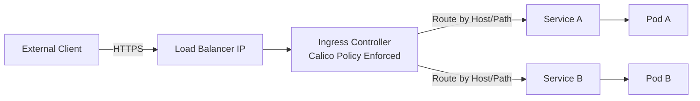

# How to Troubleshoot the Calico Ingress Gateway

Author: [nawazdhandala](https://github.com/nawazdhandala)

Tags: Calico, Kubernetes, Ingress, Gateway, Networking

Description: Diagnose ingress gateway failures in Calico including routing misconfigurations, certificate issues, and backend connectivity problems.

---

## Introduction

Calico Enterprise Ingress Gateway provides a controlled entry point for external traffic into the cluster. An ingress gateway sits at the boundary between external networks and the Kubernetes pod network, performing routing decisions, TLS termination, and traffic policy enforcement.

For open-source Calico, ingress traffic is typically handled by a standard Kubernetes Ingress controller such as NGINX or an Envoy-based controller, with Calico providing the underlying network policy enforcement. Calico Enterprise Ingress Gateway is based on Envoy Gateway and the Kubernetes Gateway API.

## Prerequisites

- Calico installed
- An ingress controller such as NGINX or an Envoy-based controller for the Ingress example, or Calico Enterprise Ingress Gateway for Gateway API deployments
- kubectl access
- DNS for external access

## Configure Ingress Resource

```yaml
apiVersion: networking.k8s.io/v1
kind: Ingress
metadata:
  name: app-ingress
  namespace: production
  annotations:
    nginx.ingress.kubernetes.io/rewrite-target: /
spec:
  ingressClassName: nginx
  rules:
  - host: app.example.com
    http:
      paths:
      - path: /
        pathType: Prefix
        backend:
          service:
            name: my-app
            port:
              number: 80
```

## Apply Calico Network Policy for Ingress

```yaml
apiVersion: projectcalico.org/v3
kind: NetworkPolicy
metadata:
  name: allow-ingress-to-app
  namespace: production
spec:
  selector: app == 'my-app'
  types:
  - Ingress
  ingress:
  - action: Allow
    source:
      namespaceSelector: projectcalico.org/name == 'ingress-nginx'
      selector: app.kubernetes.io/name == 'ingress-nginx' && app.kubernetes.io/component == 'controller'
    destination:
      ports:
      - 80
```

## Verify Gateway Functionality

```bash
# Check ingress controller pods

kubectl get pods -n ingress-nginx

# Test ingress routing
curl -H "Host: app.example.com" http://$(kubectl get svc -n ingress-nginx ingress-nginx-controller   -o jsonpath='{.status.loadBalancer.ingress[0].ip}')/

# Check ingress status
kubectl describe ingress app-ingress -n production
```

## Ingress Architecture



## Conclusion

Calico can combine Kubernetes ingress routing with Calico's network policy enforcement to provide secure, controlled external access to cluster services. Configure ingress resources for routing rules, create Calico network policies to restrict which pods the ingress controller can reach, and monitor ingress metrics to ensure reliable external access.
