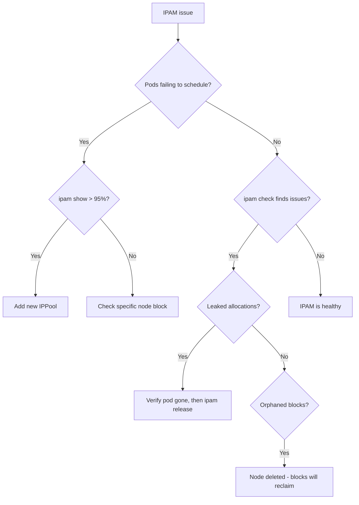

# How to Troubleshoot Calico IPAM Issues

Author: [nawazdhandala](https://github.com/nawazdhandala)

Tags: Calico, Kubernetes, Networking, IPAM, Troubleshooting

Description: Diagnose and resolve Calico IPAM issues including leaked IP allocations, exhausted IP pools, orphaned blocks from deleted nodes, and pods stuck in ContainerCreating due to IP allocation failures.

---

## Introduction

Calico IPAM issues manifest in two ways: pods fail to schedule due to IP exhaustion, or pods receive IPs but the IPAM database has inconsistencies. The `calicoctl ipam check` command detects inconsistencies, while pod ContainerCreating failures with IPAM-related events indicate active exhaustion. Both require different remediation approaches.

## Symptom 1: Pods Stuck in ContainerCreating

```bash
# Check pod events for IPAM errors
kubectl describe pod <stuck-pod> -n <namespace> | grep -A5 Events
# Look for: "failed to allocate IP" or "no more free CIDR blocks"

# Check IPAM utilization
calicoctl ipam show
# If near 100%: add a new IPPool

# Check if specific node's block is exhausted
calicoctl ipam show --show-blocks | grep <node-name>

# Quick fix: add a new IPPool
kubectl apply -f - << 'YAML'
apiVersion: projectcalico.org/v3
kind: IPPool
metadata:
  name: new-pool
spec:
  cidr: 10.240.0.0/16
  ipipMode: Always
  natOutgoing: true
YAML
```

## Symptom 2: calicoctl ipam check Reports Inconsistencies

```bash
# Run check to identify issues
calicoctl ipam check
# Output examples:
# "IP 192.168.1.5 is allocated but no pod/endpoint found"
# "Block 192.168.1.0/26 has no node affinity"

# For leaked allocations: release them
# CAUTION: Only release IPs where no pod currently uses them
# Verify the pod is truly gone before releasing
kubectl get pod --all-namespaces -o wide | grep <ip-address>
# If no pod found: safe to release
calicoctl ipam release --ip=<ip-address>
```

## Symptom 3: Orphaned Blocks from Deleted Nodes

```bash
# Check for blocks assigned to non-existent nodes
calicoctl ipam show --show-blocks | awk '{print $2}' | while read block; do
  NODE=$(calicoctl get ipamblock "${block}" \
    -o jsonpath='{.spec.affinity}' 2>/dev/null | cut -d: -f2)
  if [ -n "${NODE}" ]; then
    kubectl get node "${NODE}" > /dev/null 2>&1 || \
      echo "Orphaned block ${block} for deleted node ${NODE}"
  fi
done

# Release orphaned block affinity
# (blocks will be reclaimed by IPAM automatically after node deletion)
```

## IPAM Troubleshooting Flow



## Conclusion

Calico IPAM troubleshooting requires distinguishing between active exhaustion (pod scheduling failures, high utilization) and silent inconsistencies (leaked IPs found by ipam check). Active exhaustion is resolved by adding a new IPPool. Leaked IPs are resolved with `calicoctl ipam release` - but only after verifying the pod is truly gone. Never release an IP that might still be in use by a running pod, as this will corrupt the IPAM database and cause duplicate IP assignment.
