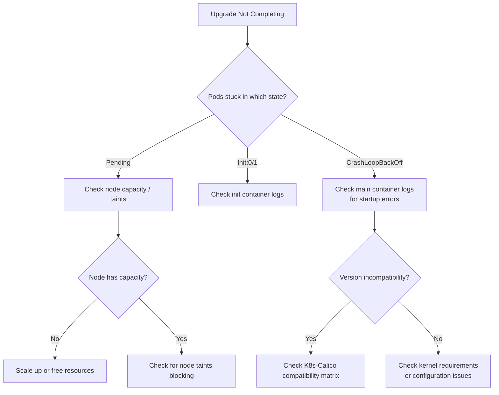

# How to Troubleshoot Calico on Kubernetes Upgrades

Author: [nawazdhandala](https://github.com/nawazdhandala)

Tags: Calico, Kubernetes, Networking, Upgrade, Troubleshooting

Description: Diagnose and resolve Calico upgrade failures including stuck rolling updates, version incompatibilities, and post-upgrade network connectivity issues.

---

## Introduction

Calico upgrade failures manifest as stuck rolling updates (calico-node pods stuck in Pending or Init states), version incompatibilities between Calico and Kubernetes, or post-upgrade connectivity issues where pods on upgraded nodes can't communicate with pods on not-yet-upgraded nodes.

Understanding the operator's upgrade state machine and the conditions that can stall it is essential for fast diagnosis and recovery.

## Symptom 1: Upgrade Stuck - calico-node Pods Not Rolling

```bash
# Check why the DaemonSet rollout is stuck
kubectl rollout status ds/calico-node -n calico-system

# Check specific pod states
kubectl get pods -n calico-system -o wide | grep -v Running

# Check events for the stuck pod
kubectl describe pod <stuck-pod> -n calico-system | tail -20

# Check operator logs for upgrade blocking reason
kubectl logs -n tigera-operator deploy/tigera-operator | \
  grep -i "upgrade\|waiting\|block" | tail -20
```

Common causes:
```bash
# Cause 1: Node is cordoned (DaemonSet pod can't schedule)
kubectl get nodes | grep SchedulingDisabled

# Cause 2: Insufficient resources on node
kubectl describe node <node-name> | grep -A5 "Conditions:"

# Cause 3: PodDisruptionBudget blocking pod termination
kubectl get pdb -A | grep calico
```

## Symptom 2: Mixed Version Cluster (Some Nodes on Old Version)

```bash
# Check what version is running on each node
kubectl get pods -n calico-system -l k8s-app=calico-node \
  -o jsonpath='{range .items[*]}{.spec.nodeName}{"\t"}{range .spec.containers[*]}{.image}{"\n"}{end}{end}'

# This is expected during a rolling upgrade but should complete
# If stuck for >30 minutes, check node health:
for node in $(kubectl get pods -n calico-system -l k8s-app=calico-node \
  -o jsonpath='{range .items[*]}{.spec.nodeName}{"\n"}{end}'); do
  echo -n "${node}: "
  kubectl get node ${node} -o jsonpath='{.status.conditions[?(@.type=="Ready")].status}'
  echo ""
done
```

## Symptom 3: Post-Upgrade Connectivity Issues

```bash
# If pods can't connect after upgrade:

# 1. Check if all calico-node pods are on the new version
kubectl get pods -n calico-system -l k8s-app=calico-node \
  -o jsonpath='{range .items[*]}{.metadata.name}{"\t"}{range .spec.containers[*]}{.image}{"\n"}{end}{end}' | \
  grep -v "v3.28.0"  # Replace with target version

# 2. Check Felix logs on affected nodes for errors
NODE_WITH_ISSUE="<node-name>"
kubectl logs -n calico-system \
  $(kubectl get pod -n calico-system -l k8s-app=calico-node \
    --field-selector=spec.nodeName=${NODE_WITH_ISSUE} \
    -o jsonpath='{.items[0].metadata.name}') | \
  grep -E "ERROR|FATAL|error" | tail -20

# 3. Check IP pool compatibility
calicoctl get ippool -o yaml | grep -E "ipipMode|vxlanMode|encapsulation"
```

## Upgrade Failure Decision Tree



## Emergency Rollback

```bash
# If upgrade causes critical issues, rollback to previous version
# Note: this requires the previous ImageSet to still exist

PREVIOUS_VERSION="v3.27.0"

# Check previous ImageSet exists
kubectl get imageset "calico-${PREVIOUS_VERSION}"

# Rollback Installation to previous version
kubectl patch installation default --type=merge \
  -p "{\"spec\":{\"version\":\"${PREVIOUS_VERSION}\"}}"

# Monitor rollback
kubectl rollout status ds/calico-node -n calico-system --timeout=300s
echo "Rollback complete. Running version: $(kubectl get installation default -o jsonpath='{.status.calicoVersion}')"
```

## Conclusion

Calico upgrade failures most commonly present as stuck rolling updates due to node resource constraints, cordoned nodes, or PodDisruptionBudgets. Post-upgrade connectivity issues typically indicate mixed-version states or IP pool configuration incompatibilities between versions. The emergency rollback procedure using the previous ImageSet provides fast recovery when needed. Always ensure the previous version's ImageSet still exists before starting an upgrade so rollback is available.
