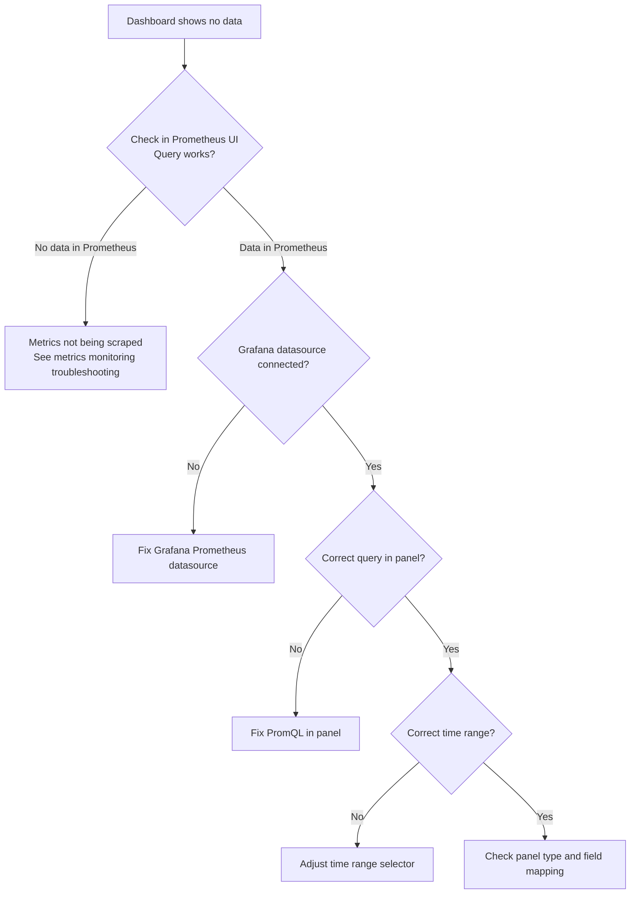

# How to Troubleshoot Calico Metrics Visualization

Author: [nawazdhandala](https://github.com/nawazdhandala)

Tags: Calico, Kubernetes, Networking, Metrics, Grafana, Troubleshooting

Description: Diagnose and resolve common Calico Grafana dashboard issues including missing data, query errors, and incorrect visualizations.

---

## Introduction

Calico dashboard issues fall into two categories: data issues (metrics not flowing into Prometheus) and visualization issues (metrics available but not displaying correctly in Grafana). Distinguishing between these two categories is the first step in troubleshooting.

## Diagnostic Approach



## Symptom 1: "No Data" in Dashboard Panel

```bash
# Step 1: Test the query in Prometheus directly
kubectl port-forward -n monitoring svc/prometheus-operated 9090 &

# Test a basic Felix query
curl -s 'http://localhost:9090/api/v1/query?query=felix_active_local_policies' | jq .

# If empty results:
# - Felix metrics not enabled (check FelixConfiguration)
# - ServiceMonitor not working (see metrics monitoring troubleshooting)
```

## Symptom 2: Dashboard Shows Correct Data But Wrong Scale

```promql
# If values seem wrong scale, check units
# Felix dataplane apply time is in seconds, not milliseconds
felix_int_dataplane_apply_time_seconds_sum / felix_int_dataplane_apply_time_seconds_count
# This is average seconds per operation

# WRONG - thinking value is in milliseconds:
# "0.02" means 20ms? No - it means 0.02 seconds = 20ms (actually correct)
# But if panel unit is set to "ms", the value will be multiplied by 1000

# CORRECT - set panel unit to "seconds (s)" for latency metrics
```

## Symptom 3: Dashboard Only Shows One Node

```promql
# WRONG query - missing "by" clause shows single aggregate
sum(felix_active_local_policies)

# CORRECT for per-node view
sum(felix_active_local_policies) by (node)

# Check the panel's "Legend format" setting
# Should be: {{ node }} to show per-node breakdown
```

## Symptom 4: Grafana Dashboard Not Auto-Imported

```bash
# Check Grafana sidecar logs
kubectl logs -n monitoring deploy/grafana -c grafana-sc-dashboard | tail -20

# Verify ConfigMap has the correct label
kubectl get configmap calico-overview-dashboard -n monitoring \
  --show-labels | grep grafana_dashboard

# Check if the label value matches Grafana sidecar configuration
kubectl get deploy grafana -n monitoring -o yaml | \
  grep -A5 LABEL
```

## Conclusion

Most Calico dashboard issues are either data pipeline problems (metrics not reaching Prometheus) or PromQL mistakes (wrong queries or missing `by` clauses for per-node breakdown). Always test queries directly in the Prometheus UI before blaming Grafana, and verify the Grafana datasource connection is working. The most productive troubleshooting approach is to isolate each layer: Prometheus targets healthy, metrics queryable, Grafana datasource connected, panel query correct.
