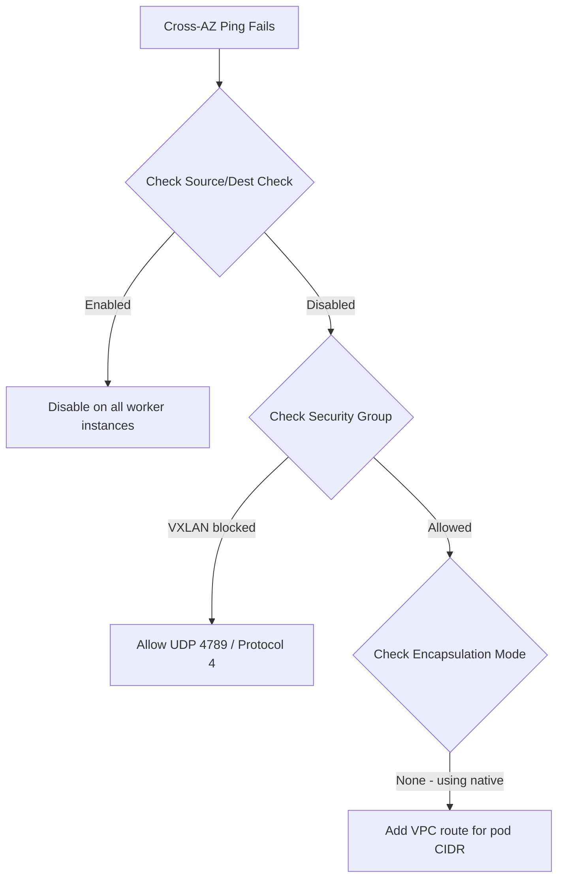

# Troubleshoot Calico Networking on AWS

Author: [nawazdhandala](https://github.com/nawazdhandala)

Tags: Calico, Kubernetes, Networking, AWS, Cloud, Troubleshooting

Description: Diagnose and resolve common Calico networking problems on AWS, including cross-AZ connectivity failures, security group misconfigurations, and source/destination check issues.

---

## Introduction

Calico networking issues on AWS often stem from the interaction between Calico's routing logic and AWS network primitives — security groups, VPC route tables, and the source/destination check setting. Problems that work perfectly in other environments may fail on AWS due to these cloud-specific constraints.

The most common AWS-specific failures involve cross-AZ traffic being dropped by security groups that don't allow encapsulation protocols, or by the source/destination check dropping packets with pod source IPs. This guide covers diagnosis and resolution of the most frequent Calico networking problems on AWS.

## Prerequisites

- SSH access to cluster nodes or ability to run privileged pods
- AWS CLI with EC2 read permissions
- `kubectl` and `calicoctl` with cluster admin access
- `tcpdump` available on nodes

## Issue 1: Cross-AZ Pod Communication Failing

**Symptom**: Pods on different nodes communicate if they're in the same AZ, but fail across AZs.

**Diagnosis:**

```bash
# Run a ping from pod in AZ1 to pod in AZ2
kubectl exec test-pod-az1 -- ping -c 3 192.168.1.50
# If this fails but same-AZ works, it's a cross-AZ issue
```



**Check source/destination:**

```bash
aws ec2 describe-instance-attribute \
  --instance-id i-0123456789 \
  --attribute sourceDestCheck
```

**Resolution:**

```bash
aws ec2 modify-instance-attribute \
  --instance-id i-0123456789 \
  --no-source-dest-check
```

## Issue 2: Security Group Blocking Encapsulation

**Symptom**: Cross-AZ traffic fails; `tcpdump` shows VXLAN packets reaching the destination node but being dropped.

```bash
# On destination node, capture VXLAN traffic
tcpdump -i eth0 -n udp port 4789
```

**Resolution:**

```bash
aws ec2 authorize-security-group-ingress \
  --group-id sg-0123456789 \
  --protocol udp \
  --port 4789 \
  --source-group sg-0123456789
```

## Issue 3: IP-in-IP Traffic Blocked

AWS security groups don't have a rule for "protocol 4" in the console. Use the CLI:

```bash
aws ec2 authorize-security-group-ingress \
  --group-id sg-0123456789 \
  --ip-permissions '[{"IpProtocol":"4","UserIdGroupPairs":[{"GroupId":"sg-0123456789"}]}]'
```

## Issue 4: VPC Route Table Not Updated

When using native routing mode (no encapsulation), each node's pod CIDR must be in the VPC route table:

```bash
# List current VPC routes
aws ec2 describe-route-tables \
  --route-table-ids rtb-0123456789 \
  --query 'RouteTables[0].Routes[*].[DestinationCidrBlock,InstanceId]' \
  --output table

# Check if a node's pod CIDR is missing
calicoctl ipam show --show-blocks | grep node2
# If node2 has block 192.168.2.0/24 but it's not in route table, add it
```

## Issue 5: IPAM Exhaustion

```bash
# Check IP pool usage
calicoctl ipam show
# If usage is > 90%, expand the pool

calicoctl patch ippool aws-pod-pool \
  --patch='{"spec":{"cidr":"192.168.0.0/15"}}'
```

## Conclusion

AWS Calico networking issues are primarily caused by the source/destination check (which must be disabled), security groups (which must allow VXLAN/IP-in-IP), and VPC route tables (which must include pod CIDR routes in native routing mode). Systematic diagnosis using `tcpdump` on the node interfaces and AWS API queries for instance attributes and security group rules quickly narrows down which layer is blocking traffic.
