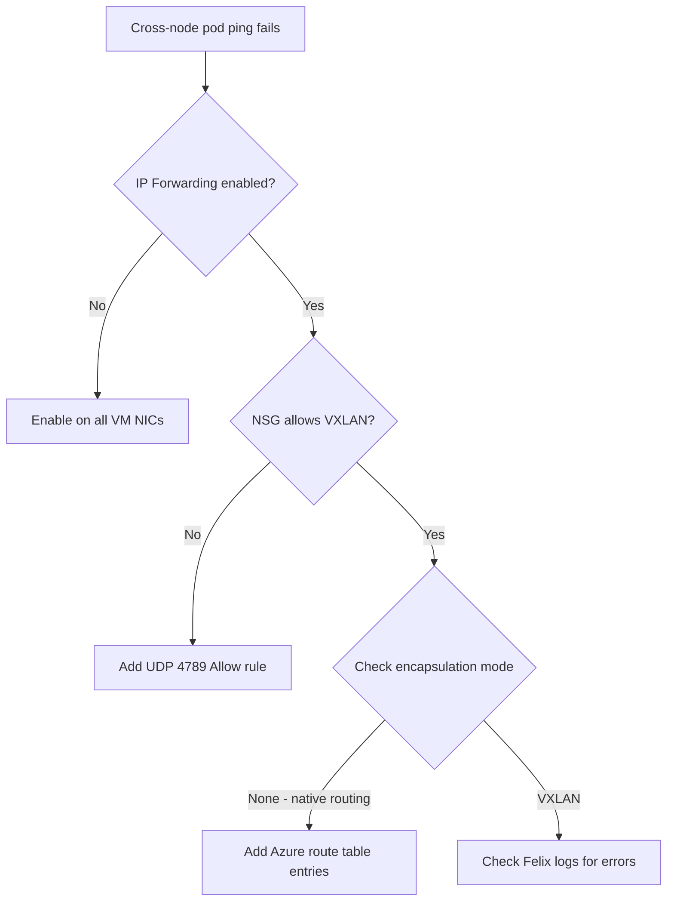

# Troubleshoot Calico Networking on Azure

Author: [nawazdhandala](https://github.com/nawazdhandala)

Tags: Calico, Kubernetes, Networking, Azure, Cloud, Troubleshooting

Description: Diagnose and resolve common Calico networking failures on Azure, including IP forwarding issues, NSG blocking, and VXLAN encapsulation problems on self-managed Kubernetes clusters.

---

## Introduction

Calico networking failures on Azure have a distinct set of root causes compared to other cloud providers. Azure's platform network virtualization enforces strict source IP validation by default, and NSGs block all unlisted traffic. These platform constraints are often the cause of pod networking failures that appear to be Calico misconfigurations but are actually Azure infrastructure issues.

This guide covers the most common failure scenarios for Calico on Azure and provides step-by-step diagnosis and resolution for each.

## Prerequisites

- Azure CLI authenticated with VM and network permissions
- `kubectl` and `calicoctl` with cluster admin access
- SSH access to cluster nodes or ability to run privileged pods
- `tcpdump` available on nodes

## Issue 1: Pods on Different Nodes Cannot Communicate

**Symptom**: `ping` between pods on the same node works, but fails across nodes.

**Diagnosis Flow:**



**Check IP Forwarding:**

```bash
az network nic show --ids /subscriptions/.../networkInterfaces/worker-1-nic \
  --query "enableIPForwarding"
# If false:
az network nic update --ids /subscriptions/.../networkInterfaces/worker-1-nic \
  --ip-forwarding true
```

## Issue 2: NSG Blocking VXLAN Traffic

**Symptom**: Packets sent but not received on destination node. `tcpdump` on sender shows packets, but receiver shows nothing.

```bash
# On sender node
tcpdump -i eth0 udp port 4789 -n

# On receiver node
tcpdump -i eth0 udp port 4789 -n
# If sender shows traffic but receiver doesn't: NSG is dropping it
```

**Resolution:**

```bash
az network nsg rule create \
  --resource-group k8s-rg \
  --nsg-name k8s-workers-nsg \
  --name AllowCalicoVXLAN \
  --priority 200 \
  --direction Inbound \
  --protocol Udp \
  --destination-port-ranges 4789 \
  --source-address-prefixes VirtualNetwork \
  --access Allow
```

## Issue 3: Native Routing Mode - Missing Route Table Entry

**Symptom**: All modes except VXLAN configured, cross-node traffic fails.

```bash
# Check if pod CIDR routes exist
az network route-table route list \
  --resource-group k8s-rg \
  --route-table-name k8s-routes \
  --output table

# Find the node's pod CIDR
calicoctl ipam show --show-blocks | grep worker-2
```

If the pod CIDR for a node is missing from the route table, add it:

```bash
az network route-table route create \
  --resource-group k8s-rg \
  --route-table-name k8s-routes \
  --name worker-2-pods \
  --address-prefix 192.168.2.0/24 \
  --next-hop-type VirtualAppliance \
  --next-hop-ip-address 10.240.0.11
```

## Issue 4: Felix CrashLoopBackOff on Azure

```bash
kubectl logs -n calico-system ds/calico-node --previous | tail -50
```

Common Azure-specific Felix failures:
- Cannot determine node IP (use `IP=autodetect` or specify `IP_AUTODETECTION_METHOD=interface=eth0`)
- Azure IMDS interference (block 169.254.169.254 from pods but allow from nodes)

```yaml
# Fix node IP autodetection
env:
  - name: IP_AUTODETECTION_METHOD
    value: "interface=eth0"
```

## Issue 5: DNS Resolution Failures

```bash
kubectl run test --image=busybox --rm -it -- nslookup kubernetes.default
# If this fails, check CoreDNS pods
kubectl get pods -n kube-system | grep coredns
```

Ensure NSG allows UDP 53 within the VNet.

## Conclusion

Azure Calico troubleshooting starts with two platform-specific checks: IP Forwarding on VM NICs and NSG rules for VXLAN. These cover the majority of cross-node connectivity failures. For more complex issues, `tcpdump` on the VXLAN interface (`vxlan.calico`) provides direct visibility into whether encapsulated packets are being sent and received correctly.
