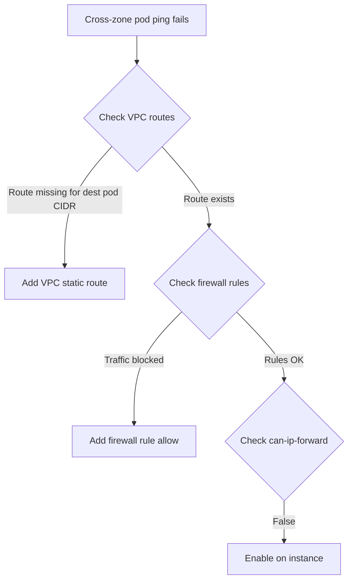

# Troubleshoot Calico Networking on Google Compute Engine

Author: [nawazdhandala](https://github.com/nawazdhandala)

Tags: Calico, Kubernetes, Networking, GCE, Google Cloud, Troubleshooting

Description: Diagnose and resolve common Calico networking problems on GCE, including VPC route misconfigurations, firewall rule issues, and cross-zone connectivity failures.

---

## Introduction

Calico networking failures on GCE typically fall into two categories: GCP infrastructure issues (firewall rules blocking traffic, missing VPC routes, can-ip-forward not set) and Calico configuration issues (wrong IP pool settings, Felix not starting correctly). The GCP-specific issues are often the root cause and should be checked first.

GCE's globally-distributed VPC means that routes and firewall rules apply at the VPC level and may affect zones that appear unrelated. A firewall rule that works for one zone may not cover a new zone if it uses instance tags rather than subnet ranges.

## Prerequisites

- `gcloud` CLI with Compute Engine permissions
- `kubectl` and `calicoctl` with cluster admin access
- SSH access to GCE instances or ability to run privileged pods

## Issue 1: Cross-Zone Pod Communication Failure

**Symptom**: Pods in the same zone communicate; pods in different zones cannot.

**Diagnosis:**

```bash
# Check VPC routes for pod CIDRs
gcloud compute routes list --filter="destRange~192.168" \
  --format="table(name,destRange,nextHopInstance,nextHopInstanceZone)"

# If a zone's pods are failing, check if their node's pod CIDR has a VPC route
calicoctl ipam show --show-blocks | grep worker-us-west1-a
```



**Resolution:**

```bash
# Add missing route
gcloud compute routes create worker-z2-pods \
  --network k8s-network \
  --destination-range 192.168.2.0/24 \
  --next-hop-instance worker-us-west1-a \
  --next-hop-instance-zone us-west1-a
```

## Issue 2: Firewall Rule Not Matching New Nodes

**Symptom**: New node added in a new zone; pods on it can't communicate.

**Check firewall rule scope:**

```bash
gcloud compute firewall-rules describe allow-calico-vxlan \
  --format="yaml(targetTags,targetServiceAccounts,targetResources)"
```

If the rule uses `targetTags`, verify the new node has the correct tag:

```bash
gcloud compute instances describe worker-new \
  --zone us-west1-a \
  --format="value(tags.items[])"
```

**Resolution:**

```bash
gcloud compute instances add-tags worker-new \
  --zone us-west1-a \
  --tags kubernetes-node
```

## Issue 3: can-ip-forward Not Enabled

**Symptom**: Pods on a specific node cannot communicate with any other pods.

```bash
gcloud compute instances describe worker-1 \
  --zone us-central1-a | grep canIpForward
# If missing or false, this is the issue
```

**Resolution:**

For most GCE machine types, can-ip-forward requires stopping the instance:

```bash
gcloud compute instances stop worker-1 --zone us-central1-a

# Update via Terraform or recreate with --can-ip-forward flag
# There is no direct in-place update for canIpForward on existing instances
# Best practice: use instance templates with canIpForward=true
```

## Issue 4: VXLAN Mode Firewall Blocking

If using VXLAN overlay mode (not native routing):

```bash
# Test if UDP 4789 is reaching the node
# SSH to destination node and check
sudo tcpdump -i ens4 udp port 4789 -n -c 10
```

If no packets appear, the GCP firewall is blocking VXLAN:

```bash
gcloud compute firewall-rules create allow-calico-vxlan-fix \
  --network k8s-network \
  --allow udp:4789 \
  --source-tags kubernetes-node \
  --target-tags kubernetes-node
```

## Issue 5: Route Count Limit

GCP VPC has a limit on custom static routes per network (default 250 per region). In large clusters, this can be exhausted:

```bash
gcloud compute routes list --filter="network=k8s-network" | wc -l
```

If approaching the limit, switch to VXLAN mode to eliminate the need for per-node routes:

```bash
calicoctl patch ippool gce-pod-pool \
  --patch='{"spec":{"vxlanMode":"Always"}}'
```

## Conclusion

GCE Calico troubleshooting focuses on three key areas: VPC static route existence for each node's pod CIDR, firewall rules covering all node tags including newly added nodes, and can-ip-forward enabled on all instances. Route count limits are a scalability consideration for large clusters that may require switching to VXLAN mode. Start with these GCP-specific checks before investigating Calico configuration itself.
