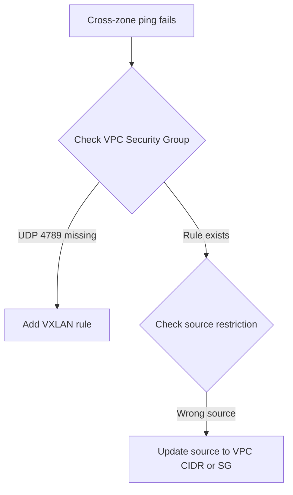

# Troubleshoot Calico Networking on IBM Cloud

Author: [nawazdhandala](https://github.com/nawazdhandala)

Tags: Calico, Kubernetes, Networking, IBM Cloud, Troubleshooting

Description: Diagnose and resolve common Calico networking problems on IBM Cloud, including IKS managed policy conflicts, VPC security group issues, and cross-zone connectivity failures.

---

## Introduction

Calico troubleshooting on IBM Cloud has unique aspects compared to other platforms. On IKS, IBM manages a set of Calico GlobalNetworkPolicies that must not be removed or overridden - doing so can break cluster networking in subtle ways. On self-managed clusters on IBM Cloud VPC, the troubleshooting process is similar to other cloud providers but requires IBM Cloud-specific tools for VPC inspection.

This guide covers the most common Calico networking failures on IBM Cloud and their resolutions.

## Prerequisites

- IBM Cloud CLI with Kubernetes plugin
- `kubectl` and `calicoctl` with cluster admin access
- IBM Cloud VPC access (for self-managed clusters)

## Issue 1: Custom Policy Conflicts with IBM Managed Policies

**Symptom**: After applying a custom GlobalNetworkPolicy, cluster components or node ports stop working.

**Diagnosis:**

```bash
# List all GlobalNetworkPolicies including IBM's
calicoctl get globalnetworkpolicies -o wide | sort

# IBM policies typically have names starting with "ibm-"
# Check if your policy has a lower order number than IBM's policies
```

IBM managed policies typically use:
- Order 1000: `allow-ibm-ports` - allows required IBM infrastructure traffic
- Order 2000: `allow-all-outbound` - allows all egress

```bash
# Check conflicting policy orders
calicoctl get globalnetworkpolicy allow-ibm-ports -o yaml | grep order
calicoctl get globalnetworkpolicy your-policy -o yaml | grep order
```

**Resolution:**

Use order numbers above 3000 for custom policies to avoid conflicting with IBM policies:

```yaml
apiVersion: projectcalico.org/v3
kind: GlobalNetworkPolicy
metadata:
  name: custom-security-policy
spec:
  order: 5000  # Higher than IBM's policies
  selector: "all()"
```

## Issue 2: VPC Security Group Blocking VXLAN

**Symptom**: Cross-zone pod communication fails.



```bash
# Check for VXLAN rule
ibmcloud is security-group-rules <sg-id> | grep -E "4789|vxlan"

# Add if missing
ibmcloud is security-group-rule-add <sg-id> inbound udp \
  --remote <sg-id> \
  --port-min 4789 --port-max 4789
```

## Issue 3: IKS Upgrade Breaks Custom Calico Configuration

**Symptom**: After IKS cluster upgrade, custom Calico policies stop working.

```bash
# Check if IBM overwrite custom policies during upgrade
kubectl get events -n kube-system | grep calico

# Review what changed
calicoctl get globalnetworkpolicies -o yaml | diff - pre-upgrade-backup.yaml
```

**Prevention:**

Back up Calico configuration before upgrades:

```bash
calicoctl get globalnetworkpolicies -o yaml > calico-policies-backup-$(date +%Y%m%d).yaml
```

## Issue 4: Classic Infrastructure IP-in-IP Failure

For IBM Classic Infrastructure clusters:

```bash
# Check Felix logs for encapsulation errors
kubectl logs -n kube-system ds/calico-node --tail=100 | grep -i "ipip\|tunnel"

# Verify IP pool uses IP-in-IP for Classic
calicoctl get ippool default-ipv4-ippool -o yaml | grep ipipMode
# Should be: ipipMode: Always
```

## Issue 5: IPAM Exhaustion on IKS

```bash
# Check IP pool utilization
calicoctl ipam show
# If pool is > 80% full:

# Option 1: Add additional IP pool
calicoctl apply -f - <<EOF
apiVersion: projectcalico.org/v3
kind: IPPool
metadata:
  name: additional-pool
spec:
  cidr: 172.31.0.0/16
  ipipMode: Never
  vxlanMode: Always
  natOutgoing: true
EOF
```

## Issue 6: calicoctl Commands Fail with Auth Error

For IKS, calicoctl needs the cluster's Calico credentials:

```bash
# Regenerate calicoctl config
ibmcloud ks cluster config --cluster my-cluster --admin --network

# The above generates ~/.bluemix/plugins/kubernetes-service/clusters/*/calicoctl.cfg
export KUBECONFIG=~/.bluemix/plugins/...
calicoctl get nodes
```

## Conclusion

Troubleshooting Calico on IBM Cloud requires awareness of IBM's managed policy structure on IKS - custom policies must use order numbers that don't conflict with IBM's managed policies. For self-managed clusters on IBM Cloud VPC, VPC security group rules are the first thing to check for cross-zone failures. Always back up Calico configuration before IKS upgrades to enable quick recovery if IBM's upgrade process modifies policy configuration.
