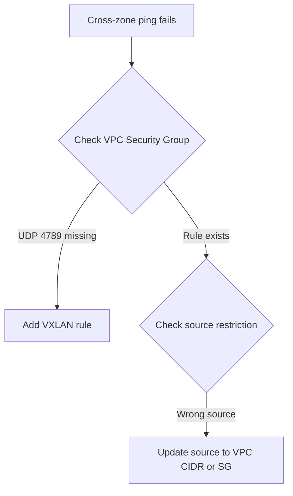

# Troubleshoot Calico Networking on IBM Cloud

Author: [nawazdhandala](https://github.com/nawazdhandala)

Tags: Calico, Kubernetes, Networking, IBM Cloud, Troubleshooting

Description: Diagnose and resolve common Calico networking problems on IBM Cloud, including IKS managed policy conflicts, VPC security group issues, and cross-zone connectivity failures.

---

## Introduction

Calico troubleshooting on IBM Cloud has unique aspects compared to other platforms. On classic IKS clusters, IBM manages a set of default Calico policies that must not be removed - they are recreated during master refreshes or updates, and overriding them without understanding the policy order can break cluster networking in subtle ways. On self-managed clusters on IBM Cloud VPC, the troubleshooting process is similar to other cloud providers but requires IBM Cloud-specific tools for VPC inspection.

This guide covers the most common Calico networking failures on IBM Cloud and their resolutions.

## Prerequisites

- IBM Cloud CLI with Kubernetes plugin
- `kubectl` and `calicoctl` with cluster admin access
- IBM Cloud VPC access (for self-managed clusters)

## Issue 1: Custom Policy Conflicts with IBM Managed Policies

**Symptom**: After applying a custom GlobalNetworkPolicy, cluster components or node ports stop working.

**Diagnosis:**

```bash
# List all GlobalNetworkPolicies including IBM's

calicoctl get globalnetworkpolicies -o wide | sort

# Check whether your policy's selector and order conflict with default host policies
```

Default Calico host policies include:
- `allow-all-outbound` - allows outbound traffic on the public network
- `allow-all-private-default` - allows inbound and outbound traffic on the private network
- `allow-node-port-dnat` - allows NLB, ALB, and NodePort service traffic
- `allow-sys-mgmt` - allows required IBM infrastructure management traffic

```bash
# Check conflicting policy orders
calicoctl get globalnetworkpolicy allow-all-private-default -o yaml | grep order
calicoctl get globalnetworkpolicy your-policy -o yaml | grep order
```

**Resolution:**

Calico applies policies with lower order numbers first. For custom policies that further restrict traffic, choose an order lower than the default allow policy that you intend to override, target the correct IBM host endpoint label, and test that IBM management, NodePort, LoadBalancer, and Ingress traffic still works:

```yaml
apiVersion: projectcalico.org/v3
kind: GlobalNetworkPolicy
metadata:
  name: custom-security-policy
spec:
  order: 900  # Lower order values are evaluated first
  selector: "ibm.role == 'worker_private'"
```

## Issue 2: VPC Security Group Blocking VXLAN

**Symptom**: Cross-zone pod communication fails.


```mermaid
graph TD
    A[Cross-zone ping fails] --> B{Check VPC Security Group}
    B -->|UDP 4789 missing| C[Add VXLAN rule]
    B -->|Rule exists| D{Check source restriction}
    D -->|Wrong source| E[Update source to VPC CIDR or SG]
```

```bash
# Check for VXLAN rule
ibmcloud is security-group-rules <sg-id> | grep -E "4789|vxlan"

# Add if missing
ibmcloud is security-group-rule-add <sg-id> inbound udp \
  --remote <sg-id> \
  --port-min 4789 --port-max 4789
```

## Issue 3: IKS Upgrade Breaks Custom Calico Configuration

**Symptom**: After IKS cluster upgrade, custom Calico policies stop working.

```bash
# Check if IBM updated default policies during the upgrade
kubectl get events -n kube-system | grep calico

# Review what changed
diff -u pre-upgrade-backup.yaml <(calicoctl get globalnetworkpolicies -o yaml)
```

**Prevention:**

Back up Calico configuration before upgrades:

```bash
calicoctl get globalnetworkpolicies -o yaml > calico-policies-backup-$(date +%Y%m%d).yaml
```

## Issue 4: Classic Infrastructure IP-in-IP Failure

For IBM Classic Infrastructure clusters:

```bash
# Check Felix logs for encapsulation errors
kubectl logs -n kube-system ds/calico-node --tail=100 | grep -i "ipip\|tunnel"

# Verify the IP pool encapsulation mode
calicoctl get ippool default-ipv4-ippool -o yaml | grep ipipMode
```

## Issue 5: IPAM Exhaustion on IKS

```bash
# Check IP pool utilization
calicoctl ipam show
# If pool is > 80% full:

# Option 1: Add additional IP pool
# Use only a reserved, non-overlapping pod CIDR that is valid for your cluster.
calicoctl apply -f - <<EOF
apiVersion: projectcalico.org/v3
kind: IPPool
metadata:
  name: additional-pool
spec:
  cidr: 172.31.0.0/16
  vxlanMode: Always
  natOutgoing: true
EOF
```

## Issue 6: calicoctl Commands Fail with Auth Error

For IKS, run `calicoctl` against the Kubernetes datastore with the cluster kubeconfig:

```bash
# Regenerate kubeconfig
ibmcloud ks cluster config --cluster my-cluster

# The above generates ~/.bluemix/plugins/container-service/clusters/<cluster_name>-<hash>/kube-config.yaml
export KUBECONFIG=~/.bluemix/plugins/container-service/clusters/<cluster_name>-<hash>/kube-config.yaml
export DATASTORE_TYPE=kubernetes
calicoctl get nodes
```

## Conclusion

Troubleshooting Calico on IBM Cloud requires awareness of IBM's managed policy structure on classic IKS - custom policies must use selectors and order numbers that don't conflict with IBM's default policies. For self-managed clusters on IBM Cloud VPC, VPC security group rules are the first thing to check for cross-zone failures. Always back up Calico configuration before IKS upgrades to enable quick recovery if IBM's upgrade process modifies policy configuration.
