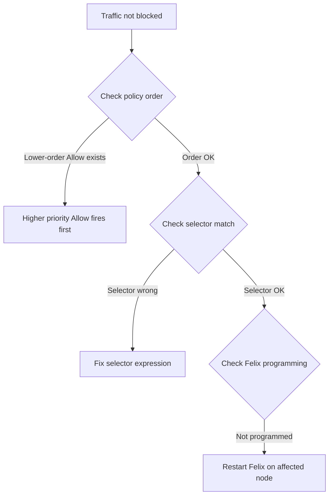

# Troubleshoot Calico NetworkPolicy Resource

Author: [nawazdhandala](https://github.com/nawazdhandala)

Tags: Calico, Kubernetes, Networking, NetworkPolicy, Troubleshooting

Description: Diagnose and resolve common Calico NetworkPolicy resource issues including policies not taking effect, traffic not being denied as expected, and selector mismatches.

---

## Introduction

NetworkPolicy troubleshooting in Calico requires understanding the policy evaluation order (tiers → order → rules) and the interaction between multiple policies. The most common issues are policies that appear correct but don't enforce because selectors don't match, because a higher-priority policy allows traffic before the deny rule is reached, or because Felix hasn't yet programmed the policy change.

## Prerequisites

- `calicoctl` and `kubectl` with cluster admin access
- Access to Calico Felix logs

## Issue 1: Policy Not Blocking Expected Traffic

**Symptom**: Traffic that should be denied by a policy still reaches the destination.

**Diagnosis:**

```bash
# Check all policies that apply to the destination pod
kubectl get pod backend -n production --show-labels
calicoctl get networkpolicies -n production | grep "app == 'backend'"

# Check policy order - is there a lower-order Allow that fires first?
calicoctl get networkpolicies -n production -o wide | sort -k3 -n
```



**Common fix**: Add a more specific allow policy with lower order than the catch-all allow.

## Issue 2: Policy Selector Not Matching

```bash
# Test selector matching
calicoctl get pods -n production -l "app == 'backend'"

# If no pods returned, labels may be wrong
kubectl get pods -n production --show-labels | grep backend
# Compare actual labels with policy selector
```

## Issue 3: Namespace Selector Issues

```bash
# Policy using namespaceSelector
# Verify namespace has the required label
kubectl get namespace production --show-labels

# Namespace label required for cross-namespace policies
kubectl label namespace production environment=production
```

## Issue 4: Policy Applied but Not Programmed by Felix

```bash
# Check Felix logs for programming errors
kubectl logs -n calico-system ds/calico-node | grep "networkpolicy\|error" | tail -50

# Verify Felix sees the policy
kubectl exec -n calico-system ds/calico-node -- \
  curl -s localhost:9091/metrics | grep "felix_active_local_policies"
```

## Issue 5: Protocol Mismatch

```bash
# Policy specifying TCP not catching UDP
# If the protocol field is missing, policy applies to all protocols
calicoctl get networkpolicy allow-web -n production -o yaml | grep protocol

# Test:
kubectl exec -n production frontend -- nc -uzv backend 8080  # UDP test
kubectl exec -n production frontend -- nc -zv backend 8080   # TCP test
```

## Issue 6: Policy Tier Interaction

```bash
# Check if another tier's policy is passing traffic before your tier
calicoctl get tiers
calicoctl get globalnetworkpolicies -o wide | sort -k4 -n
# Look for lower-order policies in higher-priority tiers that might allow traffic first
```

## Issue 7: Policy Evaluation for Existing Connections

Note: Calico policy changes do not immediately affect established TCP connections:

```bash
# If a denial policy is applied but traffic still flows:
# Existing TCP connections may continue until they timeout or are closed
# Force new connections to test the policy
kubectl exec frontend -- wget http://backend:8080  # New connection
```

## Conclusion

NetworkPolicy troubleshooting requires systematic elimination of potential causes: verify selector matching, check policy ordering for unexpected allow interactions, confirm Felix has programmed the policy, and test with new connections (not existing ones). The most common issue is a lower-order allow policy that fires before a deny rule — always review the full policy order chain for the affected pods when a policy doesn't seem to be working.
