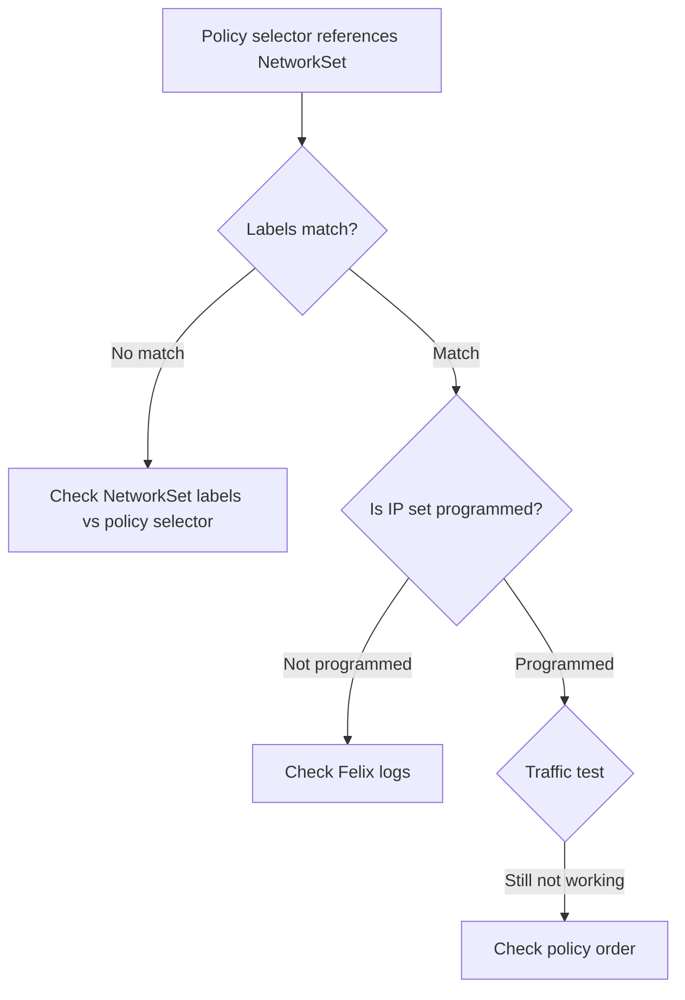

# Troubleshoot Calico NetworkSet Resource

Author: [nawazdhandala](https://github.com/nawazdhandala)

Tags: Calico, Kubernetes, Networking, NetworkSet, Troubleshooting

Description: Diagnose and resolve common issues with Calico NetworkSet resources including IP set not being programmed, selector mismatches, and traffic not being filtered as expected.

---

## Introduction

Calico NetworkSet troubleshooting addresses scenarios where IP sets either aren't being programmed into the kernel, aren't being referenced by the right policies, or contain incorrect IP ranges. Because NetworkSets are referenced by label selectors in policies, the troubleshooting process involves checking both the NetworkSet configuration and the policy selector that references it.

## Prerequisites

- `calicoctl` and `kubectl` with cluster admin access
- Node-level access for kernel IP set inspection

## Issue 1: IP in NetworkSet Is Not Being Blocked/Allowed

**Symptom**: Traffic to/from an IP that should be in the NetworkSet is not being filtered.

**Diagnosis:**

```bash
# Verify the IP is actually in the NetworkSet
calicoctl get globalnetworkset blocked-ips -o yaml | grep "nets:" -A20

# Is the IP in the right format? (CIDR notation required)
# Wrong: "198.199.1.1"
# Correct: "198.199.1.1/32"
```

**Check kernel IP set:**

```bash
# SSH to node
ipset list | grep "cali-s:blocked-ips"
ipset list cali-s:blocked-ips | grep "198.199.1.1"
```

## Issue 2: Policy Not Matching NetworkSet



```bash
# Policy selector: "threat == 'blocked'"
# NetworkSet label: "threat: blocked"
# These must match

calicoctl get globalnetworkset blocked-ips -o yaml | grep -A5 "labels:"
# Must show: threat: blocked

calicoctl get globalnetworkpolicy block-threat-ips -o yaml | grep "selector:"
# Must reference: selector: "threat == 'blocked'"
```

## Issue 3: IP Set Not Programmed After Update

```bash
# After updating a NetworkSet, check if Felix picked up the change
kubectl logs -n calico-system ds/calico-node --since=5m | grep -i "networkset\|ipset"

# Force Felix to resync
kubectl delete pod -n calico-system -l app=calico-node --field-selector spec.nodeName=worker-1
```

## Issue 4: Invalid CIDR Notation

```bash
# Validate all CIDRs in a NetworkSet are valid
calicoctl get networkset trusted-ips -n payments -o json | \
  python3 -c "
import json, sys, ipaddress
data = json.load(sys.stdin)
for net in data['spec']['nets']:
    try:
        ipaddress.ip_network(net, strict=False)
        print(f'Valid: {net}')
    except ValueError as e:
        print(f'INVALID: {net} - {e}')
"
```

## Issue 5: Namespace Scoping Confusion

```bash
# NetworkSet in payments namespace cannot be used in a GlobalNetworkPolicy
# Check: namespace-scoped set used with namespaced policy only
calicoctl get networkset trusted-ips -n payments -o yaml
# Namespace: payments - can only be referenced from NetworkPolicy in payments namespace

# For cluster-wide use, create a GlobalNetworkSet
calicoctl get globalnetworksets
```

## Issue 6: NetworkSet Too Large

Very large NetworkSets (thousands of CIDRs) may impact kernel IP set performance:

```bash
# Count entries
calicoctl get networkset large-set -n ns -o json | \
  python3 -c "import json,sys; d=json.load(sys.stdin); print(len(d['spec']['nets']))"

# If > 1000 entries: consider splitting into multiple sets
# or using CIDR aggregation to reduce count
```

## Conclusion

NetworkSet troubleshooting starts with verifying the IP addresses are correctly formatted as CIDRs, checking that labels exactly match the policy selector expressions that reference the set, and confirming that Felix has programmed the IP set into the kernel. The most common issue is a label mismatch between the NetworkSet's metadata labels and the policy's source/destination selector expression.
