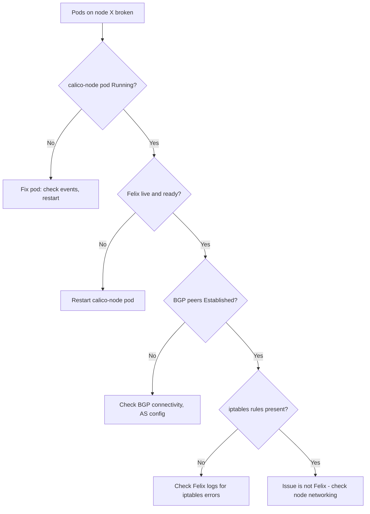

# How to Troubleshoot Calico Node-Level Networking Issues

Author: [nawazdhandala](https://github.com/nawazdhandala)

Tags: Calico, Kubernetes, Networking, Diagnostics, Troubleshooting

Description: Diagnose node-level Calico issues including Felix startup failures, BGP peer losses on individual nodes, and iptables rule inconsistencies that affect pods on a specific cluster node.

---

## Introduction

Node-level Calico issues present as connectivity failures affecting only pods on a specific node while other nodes remain healthy. The diagnostic path focuses on the calico-node pod on that node: is Felix running, are its iptables rules complete, and are its BGP peers Established? Most single-node failures trace to one of these three components.

## Symptom 1: All Pods on One Node Can't Connect

```bash
# Identify the affected node's calico-node pod
PROBLEM_NODE="<node-name>"
CALICO_POD=$(kubectl get pods -n calico-system -l app=calico-node \
  --field-selector="spec.nodeName=${PROBLEM_NODE}" \
  -o jsonpath='{.items[0].metadata.name}')

# Check pod status
kubectl get pod -n calico-system "${CALICO_POD}"

# If Running, check Felix liveness
kubectl exec -n calico-system "${CALICO_POD}" -c calico-node -- \
  calico-node -felix-live
# If not live: Felix is stuck, restart the pod
kubectl delete pod -n calico-system "${CALICO_POD}"
```

## Symptom 2: BGP Peer Lost on One Node

```bash
# Check BGP state from the affected node
kubectl exec -n calico-system "${CALICO_POD}" -c calico-node -- \
  calicoctl node status

# Look for peers in "Active" or "Connect" state (should be "Established")
# Check Felix logs for BGP-related errors
kubectl logs -n calico-system "${CALICO_POD}" -c calico-node | \
  grep -i "bgp\|bird" | tail -20

# Check if the BGP port (179) is reachable from the node
kubectl debug node/"${PROBLEM_NODE}" --image=alpine -- \
  nc -zv <peer-ip> 179
```

## Symptom 3: iptables Rules Missing on Node

```bash
# Check if Calico iptables chains exist on the node
kubectl debug node/"${PROBLEM_NODE}" --image=nicolaka/netshoot -- \
  nsenter -t 1 -n -- iptables -L | grep -c "cali-"
# If 0: Felix has not programmed iptables rules

# Check Felix logs for iptables programming errors
kubectl logs -n calico-system "${CALICO_POD}" -c calico-node | \
  grep -i "iptables\|error" | tail -30
```

## Node Troubleshooting Flow



## Collect Node-Specific Diagnostics

```bash
# Collect everything needed for Tigera support ticket
kubectl logs -n calico-system "${CALICO_POD}" -c calico-node > node-logs.txt
kubectl exec -n calico-system "${CALICO_POD}" -c calico-node -- \
  calicoctl node status > node-bgp-status.txt
kubectl exec -n calico-system "${CALICO_POD}" -c calico-node -- \
  calicoctl node diags
```

## Conclusion

Single-node Calico failures follow a predictable diagnostic path: check the calico-node pod status, verify Felix liveness, confirm BGP peer state, and verify iptables rules are programmed. Restarting the calico-node pod resolves 60% of single-node Felix failures since Felix will re-program all iptables rules and re-establish BGP peers on startup. Collect the diagnostic bundle before restarting to preserve the state for post-incident analysis.
