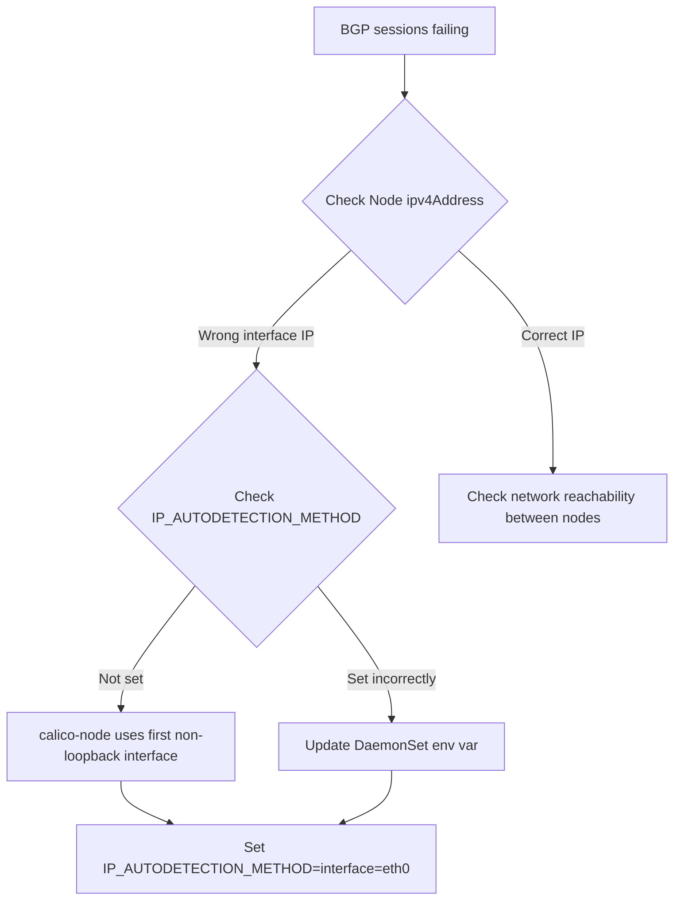

# Troubleshoot Calico Node Resource

Author: [nawazdhandala](https://github.com/nawazdhandala)

Tags: Calico, Kubernetes, Networking, Node, Troubleshooting

Description: Diagnose and resolve common Calico Node resource issues including missing node entries, incorrect IP address auto-detection, BGP session failures, and tunnel IP conflicts.

---

## Introduction

Calico Node resource issues typically manifest as BGP routing problems or pod connectivity failures. The Node resource is automatically created and updated by the calico-node agent, so problems often trace back to the calico-node pod itself — whether it failed to start, detected the wrong interface, or lost its connection to the datastore. Understanding how calico-node populates the Node resource is key to diagnosing these problems.

## Prerequisites

- `calicoctl` and `kubectl` with cluster admin access
- Access to calico-node pod logs on affected nodes

## Issue 1: Node Resource Missing

**Symptom**: A Kubernetes node exists but has no Calico Node resource. Pods on that node cannot communicate with pods on other nodes.

**Diagnosis:**

```bash
# Compare Kubernetes and Calico node lists
kubectl get nodes -o name | sed 's|node/||' | sort > /tmp/k8s-nodes.txt
calicoctl get nodes -o json | python3 -c 'import json,sys; [print(n["metadata"]["name"]) for n in json.load(sys.stdin)["items"]]' | sort > /tmp/calico-nodes.txt
diff /tmp/k8s-nodes.txt /tmp/calico-nodes.txt

# Check calico-node pod status on the missing node
kubectl get pods -n calico-system -l app=calico-node -o wide | grep <node-name>
kubectl logs -n calico-system -l app=calico-node --field-selector spec.nodeName=<node-name>
```

**Fix**: If calico-node pod is crashing, resolve the pod startup issue (often a datastore connectivity problem or incorrect environment variables).

## Issue 2: Wrong IP Address Detected

**Symptom**: BGP sessions fail because the Node resource has an IP from the wrong interface.

**Diagnosis:**

```bash
# Check what IP was detected
calicoctl get node <node-name> -o yaml | grep ipv4Address

# Check available interfaces on the node
kubectl debug node/<node-name> -it --image=busybox -- ip addr
```



**Fix**: Set the `IP_AUTODETECTION_METHOD` environment variable in the calico-node DaemonSet:

```bash
kubectl set env daemonset/calico-node -n calico-system \
  IP_AUTODETECTION_METHOD=interface=eth0
```

## Issue 3: Tunnel IP Conflict

**Symptom**: Intermittent packet loss between pods on two specific nodes.

**Diagnosis:**

```bash
# Check for duplicate tunnel IPs
calicoctl get nodes -o json | python3 -c "
import json, sys
data = json.load(sys.stdin)
seen = {}
for n in data['items']:
    tip = n['spec'].get('ipv4VXLANTunnelAddr')
    if tip:
        if tip in seen:
            print(f'CONFLICT: {n[\"metadata\"][\"name\"]} and {seen[tip]} both have {tip}')
        seen[tip] = n['metadata']['name']
"
```

**Fix**: Delete the Node resource for the affected node and let calico-node recreate it with a fresh tunnel IP assignment.

## Issue 4: BGP Sessions Not Established

```bash
# Check BIRD status on the node
NODE_POD=$(kubectl get pod -n calico-system -o name -l app=calico-node | head -1)
kubectl exec -n calico-system $NODE_POD -- birdcl show protocols all | grep -A5 BGP

# Check Felix logs for BGP-related errors
kubectl logs -n calico-system ds/calico-node | grep -i "bgp\|bird\|peer" | tail -30
```

## Issue 5: Node Resource Not Updating

```bash
# Force calico-node to re-sync by restarting it on the affected node
kubectl rollout restart daemonset/calico-node -n calico-system
# Or delete the specific pod to trigger restart
kubectl delete pod -n calico-system -l app=calico-node --field-selector spec.nodeName=<node-name>
```

## Conclusion

Node resource troubleshooting follows a path from resource existence to IP correctness to BGP session health. The most impactful issues are missing Node resources (no connectivity from that node) and wrong IP detection (BGP sessions never establish). The `IP_AUTODETECTION_METHOD` setting is the most common configuration fix, as default auto-detection picks the wrong interface in multi-NIC environments.
