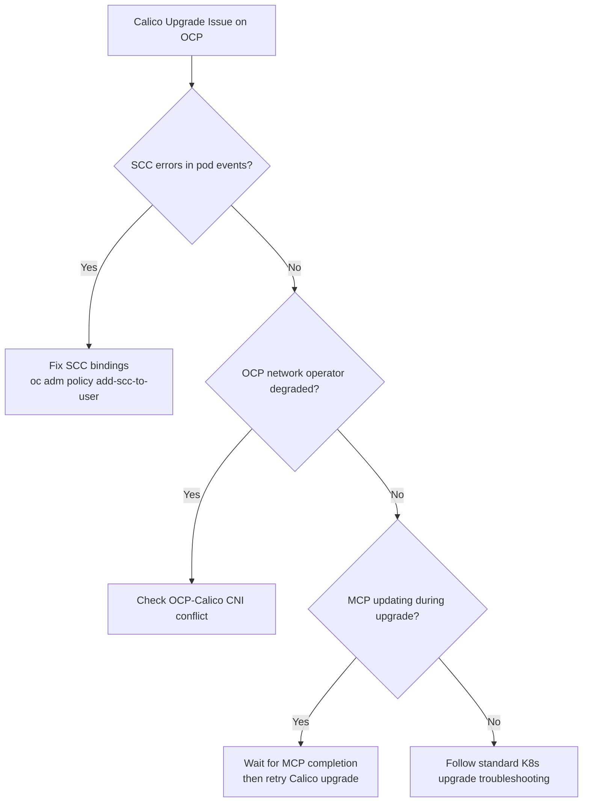

# How to Troubleshoot Calico on OpenShift Upgrades

Author: [nawazdhandala](https://github.com/nawazdhandala)

Tags: Calico, OpenShift, Kubernetes, Networking, Upgrade, Troubleshooting

Description: Diagnose and resolve Calico upgrade failures specific to OpenShift, including SCC permission errors, OLM conflicts, and MachineConfigPool interactions.

---

## Introduction

Calico upgrade failures on OpenShift often have OpenShift-specific root causes that don't appear in vanilla Kubernetes: Security Context Constraint (SCC) changes that prevent Calico pods from starting, conflicts with OCP's built-in networking operators, or MachineConfigPool updates that restart nodes during the Calico rolling update.

## Symptom 1: calico-node Pods Fail with SCC Errors

```bash
# Check pod events for SCC-related failures
oc describe pod <calico-node-pod> -n calico-system | grep -A10 "Events:"

# Common SCC errors:
# "unable to validate against any security context constraint"
# "Error creating: pods 'calico-node-xxx' is forbidden: unable to validate against any SCC"

# List available SCCs and check calico-node's binding
oc get scc | grep calico
oc get scc calico-node -o yaml | grep -E "users|groups|serviceAccounts"

# Check if calico-node service account has the right SCC
oc adm policy who-can use scc calico-node | grep calico

# Fix: grant SCC to service account
oc adm policy add-scc-to-user calico-node -z calico-node -n calico-system
```

## Symptom 2: OCP Network Operator Conflicts with Calico

```bash
# After Calico upgrade, check if OCP network operator is unhappy
oc get co network
oc describe co network | grep -A5 "Conditions:"

# Check if OCP tried to change the CNI after upgrade
oc get network.operator.openshift.io cluster -o yaml | \
  grep -A10 "defaultNetwork"

# Look for OCP network operator logs
oc logs -n openshift-network-operator deploy/network-operator | tail -50 | \
  grep -i "calico\|error\|conflict"
```

## Symptom 3: MachineConfigPool Update Interfering with Calico

```bash
# Check if nodes are being rebooted by MCP during Calico upgrade
oc get mcp -w

# Check if any nodes are in a maintenance state
oc get nodes | grep SchedulingDisabled

# MachineConfig updates force node reboots - this can restart calico-node
# before the Calico upgrade is complete, causing confusion

# Wait for all MCPs to finish before continuing Calico upgrade
watch oc get mcp
# Wait for: UPDATED=True, UPDATING=False on all MCPs
```

## Symptom 4: Calico Enterprise Operator Version Mismatch

```bash
# For Calico Enterprise on OCP with OLM management
oc get csv -n calico-system | grep tigera

# Check for operator version conflicts
oc get subscription -n calico-system -o yaml | grep -A5 "channel\|startingCSV"

# Check operator group
oc get operatorgroup -n calico-system
```

## OpenShift Upgrade Troubleshooting Flow



## Conclusion

OpenShift-specific Calico upgrade failures revolve around SCC permission changes, OCP network operator interaction, and MachineConfigPool node reboots interfering with the rolling update. Always check SCC bindings first when calico-node pods fail to start, and verify MachineConfigPools are stable before initiating Calico upgrades. The OpenShift network operator is a common source of silent conflicts - check its status and logs whenever Calico behaves unexpectedly after an upgrade on OCP.
