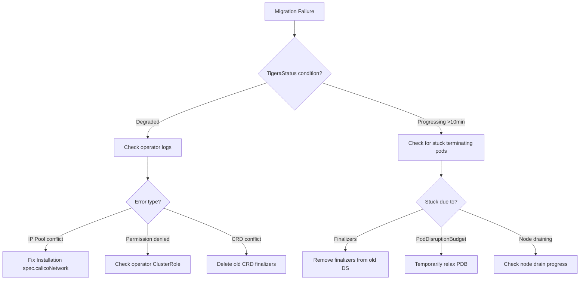

# How to Troubleshoot Calico Operator Migration

Author: [nawazdhandala](https://github.com/nawazdhandala)

Tags: Calico, Kubernetes, Networking, Operator, Migration, Troubleshooting

Description: Diagnose and resolve common issues during Calico manifest-to-operator migration, including namespace conflicts, resource ownership problems, and network disruption scenarios.

---

## Introduction

Calico operator migration failures can leave your cluster in a partially migrated state where some nodes have networking managed by the operator and others still run the old manifest-based configuration. This split state is particularly dangerous because network policy enforcement may be inconsistent across nodes.

Understanding the migration state machine and the operator's error handling is essential for effective troubleshooting. The Tigera Operator surfaces its status via `TigeraStatus` resources, but the error messages can be cryptic. This guide maps common error messages to their causes and resolutions.

## Prerequisites

- Calico migration in progress or failed
- `kubectl` with cluster-admin access
- `calicoctl` CLI

## Symptom 1: Operator Stuck "Reconciling"

```bash
# Check TigeraStatus
kubectl get tigerastatus

# If stuck in Progressing state for >10 minutes:
kubectl describe tigerastatus calico | grep -A10 "Conditions:"

# Check operator logs for the blocking action
kubectl logs -n tigera-operator deploy/tigera-operator | tail -100

# Common stuck states:
# - Waiting for old kube-system pods to terminate
# - Cannot delete manifest CRDs due to finalizers
# - Resource conflict between old and new management
```

## Symptom 2: Old calico-node Pods Not Terminating

```bash
# Check if old pods are stuck terminating
kubectl get pods -n kube-system | grep calico

# If stuck in Terminating:
kubectl describe pod <stuck-pod> -n kube-system | grep -A5 "Events:"

# Force delete if necessary (pods will be re-created by the new operator-managed DS)
kubectl delete pod <pod-name> -n kube-system --force --grace-period=0

# Check for finalizers blocking deletion
kubectl get ds calico-node -n kube-system -o jsonpath='{.metadata.finalizers}'

# Remove finalizers if needed
kubectl patch ds calico-node -n kube-system \
  --type=json -p='[{"op":"remove","path":"/metadata/finalizers"}]'
```

## Symptom 3: TigeraStatus Shows "NodeNetworkUnavailable"

```bash
# This indicates calico-node failed to configure networking on some nodes
kubectl get nodes -o custom-columns=\
'NAME:.metadata.name,READY:.status.conditions[?(@.type=="Ready")].status,\
NETWORK:.status.conditions[?(@.type=="NetworkReady")].status'

# Check the affected node's calico-node log
NODE="<node-name>"
kubectl logs -n calico-system \
  $(kubectl get pod -n calico-system -l k8s-app=calico-node \
    --field-selector spec.nodeName=${NODE} -o jsonpath='{.items[0].metadata.name}')
```

## Symptom 4: IP Pool Configuration Mismatch

```bash
# If the Installation CR doesn't match the existing IP pool,
# the operator may try to recreate it, causing disruption

# Check what the operator thinks the IP pool should be
kubectl get installation default -o jsonpath='{.spec.calicoNetwork.ipPools}' | jq .

# Check what's actually configured
calicoctl get ippools -o yaml

# If there's a mismatch, update the Installation to match
kubectl patch installation default --type=merge -p '{
  "spec": {
    "calicoNetwork": {
      "ipPools": [{
        "cidr": "192.168.0.0/16",
        "encapsulation": "VXLAN"
      }]
    }
  }
}'
```

## Migration State Troubleshooting Flow



## Symptom 5: Migration Rolledback by Operator

```bash
# If the operator detected an incompatible configuration and rolled back:
kubectl get events -n calico-system --sort-by='.lastTimestamp' | tail -20

# Check for specific rollback events
kubectl describe installation default | grep -A20 "Events:"

# Review what the operator couldn't reconcile
kubectl logs -n tigera-operator deploy/tigera-operator | grep -i "rollback\|revert\|undo"
```

## Recovering from a Partial Migration

```bash
# If nodes are split between old and new management:

# 1. Check which nodes have new vs old calico-node
echo "=== Operator-managed nodes (calico-system) ==="
kubectl get pods -n calico-system -l k8s-app=calico-node \
  -o jsonpath='{range .items[*]}{.spec.nodeName}{"\n"}{end}' | sort

echo "=== Manifest-managed nodes (kube-system) ==="
kubectl get pods -n kube-system -l k8s-app=calico-node \
  -o jsonpath='{range .items[*]}{.spec.nodeName}{"\n"}{end}' | sort

# 2. Complete the migration by forcing operator to take over remaining nodes
# This is usually done by deleting the kube-system calico-node pods
# so the operator's DaemonSet can schedule new ones
kubectl delete pods -n kube-system -l k8s-app=calico-node
```

## Conclusion

Calico operator migration failures most commonly manifest as stuck terminating pods, TigeraStatus degraded conditions, or IP pool configuration mismatches. The key to fast resolution is checking TigeraStatus conditions first, then operator logs, then individual pod states. Always have a backup of your pre-migration Calico resources so you can compare the expected vs actual configuration when diagnosing mismatches. In the worst case, the operator's rollback mechanisms and your backup files allow you to restore the original manifest-based installation.
