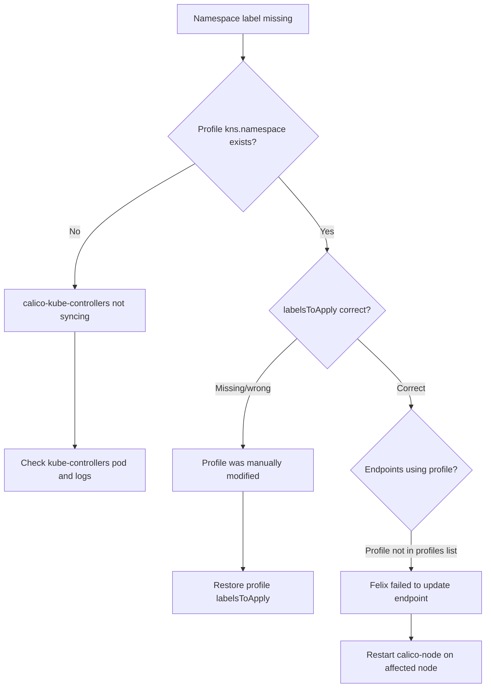

# Troubleshoot Calico Profile Resource

Author: [nawazdhandala](https://github.com/nawazdhandala)

Tags: Calico, Kubernetes, Networking, Profile, Troubleshooting

Description: Diagnose and resolve common Calico Profile resource issues including missing namespace profiles, broken label inheritance, unexpected traffic behavior from profile rules, and profile-NetworkPolicy ordering conflicts.

---

## Introduction

Calico Profile issues are often subtle because profiles affect label inheritance — a misconfigured profile causes selector-based policies to stop matching endpoints without any obvious error. The most common issue in Kubernetes clusters is a namespace profile that is out of sync with the actual namespace, causing the namespace label not to propagate to workload endpoints. This breaks any NetworkPolicy that uses `namespaceSelector` to match pods in that namespace.

## Prerequisites

- `calicoctl` and `kubectl` with cluster admin access
- Access to Felix logs

## Issue 1: Namespace Label Missing from Workload Endpoints

**Symptom**: Cross-namespace NetworkPolicy using `namespaceSelector` stops working. Pods that should be allowed by another namespace's policy are being blocked.

**Diagnosis:**

```bash
# Check if namespace profile exists and has correct labelsToApply
calicoctl get profile kns.production -o yaml

# Check if workload endpoints have the namespace label
calicoctl get workloadendpoint -n production -o json | python3 -c "
import json, sys
data = json.load(sys.stdin)
for ep in data['items']:
    labels = ep['metadata'].get('labels', {})
    ns_label = labels.get('pcns.projectcalico.org/name', 'MISSING')
    print(f'{ep[\"metadata\"][\"name\"]}: {ns_label}')
"
```

**Fix**: If the profile is missing the `labelsToApply` field, it may have been manually edited. Restore from the expected template or delete and let calico-kube-controllers recreate it.

## Issue 2: Profile Not Synchronized for New Namespace

**Symptom**: A newly created namespace has no Calico Profile, so pods in that namespace can't be matched by namespace-level selectors.

**Diagnosis:**

```bash
# Check if profile exists for the new namespace
calicoctl get profile kns.new-namespace

# Check calico-kube-controllers logs for namespace sync
kubectl logs -n calico-system deployment/calico-kube-controllers | grep "namespace\|profile" | tail -20
```



**Fix**: Restart calico-kube-controllers to trigger re-sync:

```bash
kubectl rollout restart deployment/calico-kube-controllers -n calico-system
```

## Issue 3: Profile Rules Creating Unexpected Allow

**Symptom**: Traffic is allowed that shouldn't be. NetworkPolicy is denying the traffic but it still gets through.

**Diagnosis:**

```bash
# Check if the profile has permissive rules that fire after NetworkPolicy
calicoctl get profile kns.production -o yaml | grep -A5 "ingress:\|egress:"

# Profile rules fire AFTER NetworkPolicies
# A profile with 'Allow all egress' will override a NetworkPolicy deny
```

**Fix**: Remove overly permissive rules from the namespace profile:

```bash
calicoctl patch profile kns.production \
  --patch='{"spec":{"egress":[{"action":"Allow","destination":{"selector":"pcns.projectcalico.org/name == \"production\""}}]}}'
```

## Issue 4: Profile Manual Edit Breaking Kubernetes Sync

```bash
# If you manually edit a profile, calico-kube-controllers may overwrite your changes
# Check if the profile content matches the Kubernetes namespace
kubectl get namespace production -o yaml | grep labels

# calico-kube-controllers will regenerate the profile based on namespace labels
# Do not manually edit namespace profiles in Kubernetes deployments
```

## Conclusion

Profile troubleshooting in Kubernetes primarily involves ensuring the calico-kube-controllers sync loop is healthy and that namespace profiles have not been manually modified. The critical path is: namespace exists → profile created → labelsToApply populated → labels propagated to workload endpoints → namespace selector policies match. Any break in this chain causes namespace-scoped cross-namespace policies to silently fail.
