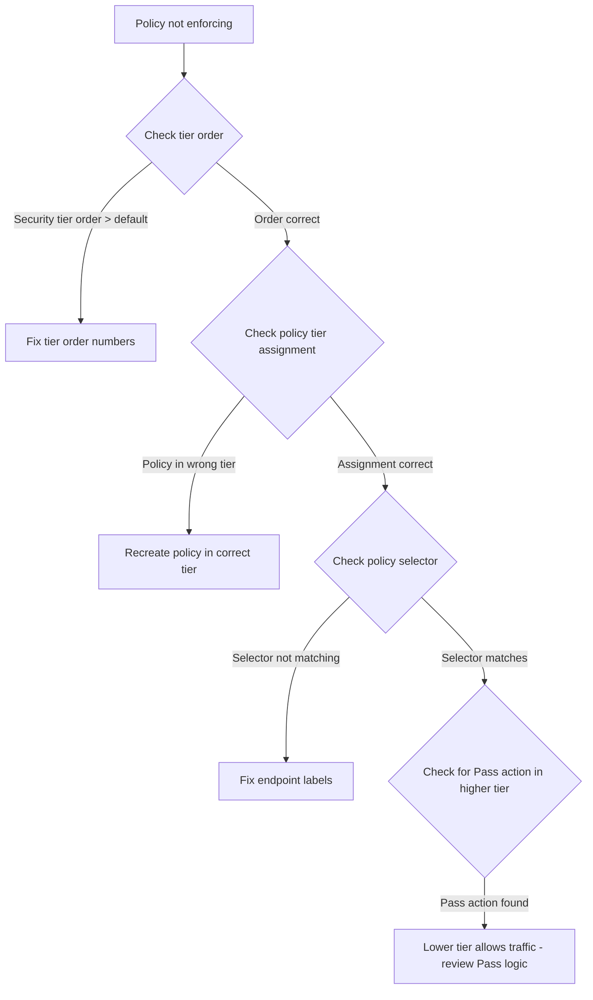

# Troubleshoot Calico Tier Resource

Author: [nawazdhandala](https://github.com/nawazdhandala)

Tags: Calico, Kubernetes, Networking, Tier, Troubleshooting

Description: Diagnose and resolve common Calico Tier resource issues including policies in wrong tiers, unexpected tier evaluation order, security baseline bypass, and tier ordering conflicts.

---

## Introduction

Calico Tier troubleshooting requires understanding how tier order maps to evaluation priority and how policies within tiers interact. The most impactful issues are policies deployed to the wrong tier (causing intended security rules to be evaluated after application rules that allow the traffic) and tier ordering that doesn't match the security design (platform tier evaluating before security tier). Both failures can silently undermine the security model without generating any errors.

## Prerequisites

- `calicoctl` with cluster admin access
- Understanding of expected tier hierarchy and policy assignments
- Access to Felix logs for policy evaluation debugging

## Issue 1: Security Policy Not Enforcing - Lower-Priority Tier Allows Traffic First

**Symptom**: A deny rule in the security tier doesn't block traffic that a policy in the default tier allows.

**Diagnosis:**

```bash
# Check tier orders - security must have LOWER order number than default
calicoctl get tiers -o json | python3 -c "
import json, sys
data = json.load(sys.stdin)
for t in sorted(data['items'], key=lambda x: x['spec'].get('order', 9999)):
    print(f'{t[\"metadata\"][\"name\"]}: order={t[\"spec\"].get(\"order\", \"none\")}')
"

# If security tier has higher order number than default, it evaluates AFTER default
# This means default tier allows can bypass security tier denies
```

**Fix**: Update the security tier to have a lower order number:

```bash
calicoctl patch tier security --patch='{"spec":{"order": 100}}'
```

## Issue 2: Policy Assigned to Wrong Tier

**Symptom**: A policy expected to be in the security tier is being evaluated at the wrong priority.

**Diagnosis:**

```bash
# Check which tier a policy is in
calicoctl get globalnetworkpolicy security.block-threats -o yaml | grep tier

# List all policies and their tier assignments
calicoctl get globalnetworkpolicies -o json | python3 -c "
import json, sys
data = json.load(sys.stdin)
for p in data['items']:
    name = p['metadata']['name']
    tier = p['spec'].get('tier', 'default')
    print(f'{name}: tier={tier}')
" | sort
```



**Fix**: Recreate the policy with the correct tier specification:

```bash
# Export, modify tier field, and reapply
calicoctl get globalnetworkpolicy wrong-tier-policy -o yaml | \
  sed 's/tier: platform/tier: security/' | \
  calicoctl apply -f -
```

## Issue 3: Tier Pass Action Bypassing Security

```bash
# A tier with 'Pass' on all unmatched traffic passes to next tier
# If security tier has no policy for certain traffic, it implicitly passes to default
# Verify all tiers have appropriate catch-all policies

calicoctl get globalnetworkpolicies -o wide | grep "tier.*order" | sort -k4 -n
# Look for gaps in coverage - traffic types not covered by any tier policy
```

## Issue 4: RBAC Allowing Wrong Team to Modify Security Tier

```bash
# Check who can modify security tier policies
kubectl get clusterrolebindings -o json | python3 -c "
import json, sys
data = json.load(sys.stdin)
for crb in data['items']:
    name = crb['metadata']['name']
    if 'calico\|security\|network' in name.lower():
        subjects = crb.get('subjects', [])
        for s in subjects:
            print(f'{name}: {s[\"kind\"]} {s[\"name\"]}')
"
```

## Issue 5: New Tier Not Taking Effect

```bash
# Felix needs to pick up new tier configuration
# Check Felix logs for tier programming
kubectl logs -n calico-system ds/calico-node | grep "tier\|Tier" | tail -20

# Verify tier is visible in datastore
calicoctl get tier security -o yaml
```

## Conclusion

Tier troubleshooting centers on ordering and assignment: verify security tier has lower order than default, verify policies are in the intended tiers, and verify no unintended `Pass` actions allow traffic to skip security tier evaluation. The most dangerous failure mode is a reversed tier order - it can appear to work normally for most traffic while allowing a specific class of traffic to bypass security controls entirely.
