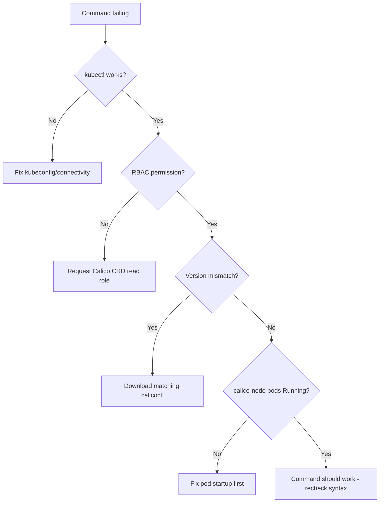

# How to Troubleshoot Calico Troubleshooting Command Failures

Author: [nawazdhandala](https://github.com/nawazdhandala)

Tags: Calico, Kubernetes, Networking, Troubleshooting

Description: Diagnose and resolve failures in Calico troubleshooting commands including calicoctl connection errors, permission failures, version mismatches, and commands returning empty or incorrect output.

---

## Introduction

Calico troubleshooting commands can fail for reasons unrelated to the cluster problem you're diagnosing. calicoctl returning "connection refused", `kubectl get tigerastatus` returning "no resources found", or `calicoctl node status` timing out are all command-level failures that need to be resolved before you can diagnose the underlying Calico issue.

## Symptom 1: calicoctl Returns "connection refused"

```bash
# Check DATASTORE_TYPE and credentials
echo "DATASTORE_TYPE: ${DATASTORE_TYPE}"
echo "KUBECONFIG: ${KUBECONFIG}"

# Test kubectl directly first
kubectl get nodes

# If kubectl works but calicoctl fails, check calicoctl version
calicoctl version
# Client version should match cluster Calico version

# For Kubernetes datastore, ensure DATASTORE_TYPE=kubernetes is set
export DATASTORE_TYPE=kubernetes
calicoctl version  # Retry
```

## Symptom 2: tigerastatus Returns "no resources found"

```bash
# Check if the TigeraStatus CRD exists
kubectl get crd | grep tigerastatus

# If missing: Tigera Operator is not installed
# If present but no resources: Operator installed but not initialized
kubectl get pods -n tigera-operator

# Check operator logs
kubectl logs -n tigera-operator -l k8s-app=tigera-operator | tail -30
```

## Symptom 3: calicoctl Commands Return Empty Output

```bash
# Check RBAC - calicoctl uses the current kubeconfig ServiceAccount
kubectl auth can-i list felixconfigurations
kubectl auth can-i list bgppeers
kubectl auth can-i list globalnetworkpolicies

# If "no": your user lacks Calico CRD read permissions
# Request cluster-admin or a custom role with Calico CRD access
```

## Symptom 4: calicoctl node status Times Out

```bash
# calicoctl node status requires exec into a calico-node pod
# If calico-node pods are crash-looping, the command will fail

kubectl get pods -n calico-system -l k8s-app=calico-node
# Check for CrashLoopBackOff or Error

# Alternative: use the Felix metrics port to check BGP state
CALICO_POD=$(kubectl get pods -n calico-system -l k8s-app=calico-node \
  -o jsonpath='{.items[0].metadata.name}')
kubectl exec -n calico-system "${CALICO_POD}" -c calico-node -- \
  birdcl show protocols | grep BGP
```

## Troubleshooting Flow



## Conclusion

Most calicoctl command failures are caused by environment issues: wrong DATASTORE_TYPE, missing RBAC permissions, or a version mismatch between calicoctl and the cluster. Resolve these in order (kubectl works, RBAC correct, version matches, pods running) before debugging the Calico cluster itself. Keep a tested calicoctl binary in your troubleshooting environment and validate it against the cluster weekly.
