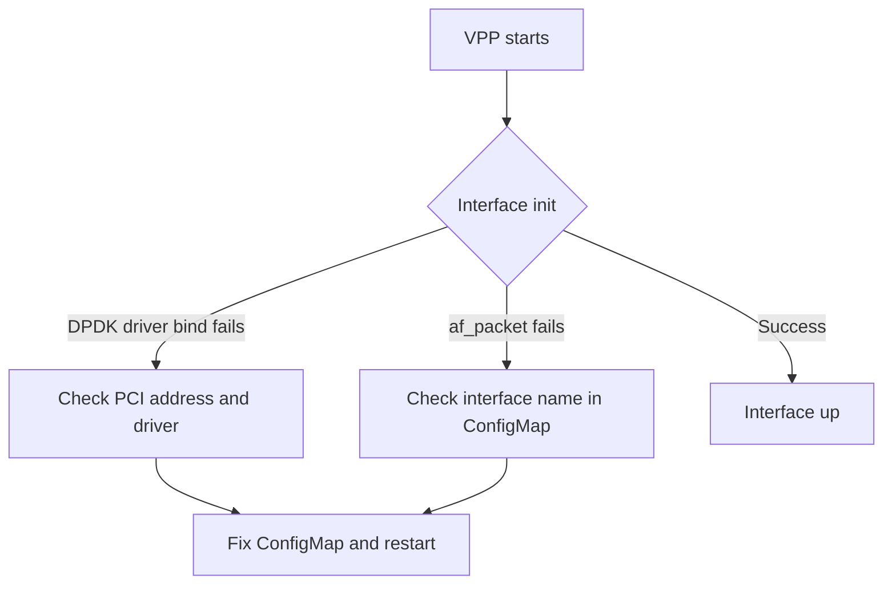

# Troubleshoot Calico VPP Host Networking

Author: [nawazdhandala](https://github.com/nawazdhandala)

Tags: Calico, Kubernetes, Networking, VPP, DPDK, Troubleshooting

Description: Diagnose and resolve common issues with Calico VPP host networking, including VPP startup failures, interface initialization problems, and pod connectivity issues.

---

## Introduction

Calico VPP troubleshooting is more complex than standard Calico because the VPP dataplane runs as a separate process and may fail in ways that are not immediately visible from Kubernetes. VPP takes ownership of the primary network interface, so startup failures can make the node temporarily unreachable. Understanding VPP's initialization sequence and having out-of-band access are prerequisites for safe VPP operation.

This guide covers the most common VPP failure modes and the diagnostic tools needed to identify and resolve them.

## Prerequisites

- Out-of-band console access to nodes (critical for VPP troubleshooting)
- `kubectl` and ability to exec into VPP pods
- Understanding of VPP's initialization sequence
- Node-level shell access

## Issue 1: VPP Fails to Start

**Symptom**: `calico-vpp-node` pod is CrashLoopBackOff; node may lose network connectivity.

**Diagnosis:**

```bash
kubectl logs -n calico-vpp-dataplane ds/calico-vpp-node -c vpp-manager --previous
# Look for VPP initialization errors

# On the node (if accessible)
journalctl -u vpp --since "10 minutes ago" | tail -50
```

**Common causes:**

```bash
# 1. Insufficient hugepages
grep HugePages_Free /proc/meminfo
# If HugePages_Free is 0: increase hugepages

# 2. Wrong PCI address for DPDK
lspci | grep -i network
# Verify the PCI address in ConfigMap matches the actual NIC

# 3. Missing DPDK modules
modprobe vfio-pci
modprobe uio_pci_generic
```

## Issue 2: Interface Initialization Failure



**Diagnosis:**

```bash
# Check VPP interface status
kubectl exec -n calico-vpp-dataplane ds/calico-vpp-node -c vpp -- \
  vppctl show interface
# Interface should show state "up"

# If interface is down
kubectl exec -n calico-vpp-dataplane ds/calico-vpp-node -c vpp -- \
  vppctl show hardware-interfaces
```

**Resolution for af_packet mode:**

```yaml
# Ensure interface name matches the actual interface
data:
  CALICOVPP_INTERFACES: |
    {
      "uplinkInterfaces": [
        {
          "interfaceName": "eth0"  # Verify this is correct on the node
        }
      ]
    }
```

## Issue 3: Pods Cannot Communicate Through VPP

**Diagnosis:**

```bash
# Check pod tap interface exists in VPP
kubectl exec -n calico-vpp-dataplane ds/calico-vpp-node -c vpp -- \
  vppctl show interface | grep tap

# Check IP routes in VPP FIB
kubectl exec -n calico-vpp-dataplane ds/calico-vpp-node -c vpp -- \
  vppctl show ip fib
```

**Check VPP ACL policy:**

```bash
# Verify policy tables are populated
kubectl exec -n calico-vpp-dataplane ds/calico-vpp-node -c vpp -- \
  vppctl show acl-plugin acl

# If empty, the Calico agent may not have programmed policies into VPP
kubectl logs -n calico-vpp-dataplane ds/calico-vpp-node -c agent --tail=100
```

## Issue 4: Hugepage Memory Issues

```bash
# Check VPP memory usage
kubectl exec -n calico-vpp-dataplane ds/calico-vpp-node -c vpp -- \
  vppctl show memory | grep hugepages

# If VPP is running out of memory
# Increase hugepages on the node
echo 2048 > /proc/sys/vm/nr_hugepages

# Update the pod resource limits
kubectl patch ds calico-vpp-node -n calico-vpp-dataplane \
  --type=json \
  -p='[{"op":"replace","path":"/spec/template/spec/containers/0/resources/limits/hugepages-2Mi","value":"2Gi"}]'
```

## Issue 5: Performance Lower Than Expected

```bash
# Check VPP is using DPDK (not af_packet)
kubectl exec -n calico-vpp-dataplane ds/calico-vpp-node -c vpp -- \
  vppctl show dpdk

# Check VPP worker thread count
kubectl exec -n calico-vpp-dataplane ds/calico-vpp-node -c vpp -- \
  vppctl show threads
# Worker threads should match the number of CPUs assigned to VPP
```

## Conclusion

Calico VPP troubleshooting requires VPP-native diagnostic tools and out-of-band node access. The most critical precaution is maintaining console access to nodes before deploying VPP, since VPP startup failures can leave nodes with no network connectivity. The most common issues are hugepage configuration errors, wrong interface names or PCI addresses, and missing DPDK kernel modules. Resolve each category in order, starting with the lowest-level infrastructure requirements.
