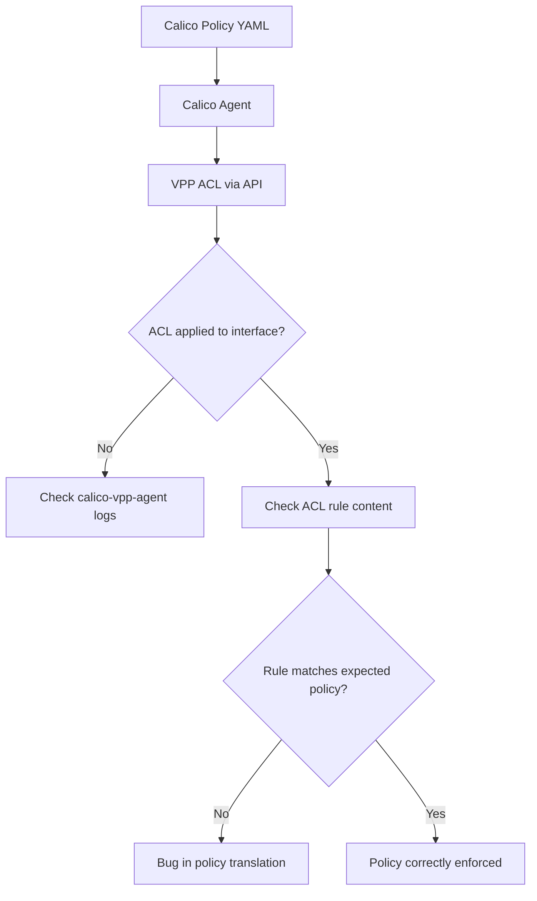

# Troubleshoot Calico VPP Technical Details

Author: [nawazdhandala](https://github.com/nawazdhandala)

Tags: Calico, Kubernetes, Networking, VPP, DPDK, Troubleshooting, Technical

Description: Advanced troubleshooting techniques for Calico VPP technical issues, including node graph debugging, ACL mismatches, DPDK errors, and VPP memory problems.

---

## Introduction

Advanced Calico VPP troubleshooting requires the ability to trace packets through VPP's node graph, interpret VPP error counters, and understand how the Calico agent translates policies into VPP ACLs. Standard network debugging tools like `tcpdump` don't work directly with DPDK interfaces - VPP has its own packet tracing mechanism that must be used instead.

This guide covers VPP-specific debugging techniques that go beyond the operational troubleshooting in the host networking guide.

## Prerequisites

- Direct `vppctl` access via kubectl exec
- Understanding of VPP node graph concepts
- Root access to nodes for advanced diagnostics

## Technique 1: VPP Packet Tracing

VPP's built-in packet tracer captures packet processing at each graph node:

```bash
# Enable packet tracing (captures next 100 packets from dpdk-input)
kubectl exec -n calico-vpp-dataplane ds/calico-vpp-node -c vpp -- \
  vppctl trace add dpdk-input 100

# Generate some traffic
# Then view the trace
kubectl exec -n calico-vpp-dataplane ds/calico-vpp-node -c vpp -- \
  vppctl show trace
```

Example trace output:

```plaintext
Packet 1
00:00:00:000001: dpdk-input
  GigabitEthernet0/0/0 rx queue 0
  IP4: src=10.0.1.1 dst=192.168.0.5
00:00:00:000002: ip4-input
  TCP: 10.0.1.1 -> 192.168.0.5
00:00:00:000003: calico-policy-forward
  ALLOW (policy: allow-web, rule: 0)
00:00:00:000004: ip4-lookup
  fib 0 dpo-load-balance 14
```

## Technique 2: Identify Packet Drops via Node Counters

```bash
# Clear counters first for clean measurement
kubectl exec -n calico-vpp-dataplane ds/calico-vpp-node -c vpp -- \
  vppctl clear run

# Generate traffic, then check counters
kubectl exec -n calico-vpp-dataplane ds/calico-vpp-node -c vpp -- \
  vppctl show node counters | grep -v " 0$"
```

Key nodes with drop counters:

```plaintext
acl-plugin-out-ip4-fa    -- ACL policy deny
dpdk-input/no_buffers   -- VPP out of buffer memory (need more hugepages)
ip4-icmp-error          -- ICMP unreachables sent
```

## Technique 3: Debug ACL Mismatches



```bash
# Check which ACLs are applied to a pod's tap interface
POD_IF=$(kubectl exec -n calico-vpp-dataplane ds/calico-vpp-node -c vpp -- \
  vppctl show interface | grep "tap" | awk '{print $1}' | head -1)

kubectl exec -n calico-vpp-dataplane ds/calico-vpp-node -c vpp -- \
  vppctl show acl-plugin interface $POD_IF

# Check agent logs for ACL programming
kubectl logs -n calico-vpp-dataplane ds/calico-vpp-node -c agent --tail=200 | \
  grep -i "acl\|policy"
```

## Technique 4: Debug DPDK Errors

```bash
# Check DPDK interface statistics
kubectl exec -n calico-vpp-dataplane ds/calico-vpp-node -c vpp -- \
  vppctl show dpdk statistics

# Key fields to check:
# rx_missed_errors: packets dropped at NIC ring (increase rx desc)
# rx_no_bufs: VPP ran out of buffers (increase buffers-per-numa)
# rx_errors: hardware errors (check NIC health)
```

## Technique 5: Calico Agent VPP API Debugging

```bash
# Enable debug logging in calico-vpp-agent
kubectl set env ds/calico-vpp-node -n calico-vpp-dataplane \
  -c agent CALICOVPP_LOG_LEVEL=debug

# Watch for VPP API errors
kubectl logs -n calico-vpp-dataplane ds/calico-vpp-node -c agent -f | \
  grep -i "error\|failed\|vpp"
```

## Technique 6: VPP Memory Diagnostics

```bash
# Check VPP heap and memory pool health
kubectl exec -n calico-vpp-dataplane ds/calico-vpp-node -c vpp -- \
  vppctl show memory verbose

# Check for memory fragmentation
kubectl exec -n calico-vpp-dataplane ds/calico-vpp-node -c vpp -- \
  vppctl show memory | grep "free"
```

## Conclusion

Advanced Calico VPP troubleshooting centers on VPP's packet tracing capability, node graph drop counters, and ACL inspection tools. These VPP-native diagnostic mechanisms provide packet-level visibility that traditional tools cannot offer for DPDK interfaces. When packet tracing reveals unexpected drop nodes or ACL mismatches, follow the policy translation chain from Calico NetworkPolicy through the agent to the VPP ACL API to identify where the discrepancy originates.
