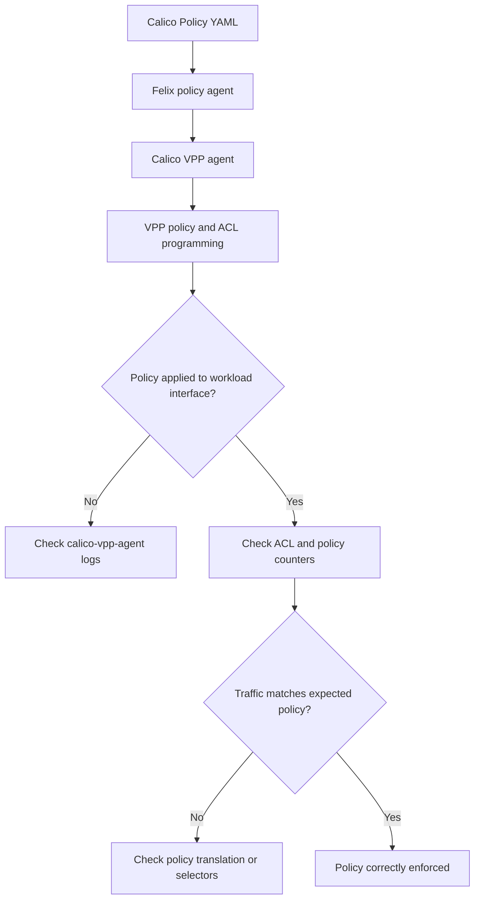

# Troubleshoot Calico VPP Technical Details

Author: [nawazdhandala](https://github.com/nawazdhandala)

Tags: Calico, Kubernetes, Networking, VPP, DPDK, Troubleshooting, Technical

Description: Advanced troubleshooting techniques for Calico VPP technical issues, including node graph debugging, ACL mismatches, DPDK errors, and VPP memory problems.

---

## Introduction

Advanced Calico VPP troubleshooting requires the ability to trace packets through VPP's node graph, interpret VPP error counters, and understand how Felix and the Calico VPP agent program policy into VPP's policy and ACL components. Standard network debugging tools like `tcpdump` don't work directly with DPDK interfaces - VPP has its own packet tracing mechanism that must be used instead.

This guide covers VPP-specific debugging techniques that go beyond the operational troubleshooting in the host networking guide.

## Prerequisites

- Direct `vppctl` access via kubectl exec
- Understanding of VPP node graph concepts
- Root access to nodes for advanced diagnostics

## Technique 1: VPP Packet Tracing

VPP's built-in packet tracer captures packet processing at each graph node:

```bash
# Enable packet tracing (captures next 100 packets from dpdk-input)

kubectl exec -n calico-vpp-dataplane ds/calico-vpp-node -c vpp -- \
  vppctl trace add dpdk-input 100

# Generate some traffic
# Then view the trace
kubectl exec -n calico-vpp-dataplane ds/calico-vpp-node -c vpp -- \
  vppctl show trace
```

Example trace output:

```plaintext
Packet 1
00:00:00:000001: dpdk-input
  GigabitEthernet0/0/0 rx queue 0
  IP4: src=10.0.1.1 dst=192.168.0.5
00:00:00:000002: ip4-input
  TCP: 10.0.1.1 -> 192.168.0.5
00:00:00:000003: calico-policy-forward
  ALLOW (policy: allow-web, rule: 0)
00:00:00:000004: ip4-lookup
  fib 0 dpo-load-balance 14
```

## Technique 2: Identify Packet Drops via Error Counters

```bash
# Clear counters first for clean measurement
kubectl exec -n calico-vpp-dataplane ds/calico-vpp-node -c vpp -- \
  vppctl clear errors

# Generate traffic, then check counters
kubectl exec -n calico-vpp-dataplane ds/calico-vpp-node -c vpp -- \
  vppctl show errors | grep -v "^ *0 "
```

Key nodes with drop counters:

```plaintext
acl-plugin-out-ip4-fa    -- ACL deny packets
dpdk-input               -- DPDK input drops, including buffer exhaustion
ip4-icmp-error           -- ICMP unreachables sent
```

## Technique 3: Debug Policy and ACL Mismatches


```mermaid
graph TD
    A[Calico Policy YAML] --> B[Felix policy agent]
    B --> C[Calico VPP agent]
    C --> D[VPP policy and ACL programming]
    D --> E{Policy applied to workload interface?}
    E -->|No| F[Check calico-vpp-agent logs]
    E -->|Yes| G[Check ACL and policy counters]
    G --> H{Traffic matches expected policy?}
    H -->|No| I[Check policy translation or selectors]
    H -->|Yes| J[Policy correctly enforced]
```

```bash
# Check pod VPP tun interfaces and their sw_if_index values
kubectl exec -n calico-vpp-dataplane ds/calico-vpp-node -c vpp -- \
  vppctl show interface | grep "^tun"

# Check ACLs and Calico VPP custom access policies
kubectl exec -n calico-vpp-dataplane ds/calico-vpp-node -c vpp -- \
  vppctl show acl-plugin interface acl

kubectl exec -n calico-vpp-dataplane ds/calico-vpp-node -c vpp -- \
  vppctl show acl-plugin custom-access-policies

# Check agent logs for policy programming
kubectl logs -n calico-vpp-dataplane ds/calico-vpp-node -c agent --tail=200 | \
  grep -i "acl\|felix\|policy\|workload"
```

## Technique 4: Debug DPDK Errors

```bash
# Check interface errors and DPDK buffer state
kubectl exec -n calico-vpp-dataplane ds/calico-vpp-node -c vpp -- \
  vppctl show hardware-interfaces

kubectl exec -n calico-vpp-dataplane ds/calico-vpp-node -c vpp -- \
  vppctl show dpdk buffer

# Key fields to check:
# rx errors/drops in hardware interface output: NIC or queue-level issues
# low available DPDK buffers: increase buffer or hugepage allocation
# descriptor settings: use show hardware-interfaces and tune rx/tx descriptors if needed
```

## Technique 5: Calico Agent VPP API Debugging

```bash
# Enable debug logging in calico-vpp-agent
kubectl set env ds/calico-vpp-node -n calico-vpp-dataplane \
  -c agent CALICOVPP_LOG_LEVEL=debug

# Watch for VPP API errors
kubectl logs -n calico-vpp-dataplane ds/calico-vpp-node -c agent -f | \
  grep -i "error\|failed\|vpp"
```

## Technique 6: VPP Memory Diagnostics

```bash
# Check VPP heap and memory pool health
kubectl exec -n calico-vpp-dataplane ds/calico-vpp-node -c vpp -- \
  vppctl show memory verbose

# Check for memory fragmentation
kubectl exec -n calico-vpp-dataplane ds/calico-vpp-node -c vpp -- \
  vppctl show memory | grep "free"
```

## Conclusion

Advanced Calico VPP troubleshooting centers on VPP's packet tracing capability, error counters, and policy programming logs. These VPP-native diagnostic mechanisms provide packet-level visibility that traditional tools cannot offer for DPDK interfaces. When packet tracing reveals unexpected drop nodes or policy mismatches, follow the policy translation chain from Calico NetworkPolicy through Felix and the Calico VPP agent to VPP's policy and ACL programming to identify where the discrepancy originates.
