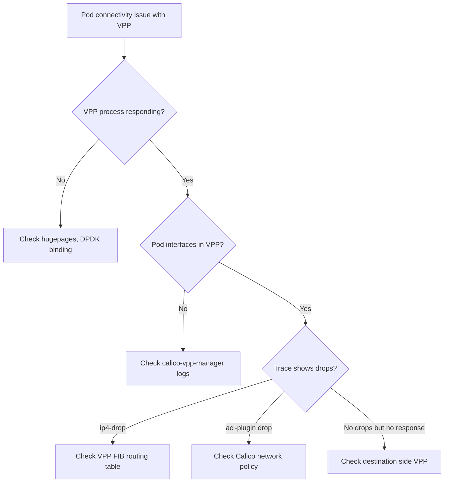

# How to Troubleshoot Calico VPP Issues

Author: [nawazdhandala](https://github.com/nawazdhandala)

Tags: Calico, VPP, Kubernetes, Networking, Troubleshooting

Description: Diagnose and resolve common Calico VPP dataplane issues including packet drops, interface configuration failures, and DPDK initialization errors.

---

## Introduction

Calico VPP issues present differently from standard Linux networking problems. VPP's user-space networking means that kernel tools like `tcpdump`, `iptables`, and `ip route` don't show VPP traffic. You need VPP-native tools: `vppctl show interface`, VPP traces, and VPP error counters to diagnose issues.

## Symptom 1: VPP Process Not Starting

```bash
# Check calico-vpp-node pod status
kubectl get pods -n calico-vpp-dataplane

# Check VPP container logs for startup errors
kubectl logs -n calico-vpp-dataplane <vpp-node-pod> -c vpp | head -50

# Common VPP startup errors:
# "dpdk: driver init failed" - DPDK interface not available
# "failed to bind NIC" - NIC not in VPP-compatible mode
# "huge pages not configured" - hugepages not allocated

# Check hugepages on node
kubectl debug node/<node> --image=alpine -it -- \
  cat /proc/meminfo | grep Huge
# HugePages_Total should be > 0
```

## Symptom 2: Pods Can't Communicate Through VPP

```bash
VPP_POD=$(kubectl get pod -n calico-vpp-dataplane -l app=calico-vpp-node \
  --field-selector=spec.nodeName=<problem-node> \
  -o jsonpath='{.items[0].metadata.name}')

# 1. Verify pod interfaces exist in VPP
kubectl exec -n calico-vpp-dataplane "${VPP_POD}" -c vpp -- \
  vppctl show interface | grep tap

# 2. Check for error counters on the interface
kubectl exec -n calico-vpp-dataplane "${VPP_POD}" -c vpp -- \
  vppctl show error | grep -v " 0 " | head -20

# 3. Trace packets to identify drop point
kubectl exec -n calico-vpp-dataplane "${VPP_POD}" -c vpp -- \
  vppctl trace add virtio-input 50

# Wait for traffic, then check trace
kubectl exec -n calico-vpp-dataplane "${VPP_POD}" -c vpp -- \
  vppctl show trace | head -100

# Look for drops in the trace output:
# "ip4-drop" indicates routing issue
# "acl-plugin-out-ip4-fa" indicates policy drop
```

## Symptom 3: Service Routing Broken (NAT Issue)

```bash
# Check VPP NAT table for service entries
kubectl exec -n calico-vpp-dataplane "${VPP_POD}" -c vpp -- \
  vppctl show nat44 sessions | grep <service-ip>

# If service IP not in NAT table:
# calico-vpp-manager may not have programmed the service
kubectl logs -n calico-vpp-dataplane "${VPP_POD}" -c calico-vpp-manager | \
  grep -i "service\|nat\|error" | tail -20
```

## VPP Troubleshooting Flow



## Conclusion

Calico VPP troubleshooting requires using VPP-native tools instead of standard Linux networking commands. The most important tools are `vppctl show interface` (interface state), `vppctl show error` (packet drop counters), and `vppctl trace add/show` (per-packet trace). VPP error counters are particularly valuable - they show exactly which VPP node dropped packets and why, pointing directly to the root cause without needing to analyze individual packet traces.
