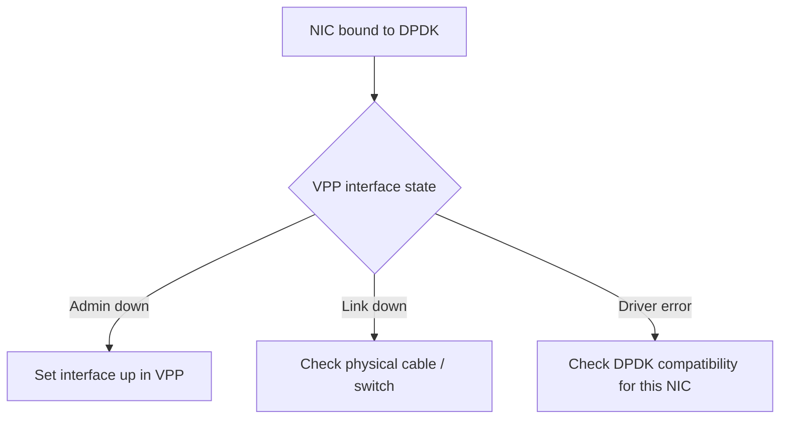

# Troubleshoot Calico VPP Uplink Configuration

Author: [nawazdhandala](https://github.com/nawazdhandala)

Tags: Calico, Kubernetes, Networking, VPP, DPDK, Uplink, Troubleshooting

Description: Diagnose and resolve common Calico VPP uplink configuration failures, including DPDK binding errors, interface initialization failures, and uplink performance issues.

---

## Introduction

Calico VPP uplink configuration failures are among the most disruptive issues because they can leave a node with no network connectivity. When DPDK takes control of the NIC, any failure in VPP's initialization leaves the node unreachable until VPP either succeeds or the NIC is re-bound to its Linux driver. Having out-of-band console access is not just recommended — it's a hard prerequisite before attempting DPDK-mode uplink configuration.

## Prerequisites

- Out-of-band console access (IPMI/iDRAC/cloud console) to affected nodes
- Node-level shell access or ability to run privileged pods
- Understanding of DPDK driver binding

## Issue 1: VPP Cannot Bind NIC to DPDK Driver

**Symptom**: VPP pod fails to start; NIC remains on Linux driver.

**Diagnosis:**

```bash
# Check current NIC driver binding
dpdk-devbind.py --status-dev net
# If still showing Linux driver (e.g., ixgbe), binding failed

# Check VPP manager logs for binding error
kubectl logs -n calico-vpp-dataplane ds/calico-vpp-node -c vpp-manager | \
  grep -i "bind\|dpdk\|pci\|error"
```

**Common causes:**

```bash
# 1. IOMMU not enabled (required for vfio-pci)
dmesg | grep -i iommu
# If no IOMMU output, enable in BIOS and add intel_iommu=on to kernel args

# 2. Wrong PCI address in ConfigMap
lspci -D | grep -i "network"
# Compare with ConfigMap's pci address setting

# 3. vfio-pci module not loaded
lsmod | grep vfio
# Fix: modprobe vfio-pci
```

## Issue 2: Uplink Interface Down After Binding



```bash
# Manually bring interface up in VPP
kubectl exec -n calico-vpp-dataplane ds/calico-vpp-node -c vpp -- \
  vppctl set interface state GigabitEthernet0/0/0 up
```

## Issue 3: Wrong Interface Being Configured

**Symptom**: Node loses connectivity because VPP took over the management interface.

```bash
# In ConfigMap, interfaceName must match the DATA interface, not management
# Check which interface has the management IP
ip addr show
# The interface with the management IP (10.0.0.x) should NOT be in the ConfigMap

# ConfigMap should reference the dedicated data interface (eth1, ens4, etc.)
```

**Recovery** (via out-of-band console):

```bash
# Stop VPP
systemctl stop vpp

# Re-bind NIC to original Linux driver
dpdk-devbind.py -b ixgbe 0000:00:0a.0

# Fix the ConfigMap to reference correct interface
kubectl edit configmap calico-vpp-config -n calico-vpp-dataplane

# Restart VPP
kubectl delete pod -n calico-vpp-dataplane -l app=calico-vpp-node \
  --field-selector spec.nodeName=affected-node
```

## Issue 4: Low Throughput in af_packet Mode

If using af_packet (non-DPDK), throughput is limited by Linux kernel overhead:

```bash
# Verify mode
kubectl get configmap calico-vpp-config -n calico-vpp-dataplane -o yaml | \
  grep vppDriver
# If "af_packet", this is expected lower performance

# To improve af_packet performance
# Increase ring buffer size in kernel
ethtool -G eth0 rx 4096 tx 4096
```

## Issue 5: DPDK Compatibility Issues

Not all NIC models are supported by DPDK in all versions:

```bash
# Check DPDK device support
dpdk-devbind.py --status-dev net | grep 0000:00:0a.0

# Check VPP DPDK support for the device
kubectl exec -n calico-vpp-dataplane ds/calico-vpp-node -c vpp -- \
  vppctl show dpdk version

# If unsupported: fall back to af_packet or virtio mode
```

## Conclusion

VPP uplink troubleshooting requires out-of-band console access as the first prerequisite. The most common issues are DPDK binding failures due to missing IOMMU or kernel modules, incorrect PCI addresses in the ConfigMap, and accidentally configuring VPP to take over the management NIC. Always identify and verify the correct data plane NIC before applying VPP configuration, and test in a single-node staging environment before rolling out to production.
