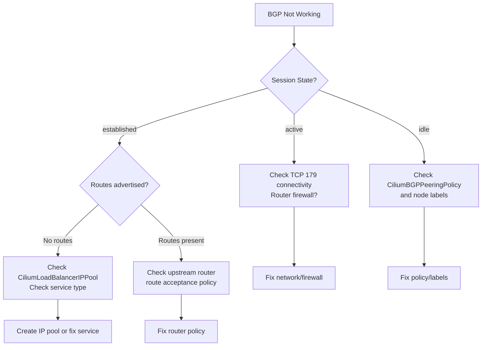

# Troubleshooting Cilium BGP Sessions

Author: [nawazdhandala](https://github.com/nawazdhandala)

Tags: Cilium, Kubernetes, Networking, BGP, eBPF

Description: Diagnose and resolve common Cilium BGP session failures including stuck Active state, route advertisement issues, and peer connectivity problems.

---

## Introduction

BGP session failures in Cilium can be difficult to diagnose because the problem may lie in the Kubernetes resource configuration, the Cilium agent's GoBGP state, network-level connectivity between nodes and routers, or the upstream router's policy. A methodical approach that checks each layer in order is the fastest path to resolution.

The most common issues are BGP sessions stuck in `Active` state (Cilium is trying to connect but the router is not responding), sessions that establish but fail to advertise routes (often a policy mismatch or missing IP pool), and sessions that flap (timer misconfigurations or network instability). Cilium provides several built-in commands and log filters specifically for BGP troubleshooting.

This guide provides a structured troubleshooting workflow for Cilium BGP, from checking basic connectivity to inspecting GoBGP state dumps.

## Prerequisites

- Cilium with BGP Control Plane enabled
- `cilium` CLI installed
- `kubectl` installed
- Access to upstream router CLI (for cross-verification)

## Step 1: Check BGP Session State

```bash
# Check all BGP peers across all nodes
cilium bgp peers

# Filter for non-established sessions
cilium bgp peers | grep -v established
```

Common states and their meanings:
- `established` - session is up and routes are exchanged
- `active` - Cilium is trying to connect; router not responding
- `idle` - session is not being attempted; check policy
- `connect` - TCP connection in progress

## Step 2: Verify Policy and Node Selector

```bash
# Confirm the policy exists and is well-formed
kubectl get ciliumbgppeeringpolicy -o yaml

# Check that nodes match the nodeSelector
kubectl get nodes --show-labels | grep rack

# Confirm Cilium picked up the policy
kubectl logs -n kube-system -l k8s-app=cilium | grep -i "bgpPeeringPolicy\|bgp.*policy"
```

## Step 3: Test TCP Connectivity to Peer

BGP uses TCP port 179. Verify connectivity from the node:

```bash
# Debug node network namespace
kubectl debug node/worker-0 -it --image=nicolaka/netshoot

# Inside the debug pod:
nc -zv 10.0.0.1 179
# Expected: Connection to 10.0.0.1 179 port [tcp/bgp] succeeded

# Also verify the return path (router can reach node)
ip addr show  # Check node IP
```

## Step 4: Check Cilium Agent BGP Logs

```bash
# Filter BGP-specific log messages
kubectl logs -n kube-system -l k8s-app=cilium --since=10m | grep -i bgp

# Enable debug logging for BGP subsystem
kubectl exec -n kube-system cilium-xxxxx -- \
  cilium config set debug-verbose datapath

# Check for GoBGP errors
kubectl logs -n kube-system cilium-xxxxx | grep -i "gobgp\|bgp.*error\|bgp.*fail"
```

## Step 5: Inspect Advertised and Available Routes

```bash
# Routes Cilium is advertising to peers
cilium bgp routes advertised ipv4 unicast

# Routes received from peers (available in routing table)
cilium bgp routes available ipv4 unicast

# If advertised routes are empty, check IP pool
kubectl get ciliumbgpclusterconfig
kubectl get ciliumulbippool
```

## Step 6: Verify LoadBalancer IP Allocation

```bash
# Check if services have external IPs assigned
kubectl get svc -A | grep LoadBalancer

# Check IP pool availability
kubectl describe ciliumulbippool

# Events on IP pool
kubectl get events --field-selector reason=IPPoolExhausted
```

## BGP Troubleshooting Decision Tree



## Conclusion

Cilium BGP troubleshooting follows a clear pattern: verify the Kubernetes resources are correct, confirm TCP connectivity, check the Cilium agent logs for GoBGP errors, and finally verify route advertisement and acceptance. The `cilium bgp peers` and `cilium bgp routes` commands are your primary diagnostic tools. When sessions are established but no routes appear, the issue is almost always a missing `CiliumLoadBalancerIPPool` or a service selector mismatch in the peering policy.
