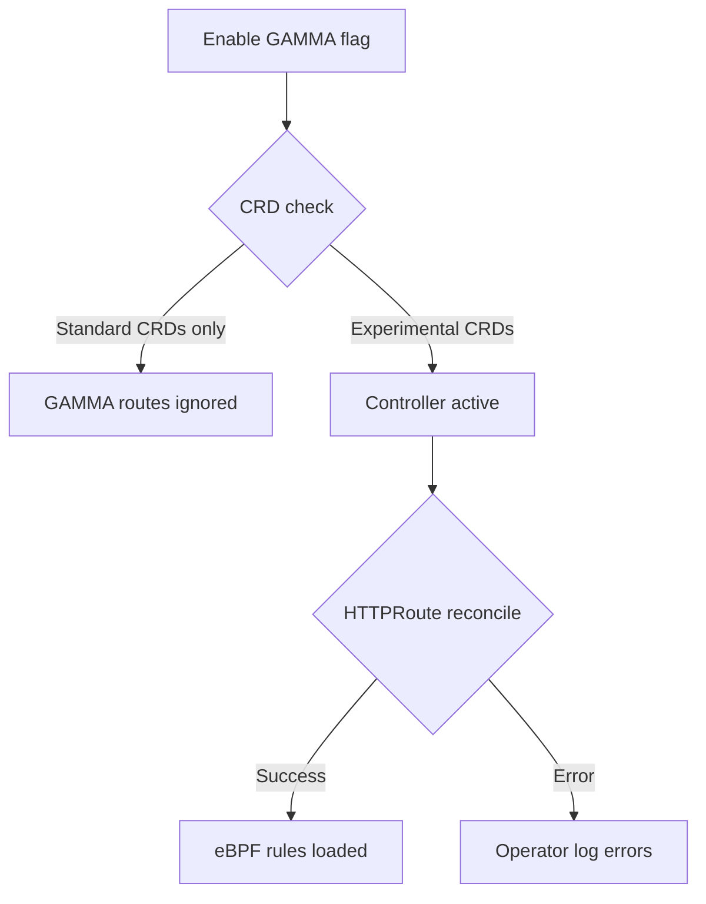

# How to Troubleshoot Cilium GAMMA Support in the Cilium Gateway API

Author: [nawazdhandala](https://github.com/nawazdhandala)

Tags: Cilium, Kubernetes, GAMMA, Gateway API, Troubleshooting

Description: Diagnose Cilium GAMMA support issues in the Gateway API controller including feature flag problems, CRD version mismatches, and eBPF program failures.

---

## Introduction

When Cilium GAMMA support fails, the symptoms are often subtle: HTTPRoutes appear accepted but traffic continues to flow directly to Services without respecting routing rules. This can occur due to feature flag misconfiguration, CRD version mismatches, or controller reconciliation errors.

Systematic troubleshooting starts by verifying the feature is actually enabled and the correct CRD versions are installed. Many GAMMA issues stem from using standard Gateway API CRDs instead of the experimental install that includes mesh support.

## Prerequisites

- Cilium installed via Helm
- `kubectl` and `cilium` CLIs
- Access to Cilium operator and agent logs

## Verify Feature Flag

```bash
kubectl get cm -n kube-system cilium-config \
  -o jsonpath='{.data.enable-gateway-api-gamma}'
```

If empty or `"false"`, re-run the Helm upgrade with `--set gatewayAPI.enableGamma=true`.

## Check CRD Version

GAMMA requires experimental CRDs:

```bash
kubectl get crd httproutes.gateway.networking.k8s.io \
  -o jsonpath='{.metadata.annotations}'
```

Look for `gateway.networking.k8s.io/bundle-version`. If the experimental install was not applied, GAMMA mesh routes will not function.

## Architecture



## Inspect Operator Logs for GAMMA Errors

```bash
kubectl logs -n kube-system -l app.kubernetes.io/name=cilium-operator \
  --since=10m | grep -iE "gamma|mesh|httproute"
```

## Check if Routes are Being Reconciled

```bash
kubectl describe httproute <name> -n <namespace>
```

If the `controllerName` in the route status is not `io.cilium/gateway-controller`, another controller is processing the route.

## Verify No Other Gateway API Controller Conflicts

```bash
kubectl get pods -A | grep -iE "gateway|nginx-ingress"
```

If multiple gateway controllers exist, they may compete for HTTPRoute reconciliation. Check GatewayClass assignments.

## Restart Cilium Operator

If GAMMA was recently enabled but routes are not being reconciled:

```bash
kubectl rollout restart deployment/cilium-operator -n kube-system
kubectl rollout status deployment/cilium-operator -n kube-system
```

## Conclusion

Troubleshooting Cilium GAMMA support in the Gateway API controller requires verifying the feature flag, confirming experimental CRD installation, and checking for controller conflicts. Operator logs provide detailed reconciliation errors that point to the specific cause.
