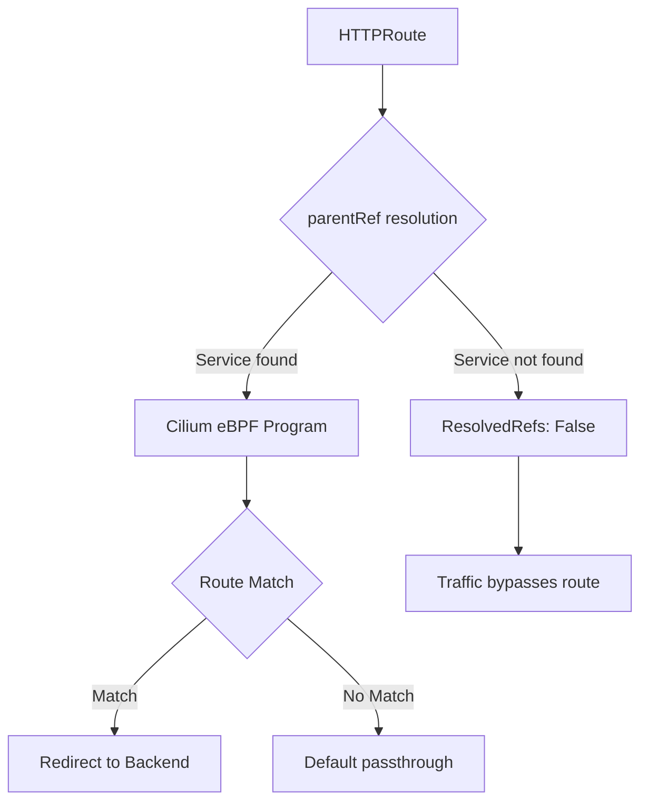

# How to Troubleshoot Cilium GAMMA Support

Author: [nawazdhandala](https://github.com/nawazdhandala)

Tags: Cilium, Kubernetes, GAMMA, Gateway API, Troubleshooting, Service Mesh

Description: Diagnose and resolve issues with Cilium GAMMA support including route attachment failures, traffic not matching mesh routes, and eBPF datapath errors.

---

## Introduction

Cilium's GAMMA implementation extends Gateway API to mesh (east-west) traffic, but misconfiguration can result in routes that appear accepted but do not affect actual traffic. Understanding the failure modes specific to GAMMA helps resolve issues quickly.

Unlike ingress routes, GAMMA HTTPRoutes use a Service as the parentRef rather than a Gateway. This means route attachment and status conditions behave differently. A route may show `Accepted: True` while traffic bypasses the eBPF datapath entirely.

This guide covers diagnosing GAMMA route attachment problems, eBPF policy mismatches, and status condition interpretation.

## Prerequisites

- Cilium with GAMMA and Gateway API enabled
- Gateway API CRDs v1.1+ with experimental support installed
- `kubectl`, `cilium`, and `hubble` CLIs

## Check GAMMA Feature Flag

Ensure GAMMA is enabled:

```bash
kubectl get cm -n kube-system cilium-config -o jsonpath='{.data.enable-gateway-api-gamma}'
```

If empty or false, enable it:

```bash
helm upgrade cilium cilium/cilium --reuse-values \
  --set gatewayAPI.enableGamma=true
```

## Inspect HTTPRoute Status

```bash
kubectl describe httproute <route-name> -n <namespace>
```

Check `Status.Parents` for the Service parentRef:

```yaml
status:
  parents:
    - parentRef:
        group: ""
        kind: Service
        name: my-service
        port: 8080
      conditions:
        - type: Accepted
          status: "True"
        - type: ResolvedRefs
          status: "True"
```

If `ResolvedRefs` is `False`, the backend Service or port is not found.

## Architecture



## Verify Backend Service Exists

```bash
kubectl get svc <backend-name> -n <namespace>
kubectl get endpoints <backend-name> -n <namespace>
```

Empty endpoints mean no pods are selected by the Service selector.

## Check Cilium Endpoint Policy

```bash
kubectl exec -n kube-system ds/cilium -- cilium-dbg endpoint list
kubectl exec -n kube-system ds/cilium -- cilium-dbg policy get
```

## Use Hubble to Trace GAMMA Traffic

```bash
hubble observe --namespace <namespace> --follow \
  --from-service <source-service> --to-service <target-service>
```

Look for `FORWARDED` or `DROPPED` verdicts. Dropped flows often indicate policy or route mismatch.

## Conclusion

Troubleshooting Cilium GAMMA requires inspecting HTTPRoute status conditions, verifying backend Service resolution, and using Hubble to trace actual traffic flows. With these tools you can distinguish between configuration issues, missing backends, and eBPF datapath problems.
