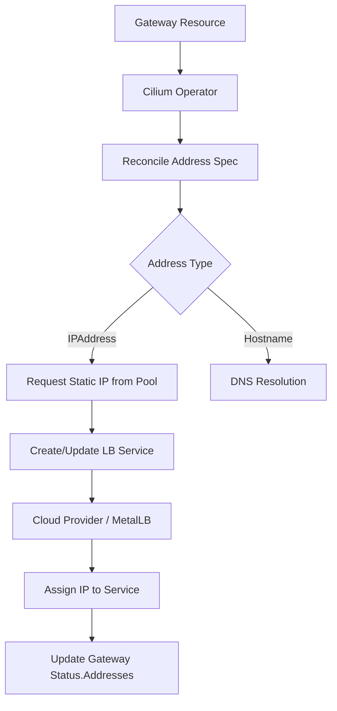

# How to Troubleshoot Cilium Gateway API Addresses Support

Author: [nawazdhandala](https://github.com/nawazdhandala)

Tags: Cilium, Kubernetes, Gateway API, Networking, EBPF, Troubleshooting

Description: A practical guide to diagnosing and resolving issues with Cilium's Gateway API addresses support, including IP allocation failures and listener binding problems.

---

## Introduction

Cilium's Gateway API implementation supports assigning specific IP addresses to Gateway resources, allowing operators to control how external traffic reaches services. When addresses are not properly allocated or bound, traffic ingress fails silently or with cryptic error messages.

Troubleshooting Gateway API address issues requires understanding how Cilium reconciles the `Gateway` resource spec with the underlying load balancer service, and how IP allocation happens at the infrastructure level. Both static IP assignment and dynamic IPAM need separate diagnostic paths.

This guide covers the most common failure modes: address fields being ignored, IPs not appearing in Gateway status, and conflicts between requested and allocated addresses.

## Prerequisites

- Kubernetes cluster with Cilium 1.14+ installed
- Cilium configured as the Gateway API implementation
- `kubectl` and `cilium` CLI tools available
- Gateway API CRDs installed (`gateway.networking.k8s.io`)

## Verify Gateway API CRDs and Controller

Confirm the Gateway API CRDs and Cilium's gatewayclass are present:

```bash
kubectl get gatewayclass
kubectl get crd gateways.gateway.networking.k8s.io
```

Check the Cilium operator logs for reconciliation errors:

```bash
kubectl logs -n kube-system -l app.kubernetes.io/name=cilium-operator --tail=100 | grep -i gateway
```

## Inspect Gateway Status for Address Errors

Check the address status on the Gateway object:

```bash
kubectl describe gateway <gateway-name> -n <namespace>
```

Look for the `Status.Addresses` field and any conditions such as `Programmed` or `Accepted`. If `Programmed` is false, the address was not applied:

```bash
kubectl get gateway <gateway-name> -n <namespace> -o jsonpath='{.status.conditions}'
```

## Check the Underlying Load Balancer Service

Cilium creates a corresponding Service for each Gateway. Locate it:

```bash
kubectl get svc -n <namespace> -l cilium.io/gateway-name=<gateway-name>
```

If the Service exists but has no external IP, check cloud provider load balancer events:

```bash
kubectl describe svc -n <namespace> <gateway-service-name>
```

## Diagnose Address Conflicts

When a static IP is requested in the Gateway spec but not allocated, verify the IP is available in the pool:

```bash
kubectl get ciliumloadbalancerippool
kubectl get ciliumloadbalancerippool <pool-name> -o jsonpath='{.status}'
```

## Architecture



## Validate TLS and Listener Bindings

If the address is assigned but traffic is not flowing, verify listener configuration:

```bash
kubectl get gateway <gateway-name> -n <namespace> -o yaml | grep -A20 listeners
```

Check that the port and protocol match service expectations and that associated HTTPRoutes are bound to the Gateway.

## Conclusion

Troubleshooting Cilium Gateway API address support involves inspecting the Gateway status conditions, the underlying load balancer service, and the IP address pool configuration. By following these steps you can identify whether the issue is at the Cilium operator, the infrastructure, or the address specification itself.
