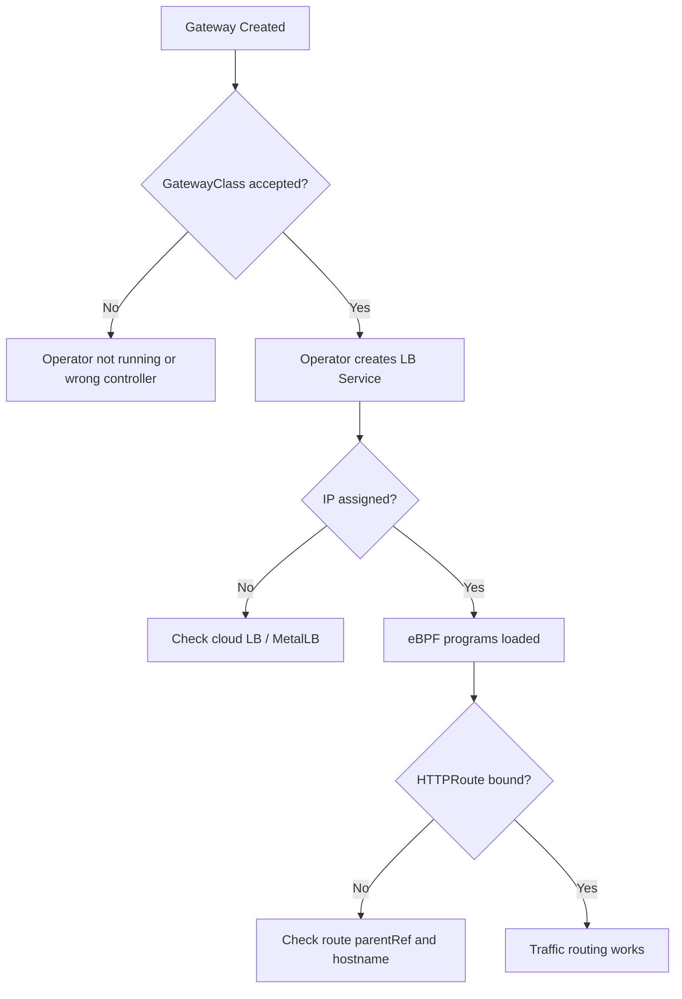

# How to Troubleshoot Cilium Gateway API Support

Author: [nawazdhandala](https://github.com/nawazdhandala)

Tags: Cilium, Kubernetes, Gateway API, Troubleshooting, Networking

Description: Diagnose and fix issues with Cilium Gateway API support including Gateway provisioning failures, HTTPRoute misconfigurations, and load balancer IP allocation problems.

---

## Introduction

Cilium's Gateway API support introduces several components that can fail independently: the GatewayClass controller in the operator, the Gateway's load balancer service, and the eBPF programs that route traffic to backends. Failures at any layer result in traffic not reaching your services.

Effective troubleshooting requires understanding the chain of events from Gateway creation to traffic routing. The Cilium operator reconciles Gateway objects and creates load balancer Services. The agent loads eBPF programs based on route configurations. Problems in either component produce distinct symptoms.

## Prerequisites

- Cilium with Gateway API enabled
- `kubectl` and Cilium operator logs access

## Check GatewayClass Acceptance

```bash
kubectl get gatewayclass cilium
# ACCEPTED should be True
```

If not accepted, check the operator is running and has the correct controller name:

```bash
kubectl logs -n kube-system -l app.kubernetes.io/name=cilium-operator \
  --since=5m | grep -i "gatewayclass"
```

## Diagnose Gateway Provisioning

```bash
kubectl describe gateway <name> -n <namespace>
```

Look for `Programmed: False` conditions. Common causes:

- No IP available from load balancer pool
- Missing permissions for the operator to create Services
- Cloud provider quota exceeded

## Check Load Balancer Service

```bash
kubectl get svc -n <namespace> -l cilium.io/gateway-name=<gateway-name>
```

If the Service has no `EXTERNAL-IP`, check cloud provider events:

```bash
kubectl describe svc <lb-service> -n <namespace> | grep -A10 Events
```

## Architecture



## Troubleshoot HTTPRoute Binding

```bash
kubectl get httproute <name> -n <namespace> \
  -o jsonpath='{.status.parents[0].conditions}'
```

If `Accepted: False` with reason `NoMatchingParent`, the Gateway name or namespace in parentRef is wrong.

## Check Certificate for HTTPS Gateways

```bash
kubectl get secret <tls-secret> -n <namespace>
kubectl describe secret <tls-secret> -n <namespace>
```

Ensure the Secret type is `kubernetes.io/tls` and contains valid certificates.

## Conclusion

Troubleshooting Cilium Gateway API support follows the provisioning chain: GatewayClass acceptance, load balancer service creation, IP assignment, and HTTPRoute binding. Each step has distinct failure indicators that narrow down the root cause.
