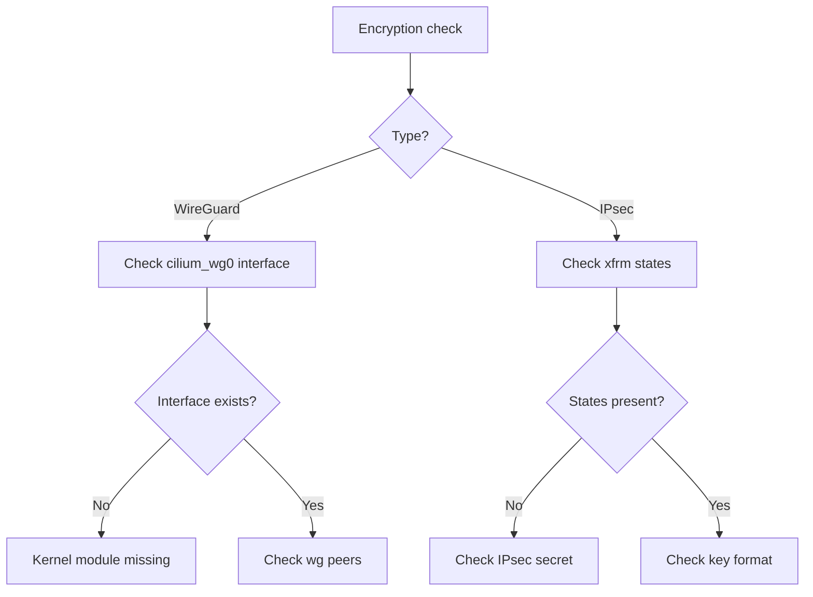

# How to Troubleshoot Cilium Transparent Encryption

Author: [nawazdhandala](https://github.com/nawazdhandala)

Tags: Cilium, Kubernetes, Encryption, WireGuard, IPsec, Troubleshooting

Description: Diagnose and fix transparent encryption issues in Cilium including failed key exchange, unencrypted traffic, and performance degradation.

---

## Introduction

Transparent encryption failures in Cilium are particularly dangerous because traffic may continue to flow in plaintext even when encryption is expected. Detecting that encryption has silently failed requires active verification rather than relying on connectivity tests.

Common issues include: WireGuard interface not created due to missing kernel module, IPsec key format errors, key rotation failures leaving stale XFRM states, and performance problems from encryption overhead.

## Prerequisites

- Cilium with encryption enabled (WireGuard or IPsec)
- `kubectl`, `wg` (for WireGuard), node access

## Step 1: Verify Encryption Status

```bash
kubectl exec -n kube-system ds/cilium -- cilium-dbg encrypt status
```

Expected output should show the encryption type and number of encrypted nodes/peers.

## Step 2: Check Encryption Feature Flag

```bash
kubectl get cm -n kube-system cilium-config \
  -o jsonpath='{.data.enable-wireguard}'
# or
kubectl get cm -n kube-system cilium-config \
  -o jsonpath='{.data.enable-ipsec}'
```

## Architecture



## Troubleshoot WireGuard

Check if the WireGuard interface was created:

```bash
kubectl debug node/<node-name> -it --image=busybox -- \
  ip link show cilium_wg0
```

If missing, check if the WireGuard kernel module is available:

```bash
kubectl debug node/<node-name> -it --image=ubuntu -- \
  lsmod | grep wireguard
```

Load the module if needed:

```bash
modprobe wireguard
```

## Troubleshoot IPsec

Check if xfrm states are installed:

```bash
kubectl debug node/<node-name> -it --image=ubuntu -- ip xfrm state
```

If empty, inspect the cilium-ipsec-keys secret format:

```bash
kubectl get secret -n kube-system cilium-ipsec-keys -o jsonpath='{.data.keys}' | base64 -d
```

Expected format: `<SPI> rfc4106(gcm(aes)) <hex-key> 128`

## Verify Traffic is Actually Encrypted

On a node, capture traffic between two pods on different nodes:

```bash
# For WireGuard - should see UDP port 51871
sudo tcpdump -i <node-interface> -n udp port 51871

# For IPsec - should see ESP protocol
sudo tcpdump -i <node-interface> -n esp
```

If you see plaintext HTTP/TCP traffic instead, encryption is not working.

## Check for XFRM State Staling (IPsec)

```bash
kubectl exec -n kube-system ds/cilium -- \
  cilium-dbg monitor --type drop | grep -i ipsec
```

If xfrm states are stale after a key rotation, restart the Cilium DaemonSet:

```bash
kubectl rollout restart ds/cilium -n kube-system
```

## Conclusion

Troubleshooting Cilium transparent encryption requires both checking Kubernetes configuration and verifying actual network behavior with tcpdump. A working configuration shows encrypted protocol traffic (WireGuard UDP or IPsec ESP) on inter-node interfaces and a healthy `cilium-dbg encrypt status` output.
