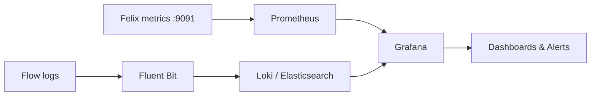

# Calico Observability: troubleshoot-dropped-traffic-auditing-calico

Author: [nawazdhandala](https://github.com/nawazdhandala)

Tags: Calico, Kubernetes, Networking, Observability

Description: Configure Calico observability capabilities for network visibility, security monitoring, and operational awareness.

---

## Introduction

Calico provides multiple observability mechanisms: Felix Prometheus metrics (port 9091), flow logs for connection-level visibility, and integration with Grafana for dashboards. In Calico Open Source v3.30 and later, flow logs are exposed through Goldmane and Whisker; file-based flow log settings are available in Calico Cloud and Calico Enterprise. This guide covers how to configure and use these capabilities effectively.

## Key Commands

```bash
# Enable Felix metrics

kubectl patch felixconfiguration default \
  --type=merge \
  -p '{"spec":{"prometheusMetricsEnabled":true,"prometheusMetricsPort":9091}}'

# Enable file-based flow logs in Calico Cloud or Calico Enterprise
kubectl patch felixconfiguration default \
  --type=merge \
  -p '{"spec":{"flowLogsFlushInterval":"15s","flowLogsFileEnabled":true}}'

# Enable the flow logs API in Calico Open Source v3.30+ operator/Helm installs
kubectl apply -f - <<'EOF'
apiVersion: operator.tigera.io/v1
kind: Goldmane
metadata:
  name: default
EOF

# Check BGP peer state
calicoctl node status

# View metrics
CALICO_POD=$(kubectl get pods -n calico-system -l k8s-app=calico-node \
  -o jsonpath='{.items[0].metadata.name}')
kubectl exec -n calico-system "${CALICO_POD}" -c calico-node -- \
  wget -qO- http://localhost:9091/metrics | grep felix | head -20
```

## Observability Architecture



## Alert Configuration

```yaml
apiVersion: monitoring.coreos.com/v1
kind: PrometheusRule
metadata:
  name: calico-observability-alerts
  namespace: calico-system
spec:
  groups:
    - name: calico.network
      rules:
        - alert: CalicoDataplaneFailures
          expr: rate(felix_int_dataplane_failures[5m]) > 0
          for: 5m
          annotations:
            summary: "Calico dataplane update failures on {{ $labels.instance }}"
        - alert: CalicoFelixMetricsDown
          expr: up{job="calico-node-metrics"} == 0
          for: 5m
          annotations:
            summary: "Calico Felix metrics unreachable on {{ $labels.instance }}"
```

## Conclusion

Calico observability requires enabling Felix Prometheus metrics, configuring flow logs for connection-level data, and building dashboards that surface actionable signals. The three most important operational signals are Felix dataplane failures (indicates dataplane programming errors), denied traffic from flow logs (indicates policy misconfiguration or security events), and IPAM utilization (indicates capacity issues). Configure alerts for the metrics-backed and log-backed signals from day one in production clusters.
