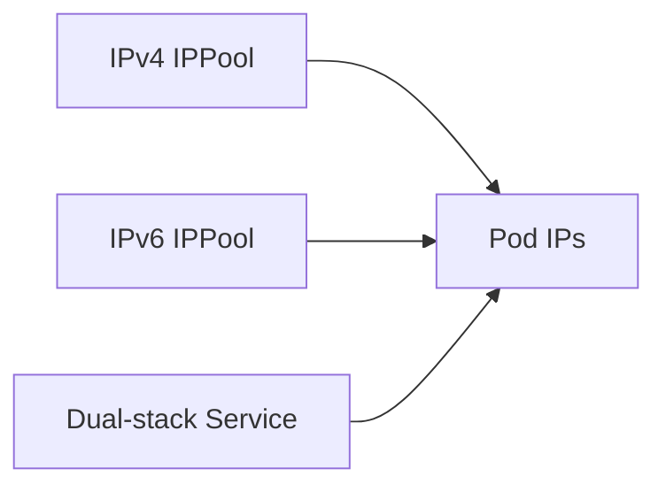

# How to Troubleshoot Dual-Stack IPv6 with Calico

Author: [nawazdhandala](https://github.com/nawazdhandala)

Tags: Calico, Kubernetes, IPv6, Dual-Stack, Networking

Description: Diagnose dual-stack IPv6 issues in Calico including address assignment failures and IPv6 routing problems.

---

## Introduction

Dual-Stack IPv6 with Calico enables important networking capabilities in Calico Kubernetes clusters. Proper configuration ensures reliable service connectivity and IP address management.

## Prerequisites

- Calico v3.20+ installed
- kubectl and calicoctl access
- Cluster-admin access

## Configuration

```bash
calicoctl get ippools -o yaml
calicoctl get bgpconfiguration -o yaml
```

## Example Configuration

```yaml
apiVersion: projectcalico.org/v3
kind: IPPool
metadata:
  name: example-ipv4-pool
spec:
  cidr: 10.48.0.0/16
  natOutgoing: true
---
apiVersion: projectcalico.org/v3
kind: IPPool
metadata:
  name: example-ipv6-pool
spec:
  cidr: 2001:db8:48::/64
  natOutgoing: true
```

## Verify

```bash
kubectl get pods -A -o wide
kubectl get svc -A -o wide
calicoctl ipam show --show-blocks
calicoctl ipam check --show-problem-ips
```

## Architecture



## Conclusion

How to Troubleshoot Dual-Stack IPv6 with Calico in Calico provides reliable IP addressing for Kubernetes services and workloads. Follow the configuration and verification steps to ensure correct behavior.
