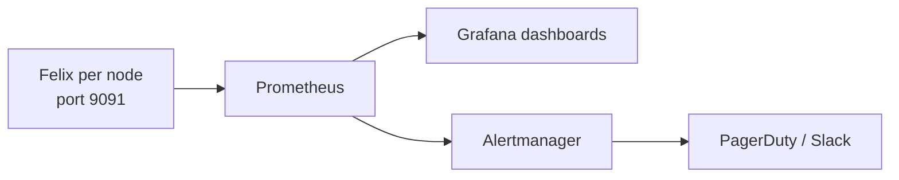

# How to Troubleshoot Felix Metrics in Calico

Author: [nawazdhandala](https://github.com/nawazdhandala)

Tags: Calico, Kubernetes, Networking, Observability

Description: Diagnose and resolve Felix metric collection issues including metrics endpoint not responding, missing node labels on metrics, and metric cardinality issues causing Prometheus storage problems.

---

## Introduction

Felix metrics troubleshooting focuses on three issues: the metrics endpoint not being accessible (FelixConfiguration prometheus metrics not enabled, or network policy blocking access), missing target labels (ServiceMonitor configuration), and high cardinality from extra runtime or dataplane metrics causing Prometheus storage issues.

## Key Commands

```bash
# Enable Felix metrics (if not already enabled)

kubectl patch felixconfiguration default   --type=merge   -p '{"spec":{"prometheusMetricsEnabled":true,"prometheusMetricsPort":9091}}'

# Test Felix metrics endpoint
CALICO_POD=$(kubectl get pods -n calico-system -l k8s-app=calico-node   -o jsonpath='{.items[0].metadata.name}')

kubectl exec -n calico-system "${CALICO_POD}" -c calico-node --   wget -qO- http://localhost:9091/metrics | head -30

# Key Felix metrics to check:
kubectl exec -n calico-system "${CALICO_POD}" -c calico-node --   wget -qO- http://localhost:9091/metrics | grep -E   "^felix_int_dataplane_failures|^felix_calc_graph"
```

## ServiceMonitor for Felix

```yaml
apiVersion: v1
kind: Service
metadata:
  name: calico-felix-metrics
  namespace: calico-system
  labels:
    app: calico-felix-metrics
spec:
  clusterIP: None
  selector:
    k8s-app: calico-node
  ports:
    - name: metrics
      port: 9091
      targetPort: 9091
---
apiVersion: monitoring.coreos.com/v1
kind: ServiceMonitor
metadata:
  name: calico-felix-metrics
  namespace: calico-system
spec:
  selector:
    matchLabels:
      app: calico-felix-metrics
  endpoints:
    - port: metrics
      path: /metrics
      interval: 30s
```

## Architecture



## Conclusion

Felix metrics provide the deepest operational visibility into the Calico data plane. Enable the Prometheus endpoint via FelixConfiguration, configure a ServiceMonitor and Service to scrape all calico-node pods, and build dashboards focused on dataplane failures and policy calculation latency. These two metric categories detect the most impactful Calico failure modes before they cause visible pod connectivity issues.
