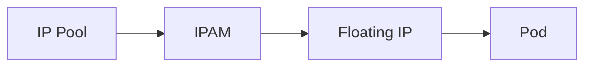

# How to Troubleshoot Floating IPs with Calico

Author: [nawazdhandala](https://github.com/nawazdhandala)

Tags: Calico, Kubernetes, IPAM, Floating IP, Networking

Description: Diagnose floating IP routing failures in Calico including stale routes and ARP cache issues.

---

## Introduction

Floating IPs with Calico provide additional IP addresses that can front a Kubernetes pod. The host uses NAT to deliver traffic from the floating IP to the pod's real IP, and the floating IP must be inside a configured Calico IPPool so it can be advertised correctly.

## Prerequisites

- Calico CNI plugin installed with floating IP support enabled
- kubectl and calicoctl access
- IP pools configured to include the floating IPs

## Configuration

```bash
kubectl get configmap calico-config -n kube-system -o yaml
calicoctl get ippools -o yaml
```

## Example

```yaml
apiVersion: v1
kind: Pod
metadata:
  name: floating-ip-demo
  annotations:
    cni.projectcalico.org/floatingIPs: '["10.48.0.10"]'
spec:
  containers:
    - name: nginx
      image: nginx:stable
```

## Verification

```bash
kubectl get pods -A -o wide
kubectl get pod floating-ip-demo -o jsonpath='{.metadata.annotations.cni\.projectcalico\.org/floatingIPs}{"\n"}'
calicoctl ipam show --ip=10.48.0.10
```

## Architecture



## Conclusion

How to Troubleshoot Floating IPs with Calico helps ensure your Calico deployment advertises the floating address and maps it to the intended pod correctly for your specific workload requirements.
