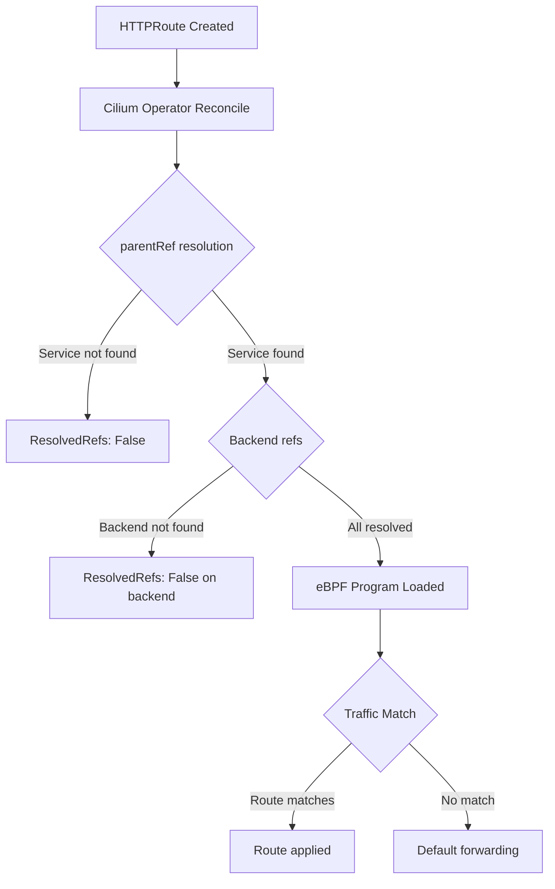

# How to Troubleshoot GAMMA in the Cilium Gateway API

Author: [nawazdhandala](https://github.com/nawazdhandala)

Tags: Cilium, Kubernetes, GAMMA, Gateway API, Troubleshooting, Service Mesh

Description: Identify and fix GAMMA configuration problems in the Cilium Gateway API including route attachment, backend resolution, and eBPF policy conflicts.

---

## Introduction

GAMMA routes in the Cilium Gateway API can fail for a variety of reasons beyond simple misconfiguration. Common issues include Service parentRef resolution failures, port mismatches, namespace isolation problems, and conflicts between GAMMA routes and Cilium network policies.

Understanding the sequence from route creation to eBPF program loading helps pinpoint where the breakdown occurs. Cilium must successfully parse the HTTPRoute, resolve all referenced backends, and load the corresponding eBPF policy for traffic to be affected.

This guide provides diagnostic steps for the most frequent GAMMA-specific failures.

## Prerequisites

- Cilium with GAMMA enabled
- `kubectl`, `cilium-dbg`, `hubble` CLIs
- Access to Cilium agent logs

## Step 1: Check Route Acceptance

```bash
kubectl get httproute -A
kubectl describe httproute <name> -n <namespace> | grep -A20 "Status:"
```

A `ResolvedRefs: False` condition indicates the Service or port is not found.

## Step 2: Verify Service parentRef

The Service referenced as parentRef must exist in the same namespace as the HTTPRoute:

```bash
kubectl get svc -n <namespace> <service-name>
```

Also verify the port number matches exactly:

```bash
kubectl get svc -n <namespace> <service-name> -o jsonpath='{.spec.ports[*].port}'
```

## Architecture



## Step 3: Check for Namespace Conflicts

GAMMA does not support cross-namespace parentRefs without `ReferenceGrant`:

```bash
kubectl get referencegrant -n <target-namespace>
```

If the route and service are in different namespaces, create a ReferenceGrant:

```yaml
apiVersion: gateway.networking.k8s.io/v1beta1
kind: ReferenceGrant
metadata:
  name: allow-gamma-route
  namespace: target-ns
spec:
  from:
    - group: gateway.networking.k8s.io
      kind: HTTPRoute
      namespace: source-ns
  to:
    - group: ""
      kind: Service
      name: my-service
```

## Step 4: Inspect Cilium Operator Logs

```bash
kubectl logs -n kube-system -l app.kubernetes.io/name=cilium-operator \
  --tail=200 | grep -i "gamma\|httproute"
```

## Step 5: Check eBPF Policy

```bash
kubectl exec -n kube-system ds/cilium -- cilium-dbg policy get 2>/dev/null | head -50
```

## Conclusion

Troubleshooting GAMMA in the Cilium Gateway API requires checking route status conditions, Service resolution, namespace grants, and eBPF policy loading. Working through these steps systematically isolates whether the problem is at the Kubernetes API layer or the eBPF datapath.
