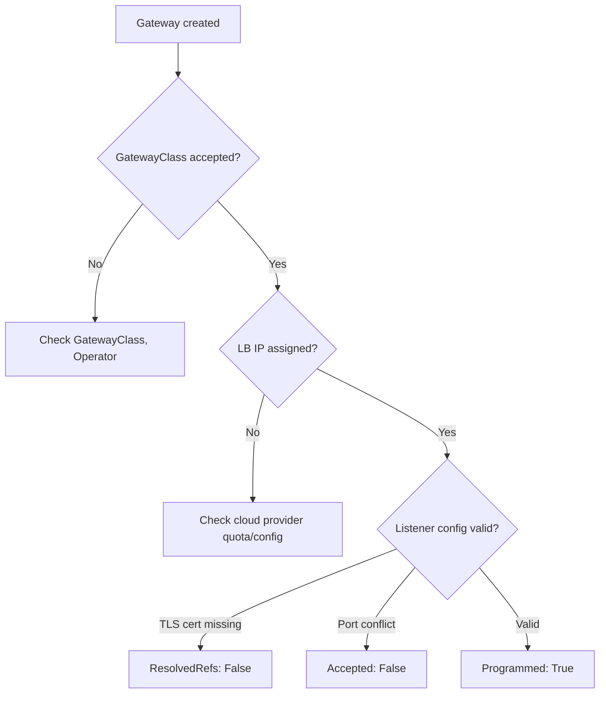

# How to Troubleshoot Gateway API Listeners That Never Become Ready in Cilium

Author: [nawazdhandala](https://github.com/nawazdhandala)

Tags: Cilium, Kubernetes, Gateway API, Troubleshooting, Listeners

Description: Diagnose and fix Gateway API listener readiness failures in Cilium including TLS certificate issues, port conflicts, and load balancer provisioning failures.

---

## Introduction

Gateway API listeners transition through several states before becoming ready: the Gateway must be accepted by the GatewayClass, the listener must have valid configuration, and (for LoadBalancer-type Gateways) an external IP must be assigned. When listeners never become ready, ingress traffic cannot reach any attached routes.

The `Programmed` condition on the Gateway resource is the top-level indicator, but the specific reason for failure is usually found in the listener-level conditions.

## Prerequisites

- Cilium with Gateway API enabled
- A Gateway that is not becoming ready

## Check Overall Gateway Status

```bash
kubectl describe gateway <name> -n <namespace>
```

Focus on the `Status.Conditions` section. Key conditions:

- `Accepted`: GatewayClass is valid and controller is running
- `Programmed`: All listeners have valid configuration and LB is assigned

## Inspect Listener Conditions

Each listener has its own conditions within the Gateway status:

```bash
kubectl get gateway <name> -n <namespace> -o json | \
  jq '.status.listeners[] | {name: .name, conditions: .conditions}'
```

| Condition | Status | Meaning |
|-----------|--------|---------|
| `Accepted` | False | Listener configuration invalid |
| `ResolvedRefs` | False | Certificate secret not found |
| `Programmed` | False | Listener not active in datapath |

## Architecture



## Common Failure: TLS Certificate Not Found

For HTTPS listeners, the referenced TLS Secret must exist:

```bash
kubectl get secret <tls-secret-name> -n <namespace>
```

Create the secret if missing:

```bash
kubectl create secret tls my-tls-cert \
  --cert=tls.crt \
  --key=tls.key \
  -n <namespace>
```

## Common Failure: Port Already in Use

If another service claims the same port:

```bash
kubectl get svc -A | grep ":80\|:443"
```

## Common Failure: Load Balancer Not Provisioned

Check if the underlying LoadBalancer Service has an external IP:

```bash
kubectl get svc -n <namespace> -l cilium.io/gateway-name=<gateway-name>
```

If no external IP after several minutes, check cloud provider events:

```bash
kubectl describe svc -n <namespace> <lb-service-name> | tail -20
```

## Check Cilium Operator Logs

```bash
kubectl logs -n kube-system -l app.kubernetes.io/name=cilium-operator \
  --since=10m | grep -iE "listener|gateway|programmed"
```

## Conclusion

Gateway API listener readiness failures in Cilium stem from four main causes: invalid GatewayClass, missing TLS certificates, port conflicts, or load balancer provisioning failures. The listener-level conditions in the Gateway status identify the specific failure, and the Cilium operator logs provide reconciliation details.
