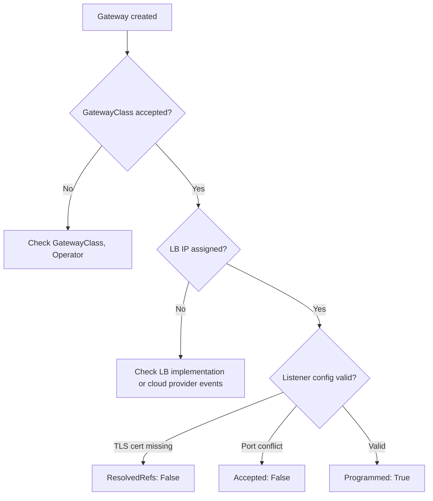

# How to Troubleshoot Gateway API Listeners That Never Become Ready in Cilium

Author: [nawazdhandala](https://github.com/nawazdhandala)

Tags: Cilium, Kubernetes, Gateway API, Troubleshooting, Listeners

Description: Diagnose and fix Gateway API listener readiness failures in Cilium including TLS certificate issues, port conflicts, and load balancer provisioning failures.

---

## Introduction

Gateway API listeners transition through several states before becoming ready: the Gateway must be accepted by the GatewayClass, the listener must have valid configuration, and the configuration must be programmed into Cilium's Envoy datapath. For LoadBalancer-type Gateways, the Gateway address and underlying Service should also be checked because traffic cannot reach the listener until load-balancer infrastructure assigns an address.

The `Programmed` condition on the Gateway resource is the top-level indicator that configuration was programmed into the datapath, but the specific reason for listener failures is usually found in the listener-level conditions.

## Prerequisites

- Cilium with Gateway API enabled
- A Gateway that is not becoming ready

## Check Overall Gateway Status

```bash
kubectl describe gateway <name> -n <namespace>
```

Focus on the `Status.Conditions` section. Key conditions:

- `Accepted`: Gateway configuration was accepted by the controller
- `Programmed`: Gateway configuration was programmed into Cilium's Envoy datapath

## Inspect Listener Conditions

Each listener has its own conditions within the Gateway status:

```bash
kubectl get gateway <name> -n <namespace> -o json | \
  jq '.status.listeners[] | {name: .name, conditions: .conditions}'
```

| Condition | Status | Meaning |
|-----------|--------|---------|
| `Accepted` | False | Listener configuration invalid |
| `ResolvedRefs` | False | Certificate secret not found |
| `Programmed` | False | Listener not active in datapath |

## Architecture


```mermaid
flowchart TD
    A[Gateway created] --> B{GatewayClass accepted?}
    B -->|No| C[Check GatewayClass, Operator]
    B -->|Yes| D{LB IP assigned?}
    D -->|No| E[Check LB implementation or cloud provider events]
    D -->|Yes| F{Listener config valid?}
    F -->|TLS cert missing| G[ResolvedRefs: False]
    F -->|Port conflict| H[Accepted: False]
    F -->|Valid| I[Programmed: True]
```

## Common Failure: TLS Certificate Not Found

For HTTPS listeners, the referenced TLS Secret must exist:

```bash
kubectl get secret <tls-secret-name> -n <namespace>
```

Create the secret if missing:

```bash
kubectl create secret tls my-tls-cert \
  --cert=tls.crt \
  --key=tls.key \
  -n <namespace>
```

## Common Failure: Host-Network Port Already in Use

If Cilium Gateway API host network mode is enabled, listener ports must be unique per Gateway and available on all Cilium nodes where Gateway API listeners are exposed:

```bash
kubectl get gateway -A -o json | \
  jq '.items[] | {namespace: .metadata.namespace, name: .metadata.name, listeners: [.spec.listeners[] | {name, port, protocol}]}'
```

## Common Failure: Load Balancer Not Provisioned

Check if the underlying LoadBalancer Service has an external IP:

```bash
kubectl get svc -n <namespace> -l gateway.networking.k8s.io/gateway-name=<gateway-name>
```

If no external IP after several minutes, check cloud provider events:

```bash
kubectl describe svc -n <namespace> <lb-service-name> | tail -20
```

## Check Cilium Operator Logs

```bash
kubectl logs -n kube-system -l app.kubernetes.io/name=cilium-operator \
  --since=10m | grep -iE "listener|gateway|programmed"
```

## Conclusion

Gateway API listener readiness failures in Cilium stem from four main causes: invalid GatewayClass, missing TLS certificates, port conflicts, or load balancer provisioning failures. The listener-level conditions in the Gateway status identify the specific failure, and the Cilium operator logs provide reconciliation details.
