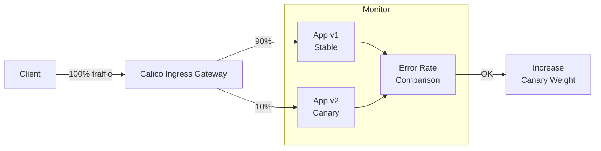

# How to Troubleshoot Ingress Gateway Canary Rollouts with Calico

Author: [nawazdhandala](https://github.com/nawazdhandala)

Tags: Calico, Kubernetes, Canary, Ingress, Deployment

Description: Diagnose canary rollout issues with Calico ingress gateway including traffic imbalances and routing failures.

---

## Introduction

Canary rollouts allow you to gradually shift traffic from a stable version of an application to a new version, monitoring for errors before completing the rollout. When combined with Calico's network policy enforcement, canary rollouts gain an additional safety layer: you can enforce that the canary version meets security policy requirements before it receives significant production traffic.

This pattern is particularly valuable for microservices where a buggy new version could cascade failures to dependent services. By limiting traffic exposure during the canary phase, you contain the blast radius of potential issues.

## Prerequisites

- Calico installed with the Tigera Operator
- Two versions of an application deployed
- Calico Ingress Gateway with Kubernetes Gateway API support enabled

## Configure Canary Routing

```yaml
# Gateway for incoming traffic
apiVersion: gateway.networking.k8s.io/v1
kind: Gateway
metadata:
  name: app-gateway
  namespace: production
spec:
  gatewayClassName: tigera-gateway-class
  listeners:
  - name: http
    protocol: HTTP
    port: 80
    hostname: app.example.com
---
# Stable and canary versions - 10% to canary
apiVersion: gateway.networking.k8s.io/v1
kind: HTTPRoute
metadata:
  name: app-route
  namespace: production
spec:
  parentRefs:
  - name: app-gateway
  hostnames:
  - app.example.com
  rules:
  - matches:
    - path:
        type: PathPrefix
        value: /
    backendRefs:
    - name: app-v1
      port: 80
      weight: 90
    - name: app-v2
      port: 80
      weight: 10
```

## Apply Calico Policies for Both Versions

```yaml
apiVersion: projectcalico.org/v3
kind: NetworkPolicy
metadata:
  name: allow-ingress-to-app-versions
  namespace: production
spec:
  selector: app in {'app-v1', 'app-v2'}
  types:
  - Ingress
  ingress:
  - action: Allow
    source:
      namespaceSelector: projectcalico.org/name == 'tigera-gateway'
      selector: gateway.envoyproxy.io/owning-gateway-name == 'app-gateway' && gateway.envoyproxy.io/owning-gateway-namespace == 'production'
```

## Monitor Canary Traffic

```bash
# Watch error rates for both versions
kubectl logs -l app=app-v1 --prefix=true | grep "500\|error" | wc -l
kubectl logs -l app=app-v2 --prefix=true | grep "500\|error" | wc -l

# Increase canary weight after validation
kubectl patch httproute app-route -n production --type='json' -p='[
  {"op":"replace","path":"/spec/rules/0/backendRefs/0/weight","value":50},
  {"op":"replace","path":"/spec/rules/0/backendRefs/1/weight","value":50}
]'
```

## Canary Rollout Flow



## Conclusion

Canary rollouts with Calico ingress gateway combine traffic splitting at the gateway layer with network policy enforcement for the canary pods. Start with a small percentage of traffic, monitor error rates for both versions, and gradually increase the canary weight as confidence grows. Use Calico policies to ensure the canary version adheres to security requirements before it receives significant traffic.
