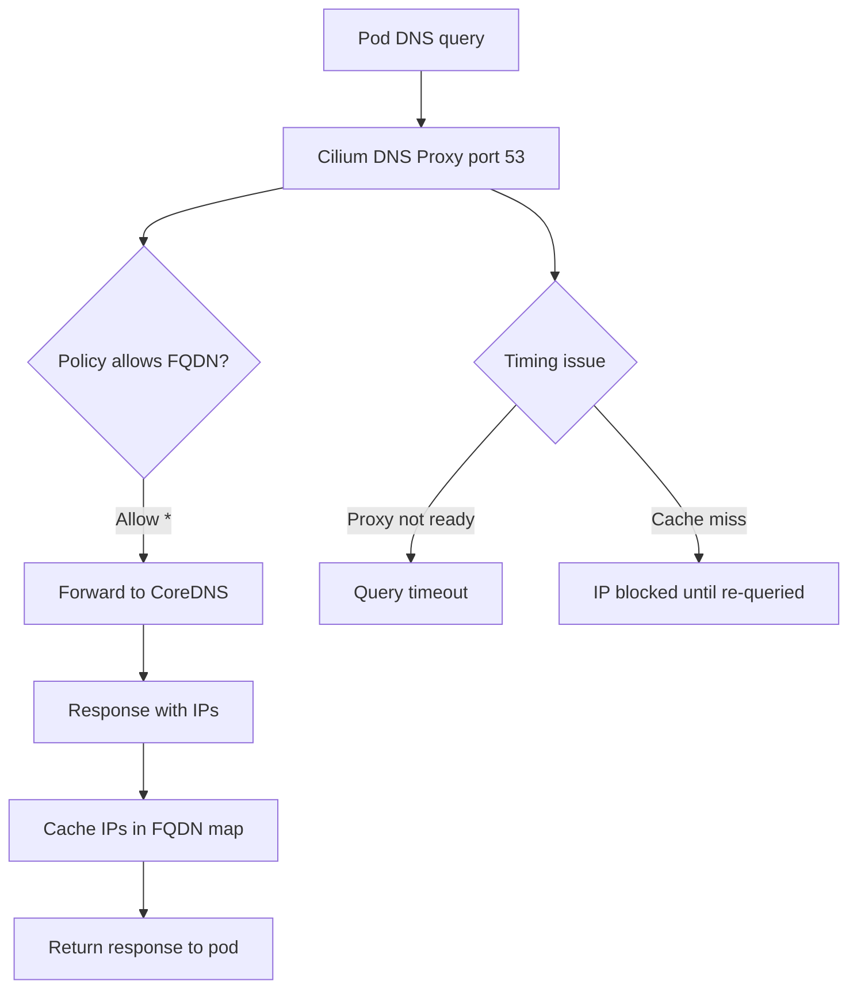

# How to Troubleshoot Intermittent DNS Resolver Failures with Cilium

Author: [nawazdhandala](https://github.com/nawazdhandala)

Tags: Cilium, Kubernetes, DNS, Troubleshooting, Network Policy, eBPF

Description: Diagnose and fix intermittent DNS resolution failures in Kubernetes clusters running Cilium, including proxy race conditions, FQDN cache staleness, and UDP policy issues.

---

## Introduction

Intermittent DNS failures in Cilium-managed clusters are notoriously difficult to debug because they often occur under specific timing conditions. The Cilium DNS proxy intercepts all DNS traffic, and failures in the proxy—even brief ones during policy updates—cause resolution timeouts for pods.

Common causes include: race conditions between policy updates and DNS proxy startup, FQDN cache entries expiring before traffic is allowed, UDP timeout misconfiguration, and conflicts between CoreDNS and Cilium's DNS proxy.

## Prerequisites

- Cilium with DNS policy support
- `kubectl`, `hubble`, `cilium-dbg` CLIs

## Step 1: Confirm the Failure is DNS-Related

```bash
kubectl exec -it <pod-name> -- \
  sh -c 'for i in $(seq 5); do nslookup api.example.com; sleep 1; done'
```

Intermittent failures show as occasional `NXDOMAIN` or `SERVFAIL` responses.

## Step 2: Check Cilium DNS Proxy Logs

```bash
kubectl logs -n kube-system ds/cilium --since=5m | grep -i "dns\|proxy\|fqdn"
```

## Architecture



## Step 3: Check FQDN Cache State

```bash
kubectl exec -n kube-system ds/cilium -- \
  cilium-dbg fqdn cache list
```

If entries are missing or have low TTLs, pods may experience failures when cache expires.

## Step 4: Increase DNS Proxy Timeout

For slow upstream resolvers, increase the timeout:

```bash
helm upgrade cilium cilium/cilium \
  --namespace kube-system \
  --reuse-values \
  --set dnsPolicy.resolutionCellularThrottlingLimit=1000
```

## Step 5: Check for UDP Port 53 Policy Issues

Ensure DNS allow rules use UDP:

```yaml
toPorts:
  - ports:
      - port: "53"
        protocol: UDP
      - port: "53"
        protocol: TCP
    rules:
      dns:
        - matchPattern: "*"
```

## Step 6: Monitor DNS Flows with Hubble

```bash
hubble observe --protocol DNS --since 5m | grep -i "DROPPED\|error"
```

## Fix: Ensure DNS Policy Applies Before Workload Starts

Use init containers or startup probes to delay application startup until DNS resolves:

```yaml
initContainers:
  - name: dns-check
    image: busybox
    command: ['sh', '-c', 'until nslookup api.example.com; do sleep 1; done']
```

## Conclusion

Intermittent DNS failures with Cilium most commonly result from FQDN cache misses, race conditions during policy updates, or missing UDP rules. Monitoring DNS flows with Hubble and maintaining appropriate cache TTLs resolves most intermittent failure patterns.
