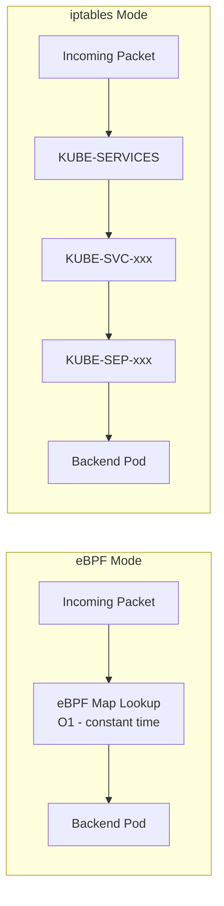

# How to Troubleshoot Kube-Proxy Replacement with Calico eBPF

Author: [nawazdhandala](https://github.com/nawazdhandala)

Tags: Calico, Kubernetes, eBPF, kube-proxy, Networking

Description: Diagnose service routing failures when Calico eBPF replaces kube-proxy.

---

## Introduction

Calico eBPF mode can completely replace kube-proxy for service routing, eliminating the iptables KUBE-* chains that grow with the number of services and endpoints. In large clusters with thousands of services, kube-proxy's iptables rules add measurable latency for each connection setup. Calico eBPF uses kernel-level hash tables for O(1) service lookups regardless of cluster size.

The replacement also enables Direct Server Return (DSR) for LoadBalancer services, where return traffic goes directly from the backend pod to the client without traversing the load balancer node again. This reduces latency and eliminates asymmetric routing.

## Prerequisites

- Linux kernel 5.3+ (5.8+ for full features)
- Calico v3.15+
- kube-proxy can be safely disabled

## Configure kube-proxy Replacement

```bash
# Step 1: Disable kube-proxy
kubectl patch ds -n kube-system kube-proxy \
  -p '{"spec":{"template":{"spec":{"nodeSelector":{"non-calico":"true"}}}}}'

# Step 2: Enable Calico eBPF
calicoctl patch felixconfiguration default --type merge \
  --patch '{"spec":{"bpfEnabled":true}}'

# Step 3: Verify no iptables KUBE rules remain
iptables -t nat -L | grep KUBE | wc -l
# Expected: 0
```

## Verify eBPF Service Handling

```bash
# Check Calico BPF service map
kubectl exec -n calico-system ds/calico-node -- \
  calico-node -bpf-nat-dump

# Verify service IP routes
kubectl exec test-pod -- nslookup kubernetes.default.svc.cluster.local
kubectl exec test-pod -- wget -O- http://kubernetes.default.svc
```

## Enable DSR for LoadBalancer Services

```bash
calicoctl patch felixconfiguration default --type merge \
  --patch '{"spec":{"bpfExternalServiceMode":"DSR"}}'
```

## eBPF vs iptables Service Routing



## Conclusion

Replacing kube-proxy with Calico eBPF provides O(1) service routing performance that scales with cluster size, eliminates iptables chain traversal overhead, and enables DSR for lower-latency load balancing. The migration requires disabling kube-proxy and enabling Calico eBPF, which can be done without rebooting nodes but does require restarting pods in some configurations.
