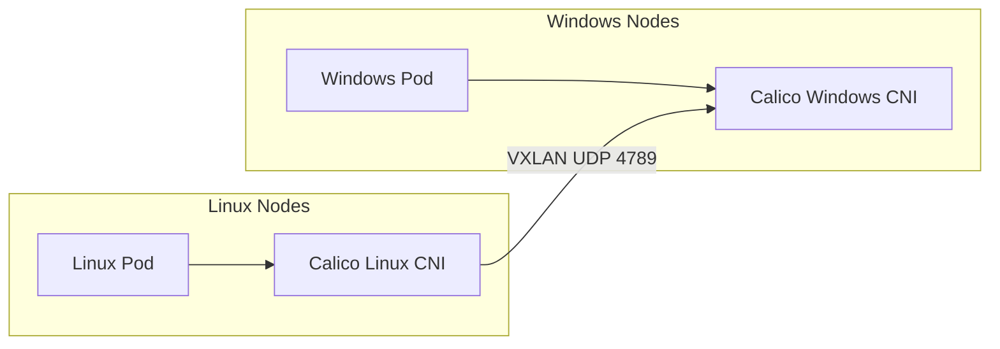

# How to Troubleshoot Mixed Linux and Windows Networking with Calico

Author: [nawazdhandala](https://github.com/nawazdhandala)

Tags: Calico, Kubernetes, Window, Linux, Networking

Description: Diagnose connectivity failures between Linux and Windows pods in Calico mixed-OS deployments.

---

## Introduction

Running Calico in mixed Linux/Windows Kubernetes clusters enables organizations to containerize Windows-specific workloads alongside Linux containers while using a unified networking and policy model. Calico for Windows supports VXLAN encapsulation (IP-in-IP is not supported on Windows) and non-overlay BGP networking, with Calico policy support and Windows-specific limitations.

Mixed OS networking requires careful attention to differences in how Windows handles network interfaces, IPAM, and policy enforcement. Windows Calico uses a different CNI binary and network driver compared to Linux, but both integrate with the same Kubernetes API and Calico datastore.

## Prerequisites

- Kubernetes cluster with Linux control plane nodes
- Windows worker nodes running a Kubernetes-supported Windows Server version
- Calico v3.27+ for Operator installs
- VXLAN mode configured for overlay networking, or BGP without encapsulation

## Configure VXLAN for a Windows-Compatible Overlay

```yaml
apiVersion: projectcalico.org/v3
kind: IPPool
metadata:
  name: default-ipv4-ippool
spec:
  cidr: 10.244.0.0/16
  vxlanMode: Always  # Use VXLAN for overlay deployments
  ipipMode: Never    # IP-in-IP not supported on Windows
  natOutgoing: true
```

## Enable Calico on Windows Nodes

```bash
# Enable strict IPAM affinity so Linux nodes do not borrow IPs from Windows nodes
kubectl patch ipamconfigurations default --type merge --patch='{"spec": {"strictAffinity": true}}'

# Enable the Windows HNS dataplane with your cluster's Kubernetes service CIDR
kubectl patch installation default --type merge --patch='{"spec": {"serviceCIDRs": ["10.96.0.0/12"], "calicoNetwork": {"windowsDataplane": "HNS"}}}'

# Monitor the Windows Calico node pods
kubectl logs -f -n calico-system -l k8s-app=calico-node-windows -c install-cni
```

## Test Cross-OS Connectivity

```bash
# Deploy Linux pod
kubectl run linux-pod --image=busybox -- sleep 3600

# Deploy Windows pod
kubectl apply -f windows-pod.yaml

LINUX_IP=$(kubectl get pod linux-pod -o jsonpath='{.status.podIP}')
WIN_IP=$(kubectl get pod windows-pod -o jsonpath='{.status.podIP}')

# Test Linux to Windows
kubectl exec linux-pod -- ping -c 3 ${WIN_IP}

# Test Windows to Linux (from Windows pod)
kubectl exec windows-pod -- ping -n 3 ${LINUX_IP}
```

## Mixed OS Architecture



## Conclusion

Mixed Linux/Windows networking with Calico requires a Windows-compatible networking mode such as VXLAN or BGP without encapsulation (IP-in-IP is not supported on Windows), careful MTU configuration, and thorough testing of cross-OS pod connectivity. Kubernetes and Calico network policies can be applied across both OS types, subject to Windows dataplane limitations, giving you a unified security model for mixed workload clusters.
